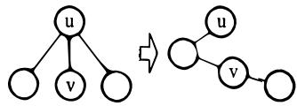
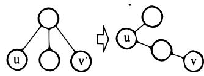
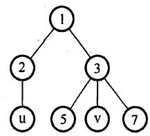
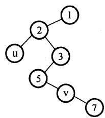
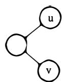
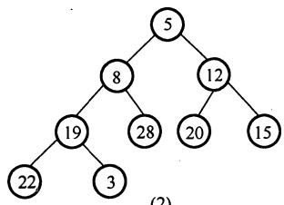
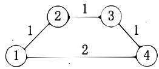

# 2009年计算机408统考真题解析.pdf — 图像索引

> 由 MinerU 结构化结果生成。题目若依赖树形、拓扑、流程、曲线、区域、时序或其他空间关系，应核对这里的原图，不要只依据 OCR 文本推断。

## 图 1

原文页码：2；bbox：`[214, 336, 445, 394]`

## 图 2

原文页码：2；bbox：`[615, 335, 847, 395]`

**图注：** I II

## 图 3

原文页码：2；bbox：`[330, 472, 480, 566]`

## 图 4

原文页码：2；bbox：`[534, 472, 677, 583]`

**图注：** 图 III

## 图 5

原文页码：2；bbox：`[279, 645, 409, 720]`

## 图 6

原文页码：2；bbox：`[413, 644, 500, 722]`

**图注：** (2)

## 图 7

原文页码：2；bbox：`[517, 645, 600, 720]`

**图注：** (3)

## 图 8

原文页码：2；bbox：`[608, 646, 731, 720]`

## 图 9

原文页码：3；bbox：`[137, 148, 356, 261]`

**图注：** (1)

## 图 10

原文页码：3；bbox：`[377, 148, 594, 257]`

**图注：** (2)

## 图 11

原文页码：3；bbox：`[622, 146, 839, 257]`

**图注：** (3)

## 图 12

原文页码：7；bbox：`[189, 395, 371, 450]`

**图注：** (1)

## 图 13

原文页码：7；bbox：`[634, 392, 727, 452]`

**图注：** (2)
