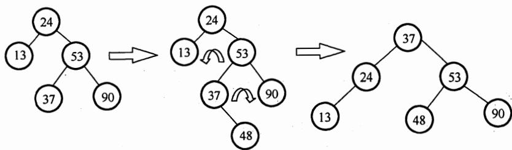
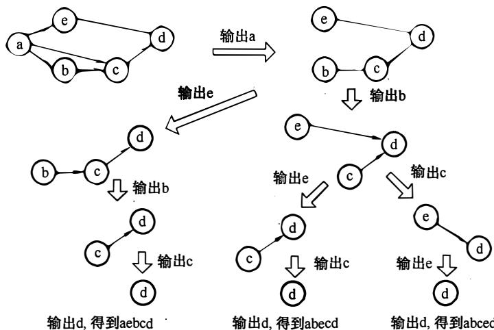
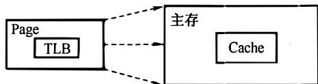
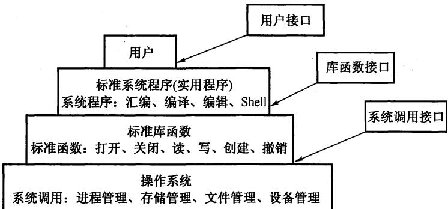
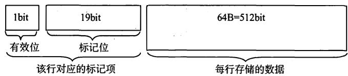
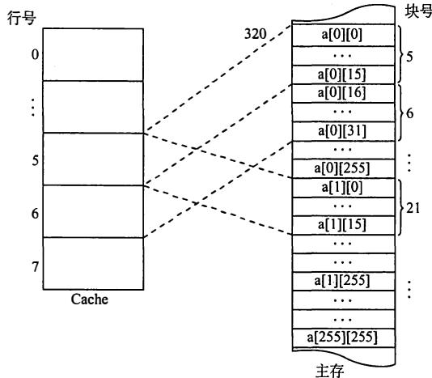
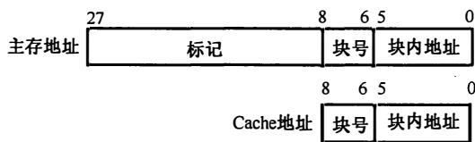

# 2010年计算机408统考真题解析.pdf — 图像索引

> 由 MinerU 结构化结果生成。题目若依赖树形、拓扑、流程、曲线、区域、时序或其他空间关系，应核对这里的原图，不要只依据 OCR 文本推断。

## 图 1

原文页码：1；bbox：`[204, 796, 782, 914]`

## 图 2

原文页码：2；bbox：`[256, 462, 755, 694]`

## 图 3

原文页码：4；bbox：`[339, 443, 660, 502]`

## 图 4

原文页码：5；bbox：`[227, 402, 743, 570]`

## 图 5

原文页码：6；bbox：`[271, 298, 751, 478]`

## 图 6

原文页码：9；bbox：`[245, 756, 717, 827]`

## 图 7

原文页码：10；bbox：`[325, 100, 697, 327]`

## 图 8

原文页码：10；bbox：`[327, 419, 695, 496]`

## 图 9

原文页码：11；bbox：`[225, 726, 757, 804]`

## 图 10

原文页码：11；bbox：`[508, 728, 757, 804]`

**图注：** (a) 时间最短的情况 (b) 时间最长的情况
