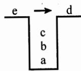
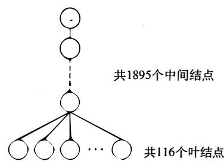
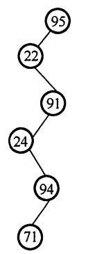
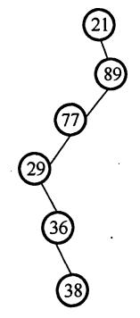
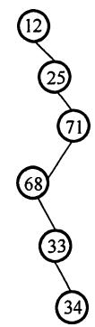
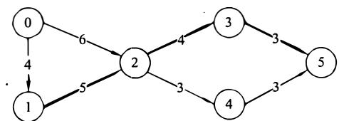

# 2011年计算机408统考真题解析.pdf — 图像索引

> 由 MinerU 结构化结果生成。题目若依赖树形、拓扑、流程、曲线、区域、时序或其他空间关系，应核对这里的原图，不要只依据 OCR 文本推断。

## 图 1

原文页码：1；bbox：`[742, 435, 852, 502]`

## 图 2

原文页码：2；bbox：`[313, 162, 713, 267]`

## 图 3

原文页码：2；bbox：`[656, 342, 918, 475]`

## 图 4

原文页码：2；bbox：`[226, 538, 321, 715]`

**图注：** (a) 选项A的查找过程

## 图 5

原文页码：2；bbox：`[391, 538, 515, 715]`

**图注：** (b) 选项B的查找过程

## 图 6

原文页码：2；bbox：`[532, 537, 641, 709]`

**图注：** (c) 选项C的查找过程

## 图 7

原文页码：2；bbox：`[715, 538, 788, 713]`

**图注：** (d) 选项D的查找过程

## 图 8

原文页码：3；bbox：`[163, 245, 813, 352]`

## 图 9

原文页码：7；bbox：`[205, 505, 763, 559]`

## 图 10

原文页码：7；bbox：`[314, 751, 652, 836]`

## 图 11

原文页码：8；bbox：`[346, 800, 676, 881]`
