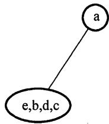
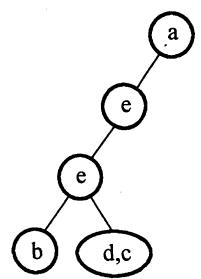
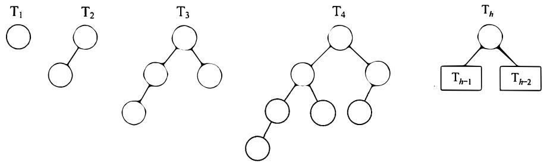
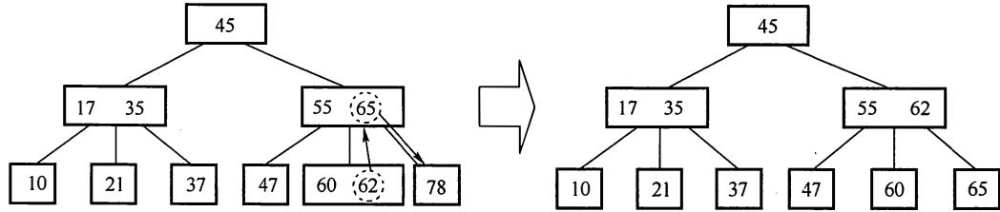
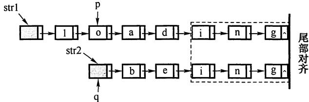

# 2012年计算机408统考真题解析.pdf — 图像索引

> 由 MinerU 结构化结果生成。题目若依赖树形、拓扑、流程、曲线、区域、时序或其他空间关系，应核对这里的原图，不要只依据 OCR 文本推断。

## 图 1

原文页码：2；bbox：`[222, 535, 350, 636]`

**图注：** (a) (b)

## 图 2

原文页码：2；bbox：`[493, 535, 632, 670]`

**图注：** (c)

## 图 3

原文页码：2；bbox：`[647, 535, 785, 679]`

**图注：** (d)

## 图 4

原文页码：2；bbox：`[187, 799, 823, 932]`

## 图 5

原文页码：4；bbox：`[141, 153, 873, 261]`

## 图 6

原文页码：7；bbox：`[233, 316, 747, 429]`

## 图 7

原文页码：8；bbox：`[638, 646, 905, 810]`

## 图 8

原文页码：9；bbox：`[273, 395, 711, 496]`
