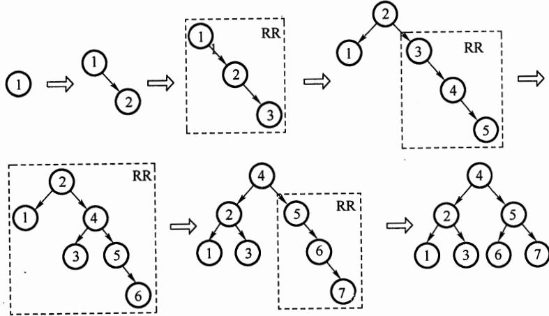
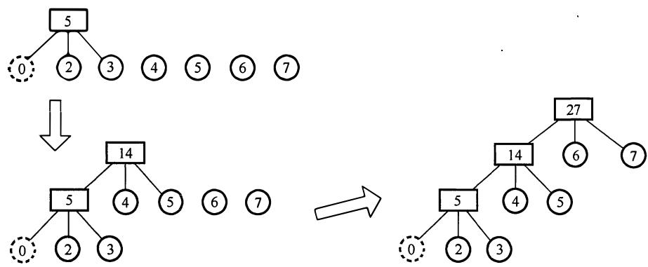
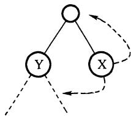
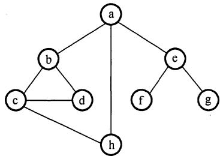
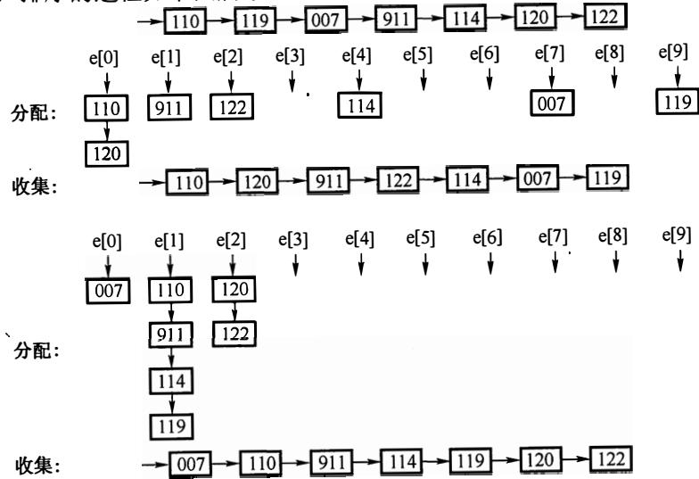
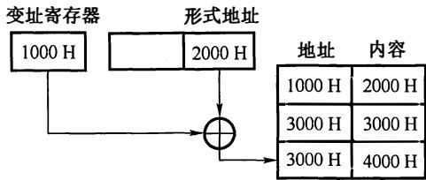
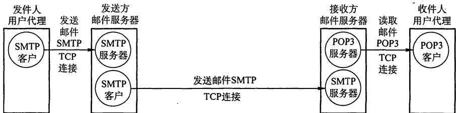
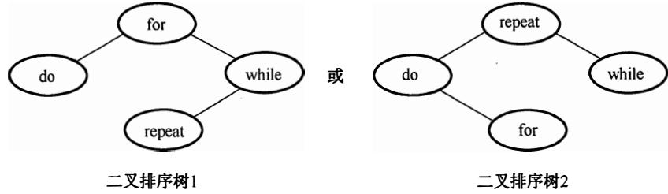
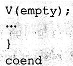
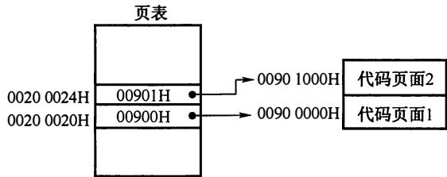

# 2013年计算机408统考真题解析.pdf — 图像索引

> 由 MinerU 结构化结果生成。题目若依赖树形、拓扑、流程、曲线、区域、时序或其他空间关系，应核对这里的原图，不要只依据 OCR 文本推断。

## 图 1

原文页码：1；bbox：`[246, 604, 796, 823]`

## 图 2

原文页码：2；bbox：`[169, 84, 810, 269]`

## 图 3

原文页码：2；bbox：`[416, 372, 565, 464]`

## 图 4

原文页码：2；bbox：`[364, 672, 619, 798]`

## 图 5

原文页码：3；bbox：`[230, 233, 775, 492]`

## 图 6

原文页码：4；bbox：`[327, 154, 660, 252]`

## 图 7

原文页码：6；bbox：`[170, 724, 796, 832]`

## 图 8

原文页码：8；bbox：`[203, 577, 794, 695]`

## 图 9

原文页码：10；bbox：`[187, 89, 290, 154]`

## 图 10

原文页码：10；bbox：`[288, 504, 680, 612]`
