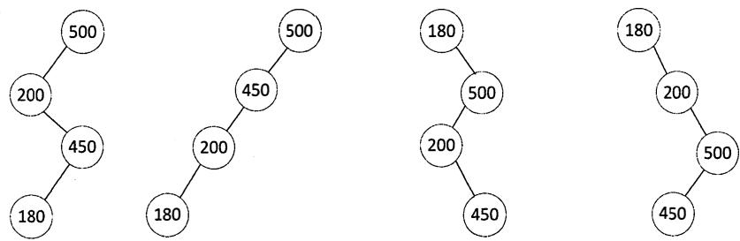

# 2015年计算机408统考真题解析.pdf — 图像索引

> 由 MinerU 结构化结果生成。题目若依赖树形、拓扑、流程、曲线、区域、时序或其他空间关系，应核对这里的原图，不要只依据 OCR 文本推断。

## 图 1

原文页码：1；bbox：`[421, 744, 579, 852]`

## 图 2

原文页码：2；bbox：`[209, 166, 792, 298]`

## 图 3

原文页码：2；bbox：`[226, 643, 775, 733]`
