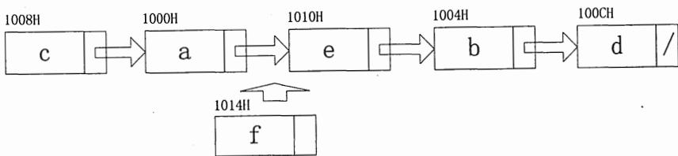
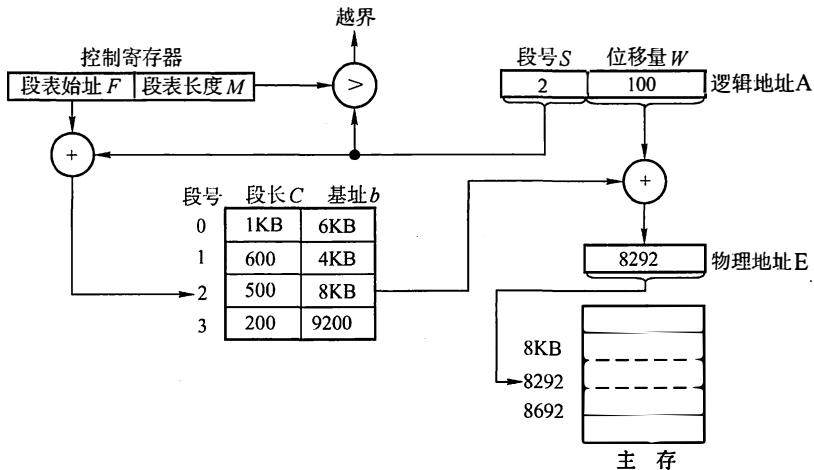
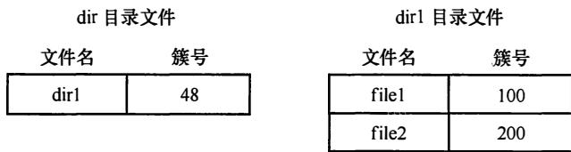

# 2016年计算机408统考真题解析.pdf — 图像索引

> 由 MinerU 结构化结果生成。题目若依赖树形、拓扑、流程、曲线、区域、时序或其他空间关系，应核对这里的原图，不要只依据 OCR 文本推断。

## 图 1

原文页码：1；bbox：`[196, 414, 791, 509]`

## 图 2

原文页码：6；bbox：`[208, 399, 774, 626]`

## 图 3

原文页码：7；bbox：`[427, 438, 580, 586]`

## 图 4

原文页码：12；bbox：`[260, 262, 703, 344]`
