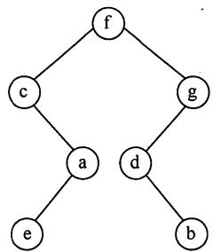
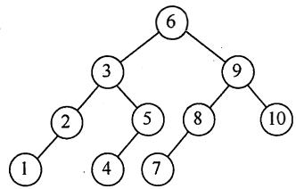
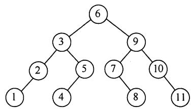
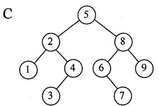
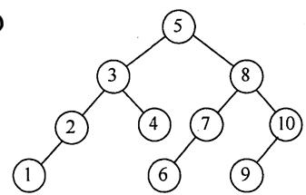

# 2017年计算机408统考真题解析.pdf

# 2017年计算机学科专业基础综合试题参考答案

## 一、单项选择题

<table><tr><td>1.</td><td>B</td><td>2.</td><td>C</td><td>3.</td><td>A</td><td>4.</td><td>B</td><td>5.</td><td>B</td><td>6.</td><td>D</td><td>7.</td><td>B</td><td>8.</td><td>A</td></tr><tr><td>9.</td><td>B</td><td>10.</td><td>B</td><td>11.</td><td>D</td><td>12.</td><td>C</td><td>13.</td><td>C</td><td>14.</td><td>A</td><td>15.</td><td>D</td><td>16.</td><td>A</td></tr><tr><td>17.</td><td>C</td><td>18.</td><td>B</td><td>19.</td><td>A</td><td>20.</td><td>D</td><td>21.</td><td>D</td><td>22.</td><td>B</td><td>23.</td><td>D</td><td>24.</td><td>C</td></tr><tr><td>25.</td><td>B</td><td>26.</td><td>D</td><td>27.</td><td>B</td><td>28.</td><td>D</td><td>29.</td><td>B</td><td>30.</td><td>D</td><td>31.</td><td>B</td><td>32.</td><td>B</td></tr><tr><td>33.</td><td>A</td><td>34.</td><td>D</td><td>35.</td><td>B</td><td>36.</td><td>A</td><td>37.</td><td>D</td><td>38.</td><td>C</td><td>39.</td><td>A</td><td>40.</td><td>C</td></tr></table>

## 1. 解析：

sum += ++i; 相当于++i; sum = sum + i;。进行到第 k 趟循环，sum = (1+k)\*k/2。显然需要进行 O(n^{1/2}) 趟循环，因此这也是该函数的时间复杂度。

## 2. 解析:

I 的反例：计算斐波拉契数列迭代实现只需要一个循环即可实现。III 的反例：入栈序列为 1、2，进行如下操作 PUSH、PUSH、POP、POP，出栈次序为 2、1；进行如下操作 PUSH、POP、PUSH、POP，出栈次序为 1、2。IV，栈是一种受限的线性表，只允许在一端进行操作。因此 II 正确。

## 3. 解析:

三元组表的结点存储了行 row、列 col、值 value 三种信息，是主要用来存储稀疏矩阵的一种数据结构。十字链表将行单链表和列单链表结合起来存储稀疏矩阵。邻接矩阵空间复杂度达 $O(n^{2})$ ，不适于存储稀疏矩阵。二叉链表又名左孩子右兄弟表示法，可用于表示树或森林。因此 A 正确。

## 4. 解析:

先序序列是先父结点，接着左子树，然后右子树。中序序列是先左子树，接着父结点，然后右子树，递归进行。如果所有非叶结点只有右子树，先序序列和中序序列都是先父结点，然后右子树，递归进行，因此 B 正确。

## 5. 解析:

后序序列是先左子树，接着右子树，最后父结点，递归进行。根结点左子树的叶结点首先被访问，它是 e。接下来是它的父结点 a，然后是 a 的父结点 c。接着访问根结点的右子树。它的叶结点 b 首先被访问，然后是 b 的父结点 d，再者是 d 的父结点 g。最后是根结点 f。因此 d 与 a 同层，B 正确。



## 6. 解析:

哈夫曼编码是前缀编码，各个编码的前缀各不相同，因此直接拿编码序列与哈夫曼编码一一比对即可。序列可分割为 0100 011 001 001 011 11 0101，译码结果是 a f e e f g d，选项 D 正确。

## 7. 解析:

无向图边数的两倍等于各顶点度数的总和。由于其他顶点的度均小于3，可以设它们的度都为2，设它们的数量是x，可列出方程 $4\times3+3\times4+2x=16\times2$ ，解得 $x=3$ 。 $4+3+3=11$ ，B正确。

## 8. 解析:

折半查找判定树实际上是一棵二叉排序树，它的中序序列是一个有序序列。可以在树结点上依次填上相应的元素，符合折半查找规则的树即是所求。

B 选项 4、5 相加除 2 向上取整，7、8 相加除 2 向下取整，矛盾。C 选项，3、4 相加除 2 向上取整，6、7 相加除 2 向下取整，矛盾。D 选项，1、10 相加除 2 向下取整，6、7 相加除 2 向上取整，矛盾。A 符合折半查找规则，因此正确。

A  


B  




D  


## 9. 解析:

B+树是应文件系统所需而产生的 B-树的变形，前者比后者更加适用于实际应用中的操作系统的文件索引和数据库索引，因为前者磁盘读写代价更低，查询效率更加稳定。编译器中的词法分析使用有穷自动机和语法树。网络中的路由表快速查找主要靠高速缓存、路由表压缩技术和快速查找算法。系统一般使用空闲空间链表管理磁盘空闲块。所以 B 正确。

## 10. 解析:

归并排序代码比选择插入排序更复杂，前者空间复杂度是 $O(n)$ ，后者是 $O(1)$ 。但是前者时间复杂度是 $O(n \log n)$ ，后者是 $O(n^{2})$ 。所以 B 正确。

## 11. 解析:

插入排序、选择排序、起泡排序原本时间复杂度是 $O(n^{2})$ ，更换为链式存储后的时间复杂度还是 $O(n^{2})$ 。希尔排序和堆排序都利用了顺序存储的随机访问特性，而链式存储不支持这种性质，所以时间复杂度会增加，因此选 D。

## 12. 解析:

运行时间 = 指令数×CPI/主频。M1 的时间 = 指令数×2/1.5，M2 的时间 = 指令数×1/1.2，两者之比为(2/1.5):(1/1.2)=1.6。故选 C。

## 13. 解析:

由 4 个 DRAM 芯片采用交叉编址方式构成主存可知主存地址最低二位表示该字节存储的芯片编号。double 型变量占 64 位，8 个字节。它的主存地址 804 001 AH 最低二位是 10，说明它从编号为 2 的芯片开始存储（编号从 0 开始）。一个存储周期可以对所有芯片各读取一个字节，因此需要 3 轮，故选 C。

## 14. 解析:

时间局部性是一旦一条指令被执行，则在不久的将来它可能再次被执行。空间局部性是一旦一个存储单元被访问，那么它附近的存储单元也很快被访问。显然，这里的循环指令本身具有时间局部性，它对数组 a 的访问具有空间局部性，故选 A。

## 15. 解析:

在变址操作时，将计算机指令中的地址与变址寄存器中的地址相加，得到有效地址，指令提供数组首地址，由变址寄存器来定位数据中的各元素。所以它最适合按下标顺序访问一维数组元素，故选 D。

相对寻址以 PC 为基地址，以指令中的地址为偏移量确定有效地址。寄存器寻址则是在指令中指出需要使用的寄存器。直接寻址是在指令的地址字段直接指出操作数的有效地址。

## 16. 解析:

三地址指令有 29 条，所以它的操作码至少为 5 位。以 5 位进行计算，它剩余 32 - 29 = 3 种操作码给二地址。而二地址另外多了 6 位给操作码，因此它的数量最大达 $3 \times 64 = 192$ 。所以指令字长最少为 23 位，因为计算机按字节编址，需要是 8 的倍数，所以指令字长至少应该是 24 位，故选 A。

## 17. 解析:

超标量是指在 CPU 中有一条以上的流水线，并且每个时钟周期内可以完成一条以上的指令，其实质是以空间换时间。I 错误，它不影响流水线功能段的处理时间；II、III 正确。故选 C。

## 18. 解析:

主存储器就是我们通常说的主存，在 CPU 外，存储指令和数据，由 RAM 和 ROM 实现。控制存储器用来存放实现指令系统的所有微指令，是一种只读型存储器，机器运行时只读不写，在 CPU 的控制器内。CS 按照微指令的地址访问，所以 B 错误。

## 19. 解析:

五阶段流水线可分为取指（IF）、译码/取数（ID）、执行（EXC）、存储器读（MEM）、写回（Write Back）。数字系统中，各个子系统通过数据总线连接形成的数据传送路径称为数据通路，包括程序计数器、算术逻辑运算部件、通用寄存器组、取指部件等，不包括控制部件，故选 A。

## 20. 解析:

多总线结构用速率高的总线连接高速设备，用速率低的总线连接低速设备。一般来说，CPU是计算机的核心，是计算机中速度最快的设备之一，所以A正确。突发传送方式把多个数据单元作为一个独立传输处理，从而最大化设备的吞吐量。现实中一般用支持突发传送方式的总线提高存储器的读写效率，B正确。各总线通过桥接器相连，后者起流量交换作用。PCI-Express总线都采用串行数据包传输数据，所以选D。

## 21. 解析:

I/O 端口又称 I/O 接口，是 CPU 与设备之间的交接面。由于主机和 I/O 设备的工作方式和工作速度有很大差异，I/O 端口就应运而生。在执行一条指令时，CPU 使用地址总线选择所请求的 I/O 端口，使用数据总线在 CPU 寄存器和端口之间传输数据。所以选 D。

## 22. 解析:

多重中断系统在保护被中断进程现场时关中断，执行中断处理程序时开中断，B 错误。

CPU 一般在一条指令执行结束的阶段采样中断请求信号，查看是否存在中断请求，然后决定是否响应中断，A、D 正确。中断请求一般来自 CPU 以外的事件，异常一般发生在 CPU 内部，C 正确。

## 23. 解析：

先来先服务调度算法是作业来得越早，优先级越高，因此会选择 J1。短作业优先调度算法是作业运行时间越短，优先级越高，因此会选择 J3。所以 D 正确。

## 24. 解析:

执行系统调用的过程是这样的：正在运行的进程先传递系统调用参数，然后由陷入（trap）指令负责将用户态转化为内核态，并将返回地址压入堆栈以备后用，接下来 CPU 执行相应的内核态服务程序，最后返回用户态。所以 C 正确。

## 25. 解析:

回收起始地址为 60K、大小为 140KB 的分区时，它与表中第一个分区和第四个分区合并，成为起始地址为 20K、大小为 380KB 的分区，剩余 3 个空闲分区。在回收内存后，算法会对空闲分区链按分区大小由小到大进行排序，表中的第二个分区排第一。所以选择 B。

## 26. 解析：

绝大多数操作系统为改善磁盘访问时间，以簇为单位进行空间分配，因此选 D。

## 27. 解析:

进程切换带来系统开销，切换次数越多，开销越大，A 正确。当前进程的时间片用完后，它的状态由执行态变为就绪态，B 错误。时钟中断是系统中特定的周期性时钟节拍。操作系统通过它来确定时间间隔，实现时间的延时和任务的超时，C 正确。现代操作系统为了保证性能最优，通常根据响应时间、系统开销、进程数量、进程运行时间、进程切换开销等因素确定时间片大小，D 正确。

## 28. 解析:

多道程序系统通过组织作业（编码或数据）使 CPU 总有一个作业可执行，从而提高了 CPU 的利用率、系统吞吐量和 I/O 设备利用率，I、III、IV 是优点。但系统要付出额外的开销来组织作业和切换作业，II 错误。所以选 D。

## 29. 解析:

一个新的磁盘是一个空白版，必须分成扇区以便磁盘控制器能读和写，这个过程称为低级格式化（或物理格式化）。低级格式化为磁盘的每个扇区采用特别的数据结构，包括校验码，III错误。为了使用磁盘存储文件，操作系统还需要将其数据结构记录在磁盘上。这分为两步。第一步是将磁盘分为由一个或多个柱面组成的分区，每个分区可以作为一个独立的磁盘，I错误。在分区之后，第二步是逻辑格式化（创建文件系统）。在这一步，操作系统将初始的文件系统数据结构存储到磁盘上。这些数据结构包括空闲和已分配的空间和一个初始为空的目录，II、IV正确。所以选B。

## 30. 解析:

可以把用户访问权限抽象为一个矩阵，行代表用户，列代表访问权限。这个矩阵有4行5列，1代表true，0代表false，所以需要20位，选D。

## 31. 解析:

硬链接指通过索引结点进行连接。一个文件在物理存储器上有一个索引节点号。存在多个文件名指向同一个索引节点，II 正确。两个进程各自维护自己的文件描述符，III 正确，I 错误。所以选择 B。

## 32. 解析:

在开始 DMA 传输时，主机向内存写入 DMA 命令块，向 DMA 控制器写入该命令块的地址，启动 I/O 设备。然后，CPU 继续其他工作，DMA 控制器则继续下去直接操作内存总线，将地址放到总线上开始传输。当整个传输完成后，DMA 控制器中断 CPU。因此执行顺序是 2,3,1,4，选 B。

## 33. 解析:

OSI 参考模型共 7 层，除去物理层和应用层，剩五层。它们会向 PDU 引入 $20B \times 5 = 100B$ 的额外开销。应用层是最顶层，所以它的数据传输效率为 400B/500B = 80%，选 A。

## 34. 解析：

可用奈奎斯特采样定理计算无噪声情况下的极限数据传输速率，用香农第二定理计算有噪信道极限数据传输速率。 $2W\log_{2}N\geqslant W\log_{2}(1+S/N)$ ，W是信道带宽，N是信号状态数，S/N是信噪比，将数据代入计算可得 $N\geqslant32$ ，选D。分贝数 $=10\log_{10}S/N$ 。

## 35. 解析:

IEEE 802.11 数据帧有四种子类型，分别是 IBSS、From AP、To AP、WDS。这里的数据帧 F 是从笔记本电脑发送往访问接入点（AP），所以属于 To AP 子类型。这种帧地址 1 是 RA（BSSID），地址 2 是 SA，地址 3 是 DA。RA 是 Receiver Address 的缩写，BSSID 是 basic service set identifier 的缩写，SA 是 source address 的缩写，DA 是 destination address 的缩写。因此地址 1 是 AP 的 MAC，地址 2 是 H 的 MAC，地址 3 是 R 的 MAC，选 B。

## 36. 解析:

根据 RFC 文档描述，0.0.0.0/32 可以作为本主机在本网络上的源地址。127.0.0.1 是回送地址，以它为目的 IP 地址的数据将被立即返回到本机。200.10.10.3 是 C 类 IP 地址。255.255.255.255 是广播地址。

## 37. 解析:

RIP 是一种分布式的基于距离向量的路由选择协议，通过广播 UDP 报文来交换路由信息。OSPF 是一个内部网关协议，不使用传输协议，如 UDP 或 TCP，而是直接用 IP 包封装它的数据。BGP 是一个外部网关协议，用 TCP 封装它的数据。因此选 D。

## 38. 解析:

这个网络有 16 位的主机号，平均分成 128 个规模相同的子网，每个子网有 7 位的子网号，9 位的主机号。除去一个网络地址和广播地址，可分配的最大 IP 地址个数是 $2^{9}-2=512-2=510$ ，故选 C。

## 39. 解析:

按照慢开始算法，发送窗口 = min{拥塞窗口，接收窗口}，初始的拥塞窗口为最大报文段长度 1KB。每经过一个 RTT，拥塞窗口翻倍，因此需至少经过 5 个 RTT，发送窗口才能达到 32KB，所以选 A。这里假定乙能及时处理接收到的数据，空闲的接收缓存≥32KB。

## 40. 解析:

FTP 协议使用控制连接和数据连接，控制连接存在于整个 FTP 会话过程中，数据连接在每次文件传输时才建立，传输结束就关闭，A 和 B 是正确的。默认情况下 FTP 协议使用 TCP 20 端口进行数据连接，TCP 21 端口进行控制连接。但是是否使用 TCP 20 端口建立数据连接与传输模式有关，主动方式使用 TCP 20 端口，被动方式由服务器和客户端自行协商决定，C 错，D 对。所以选 C。

## 二、综合应用题

## 41. 解答:

## （1）算法的基本设计思想

表达式树的中序序列加上必要的括号即为等价的中缀表达式。可以基于二叉树的中序遍历策略得到所需的表达式。(3 分)

表达式树中分支结点所对应的子表达式的计算次序，由该分支结点所处的位置决定。为得到正确的中缀表达式，需要在生成遍历序列的同时，在适当位置增加必要的括号。显然，表达式的最外层（对应根结点）及操作数（对应叶结点）不需要添加括号。（2分）

## (2) 算法实现（10 分）

将二叉树的中序遍历递归算法稍加改造即可得本题答案。除根结点和叶结点外，遍历到其他结点时在遍历其左子树之前加上左括号，在遍历完右子树后加上右括号。

```c
void BtreeToE(BTree *root){
    BtreeToExp(root, 1); // 根的高度为 1
}
void BtreeToExp(BTree *root, int deep)
{
    if (root == NULL) return; // 空结点返回
    else if (root->left == NULL && root->right == NULL) // 若为叶结点
    printf("%s", root->data); // 输出操作数，不加括号
    else {
    if (deep > 1) printf(" "); // 若有子表达式则加 1 层括号
    BtreeToExp(root->left, deep + 1);
    printf("%s", root->data); // 输出操作符
    BtreeToExp(root->right, deep + 1);
    if (deep > 1) printf(" )"); // 若有子表达式则加 1 层括号
}
```

【评分说明】① 若考生设计的算法满足题目的功能要求，则（1）、（2）根据所实现算法的策略及输出结果给分，评分标准见下表。

<table><tr><td>分数</td><td>备注</td></tr><tr><td>15</td><td>采用中序遍历算法且正确,括号嵌套正确,层数适当</td></tr><tr><td>14</td><td>采用中序遍历算法且正确,括号嵌套正确,但括号嵌套层数过多。例如,表达式最外层加上括号,或操作数加括号,如(a)</td></tr><tr><td>11</td><td>采用中序遍历算法,但括号嵌套层数不完全正确。例如,左右括号数量不匹配</td></tr><tr><td>9</td><td>采用中序遍历算法,但没有考虑括号</td></tr><tr><td> $\leqslant 7$ </td><td>其他</td></tr></table>

② 若考生采用其他方法得到正确结果，可参照①的评分标准给分。

③ 如果程序中使用了求结点深度等辅助函数，但没有给出相应的实现过程，只要考生进行了必要的说明，可不扣分。

④ 若在算法的基本设计思想描述中因文字表达没有清晰反映出算法思路，但在算法实现中能够表达出算法思想且正确的，则可参照①的标准给分。

⑤ 若算法的基本设计思想描述或算法实现中部分正确，可参照①中各种情况的相应给分标准酌情给分。

⑥ 参考答案中只给出了使用 C 语言的版本，使用 C++ 语言的答案参照以上评分标准。

42. 解答:

（1）Prim 算法属于贪心策略。算法从一个任意的顶点开始，一直长大到覆盖图中所有顶点为止。算法每一步在连接树集合 S 中顶点和其他顶点的边中，选择一条使得树的总权重增加最小的边加入集合 S。当算法终止时，S 就是最小生成树。

① S 中顶点为 A，候选边为(A, D), (A, B), (A, E)，选择(A, D)加入 S。

② S 中顶点为 A, D，候选边为(A, B), (A, E), (D, E), (C, D)，选择(D, E)，加入 S。

③ S 中顶点为 A, D, E，候选边为(A, B), (C, D), (C, E)，选择(C, E)加入 S。

④ S 中顶点为 A, D, E, C，候选边为(A, B), (B, C)，选择(B, C)加入 S。

⑤ S 就是最小生成树。

## 依次选出的边为

$$
(\mathrm{A}, \mathrm{D}), (\mathrm{D}, \mathrm{E}), (\mathrm{C}, \mathrm{E}), (\mathrm{B}, \mathrm{C}) \quad (4 \text {分})
$$

【评分说明】每正确选对一条边且次序正确，给 1 分。若考生选择的边正确，但次序不完全正确，酌情给分。

（2）图 G 的 MST 是唯一的。（2 分）第一小题的最小生成树包括了图中权值最小的四条边，其他边都比这四条边大，所以此图的 MST 唯一。

（3）当带权连通图的任意一个环中所包含的边的权值均不相同时，其 MST 是唯一的。（2 分）此题不要求回答充分必要条件，所以回答一个限制边权值的充分条件即可。

【评分说明】① 若考生答案中给出的是其他充分条件，例如 “带权连通图的所有边的权值均不相同”，同样给分。

② 若考生给出的充分条件对图的顶点数和边数做了某些限制，例如，限制了图中顶点的个数（顶点个数少于3个）、限制了图的形状（图中没有环）等，则最高给1分。

③ 答案部分正确，酌情给分。

43. 解答:

（1）由于 i 和 n 是 unsigned d 型，故 “i <= n-1” 是无符号数比较，n = 0 时，n - 1 的机器数为全 1，值是 $2^{32} - 1$ ，为 unsigned d 型可表示的最大数，条件 “i <= n-1” 永真，因此出现死循环。（2 分）

若 i 和 n 改为 int 类型，则不会出现死循环。(1 分)

因为 “i <= n-1” 是带符号整数比较，n = 0 时，n-1 的值是 -1，当 i = 0 时条件 “i <= n-1” 不成立，此时退出 for 循环。（1 分）

(2) f1(23)与f2(23)的返回值相等。(1分) $f(23)=2^{23+1}-1=2^{24}-1$ ，它的二进制形式是24个1。int占32位，没有溢出。float有1个符号位，8个指数位，23个底数位，23个底数位可以表示24位的底数。所以两者返回值相等。

f1(23)的机器数是 00FF FFFFH。(1 分)

f2(23)的机器数是 4B7F FFFFH。(1 分)

显而易见前者是24个1，即0000 0000 1111 1111 1111 1111 1111 1111 $_{(2)}$ ，后者符号位是0，指数位为 $23 + 127_{(10)} = 1001\ 0110_{(2)}$ ，底数位是111 1111 1111 1111 1111 1111 $_{(2)}$ 。

（3）当 n=24 时， $f(24)=1\ 1111\ 1111\ 1111\ 1111\ 1111\ 1111\ B$ ，而 float 型数只有 24 位有效位，舍入后数值增大，所以 f2(24) 比 f1(24) 大 1。（1 分）

【评分说明】只要说明 f2(24)需舍入处理即可给分。

（4）显然 f(31)已超出了 int 型数据的表示范围，用 f1(31)实现时得到的机器数为 32 个 1，

作为 int 型数解释时其值为 -1，即 f1(31) 的返回值为 -1。（1 分）

因为 int 型最大可表示数是 0 后面加 31 个 1，故使 f1(n) 的返回值与 f(n) 相等的最大 n 值是 30。（1 分）

【评分说明】对于第二问，只要给出 n=30 即可给分。

（5）IEEE 754 标准用 “阶码全 1、尾数全 0” 表示无穷大。f2 返回值为 float 型，机器数 7F80 0000H 对应的值是 +∞。（1 分）

当 n = 126 时， $f(126) = 2^{127} - 1 = 1.1 \cdots 1 \times 2^{126}$ ，对应阶码为 $127 + 126 = 253$ ，尾数部分舍入后阶码加 1，最终阶码为 254，是 IEEE 754 单精度格式表示的最大阶码。故使 f2 结果不溢出的最大 n 值为 126。（1 分）

当 n = 23 时，f(23)为 24 位 1，float 型数有 24 位有效位，所以不需舍入，结果精确。故使 f2 获得精确结果的最大 n 值为 23。（1 分）

【评分说明】对于第二问，只要给出 n = 23，即可给分。对于第三问，只要给出 n = 126，即可给分。

44. 解答:

(1) M 为 CISC。(1 分)

M 的指令长短不一，不符合 RISC 指令系统特点。(1 分)

(2) f1 的机器代码占 96B。(1 分)

因为 f1 的第一条指令 “push ebp” 所在的虚拟地址为 0040 1020H，最后一条指令 “ret” 所在的虚拟地址为 0040 107FH，所以，f1 的机器指令代码长度为 0040 107FH-0040 1020H + 1 = 60H = 96 个字节。（1 分）

(3) CF = 1。(1 分)

cmp 指令实现 i 与 n-1 的比较功能，进行的是减法运算。在执行 f1(0) 过程中，n=0，当 i=0 时，i=0000 0000H，并且 n-1=FFFF FFFFH。因此，当执行第 20 条指令时，在补码加/减运算器中执行 “0 减 FFFF FFFFH” 的操作，即 0000 0000H+0000 0000H+1=0000 0001H，此时，进位输出 C=0，减法运算时的借位标志 CF=C⊕1=1。（2 分）

## (4) f2 中不能用 shl 指令实现 power\*2。(1 分)

因为 sh1 指令用来将一个整数的所有有效数位作为一个整体左移；而 f2 中的变量 power 是 float 型，其机器数中不包含最高有效数位，但包含了阶码部分，将其作为一个整体左移时并不能实现 “乘 2” 的功能，因而 f2 中不能用 sh1 指令实现 power\*2。（2 分）浮点数运算比整型运算要复杂，耗时也较长。

45. 解答:

（1）函数 f1 的代码段中所有指令的虚拟地址的高 20 位相同，因此 f1 的机器指令代码在同一页中，仅占用 1 页。（1 分）页目录号用于寻找页目录的表项，该表项包含页表的位置。页表索引用于寻找页表的表项，该表项包含页的位置。

（2）push ebp 指令的虚拟地址的最高 10 位（页目录号）为 00 0000 0001，中间 10 位（页表索引）为 00 0000 0001，所以，取该指令时访问了页目录的第 1 个表项，（1 分）在对应的页表中访问了第 1 个表项。（1 分）

（3）在执行 scanf() 的过程中，进程 P 因等待输入而从执行态变为阻塞态。（1 分）输入结束时，P 被中断处理程序唤醒，变为就绪态。（1 分）P 被调度程序调度，变为运行态。（1 分）CPU 状态会从用户态变为内核态。（1 分）

## 46. 解答:

先找出线程对在各个变量上的互斥、并发关系。如果是一读一写或两个都是写，那么这就是互斥关系。每一个互斥关系都需要一个信号量进行调节。

semaphore mutex\_y1=1; //mutex\_y1 用于 thread1 与 thread3 对变量 y 的互斥访问。
semaphore mutex\_y2=1; //mutex\_y2 用于 thread2 与 thread3 对变量 y 的互斥访问。
semaphore mutex\_z=1; //mutex\_z 用于变量 z 的互斥访问。

互斥代码如下：（5分）

```txt
thread1
{
    cnum w;
    wait( mutex_y1 );
    w = add( x, y );
    signal( mutex_y1 );
    ...
    {
    cnum w;
    wait( mutex_y2 );
    wait( mutex_z );
    w = add( y, z );
    signal( mutex_z );
    signal( mutex_y2 );
    ...
    }
    {
    cnum w;
    w.a = 1;
    w.b = 1;
    wait( mutex_z );
    z = add( z, w );
    signal( mutex_z );
    wait( mutex_y1 );
    wait( mutex_y2 );
    y = add( y, w );
    signal( mutex_y1 );
    signal( mutex_y2 );
    ...
    }
}
```

## 【评分说明】

① 各线程与变量之间的互斥、并发情况及相应评分见下表。

<table><tr><td>变量\线程对</td><td>thread1 和 thread2</td><td>thread2 和 thread3</td><td>thread1 和 thread3</td><td>给分</td></tr><tr><td>x</td><td>不共享</td><td>不共享</td><td>不共享</td><td>1 分</td></tr><tr><td>y</td><td>同时读</td><td>读写互斥</td><td>读写互斥</td><td>3 分</td></tr><tr><td>z</td><td>不共享</td><td>读写互斥</td><td>不共享</td><td>1 分</td></tr></table>

② 若考生仅使用一个互斥信号量，互斥代码部分的得分最多给 2 分。

③ 答案部分正确，酌情给分。

47. 解答:

（1） $t_{0}$ 时刻到 $t_{1}$ 时刻期间，甲方可以断定乙方已正确接收了 3 个数据帧，（1 分）分别是 $S_{0,0}$ ， $S_{1,0}$ ， $S_{2,0}$ （1 分）。 $R_{3,3}$ 说明乙发送的数据帧确认号是 3，即希望甲发送序号 3 的数据帧，说明乙已经接收了序号为 0～2 的数据帧。

（2）从 $t_{1}$ 时刻起，甲方最多还可以发送 5 个数据帧（1 分），其中第一个帧是 $S_{5,2}$ （1 分），最后一个数据帧是 $S_{1,2}$ （1 分）。发送序号 3 位，有 8 个序号。在 GBN 协议中，序号个数 $\geqslant$ 发送窗口 +1，所以这里发送窗口最大为 7。此时已发送了 $S_{3,0}$ 和 $S_{4,1}$ ，所以最多还可以发送 5 个帧。

（3）甲方需要重发 3 个数据帧（1 分），重发的第一个帧是 $S_{2,3}$ （1 分）。在 GBN 协议中，接收方发送了 N 帧后，检测出错，则需要发送出错帧及其之后的帧。 $S_{2,0}$ 超时，所以重发的第一帧是 $S_{2}$ 。已收到乙的 $R_{2}$ 帧，所以确认号应为 3。

（4）甲方可以达到的最大信道利用率是

$$
\frac {7 \times \frac {8 \times 1000}{100 \times 10^{6}}}{0.96 \times 10^{-3} + 2 \times \frac {8 \times 1000}{100 \times 10^{6}}} \times 100\% = 50\% \text {(2分)}
$$

$U =$ 发送数据的时间/从开始发送第一帧到收到第一个确认帧的时间 $= NT\mathrm{d} / (\mathrm{T}\mathrm{d} + \mathrm{RTT} + \mathrm{Ta})$

U 是信道利用率，N 是发送窗口的最大值，Td 是发送一数据帧的时间，RTT 是往返时间，Ta 是发送一确认帧的时间。这里采用捎带确认，Td = Ta。

【评分说明】答案部分正确，酌情给分。
