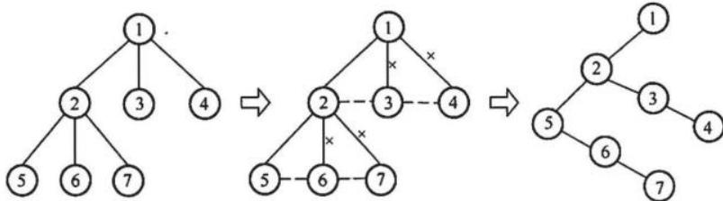
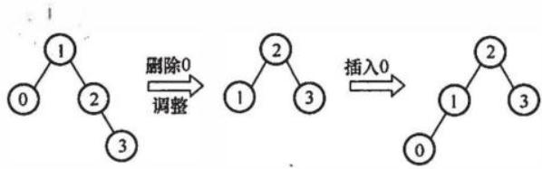
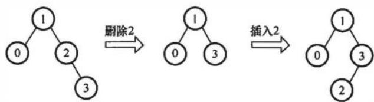
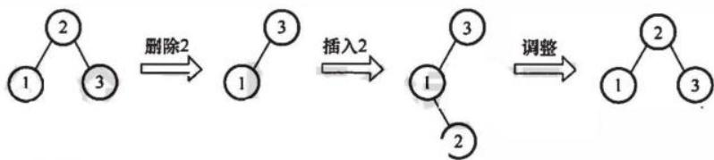
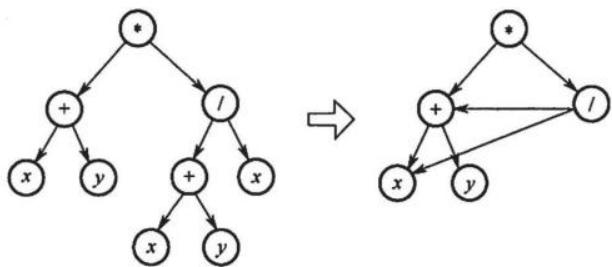
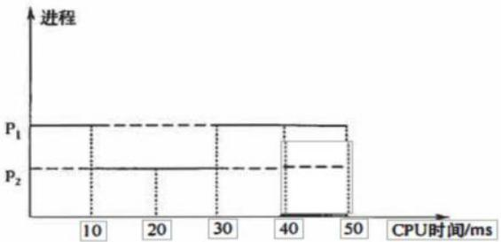
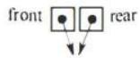
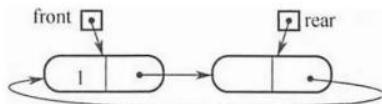

# 2019年计算机408统考真题解析.pdf — 图像索引

> 由 MinerU 结构化结果生成。题目若依赖树形、拓扑、流程、曲线、区域、时序或其他空间关系，应核对这里的原图，不要只依据 OCR 文本推断。

## 图 1

原文页码：1；bbox：`[172, 578, 787, 691]`

## 图 2

原文页码：2；bbox：`[291, 76, 748, 171]`

## 图 3

原文页码：2；bbox：`[276, 268, 761, 356]`

## 图 4

原文页码：2；bbox：`[214, 435, 825, 526]`

## 图 5

原文页码：3；bbox：`[246, 118, 714, 254]`

## 图 6

原文页码：6；bbox：`[246, 693, 678, 831]`

## 图 7

原文页码：10；bbox：`[457, 265, 576, 298]`

## 图 8

原文页码：10；bbox：`[374, 411, 665, 463]`
