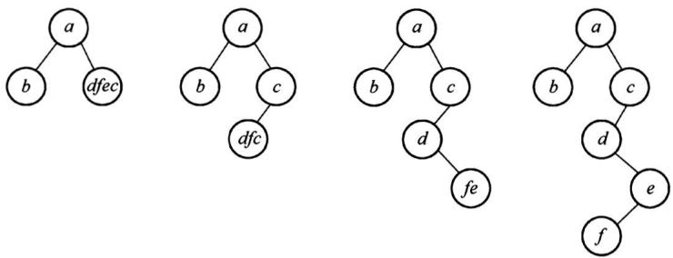
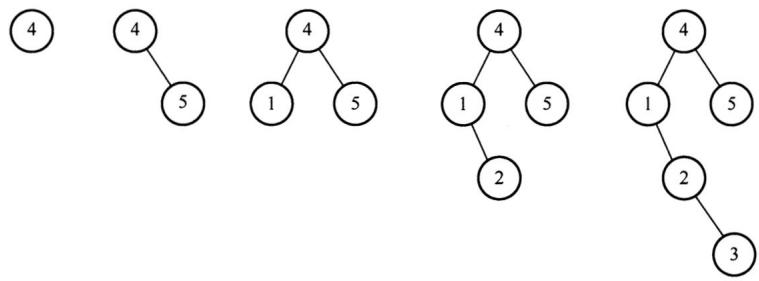
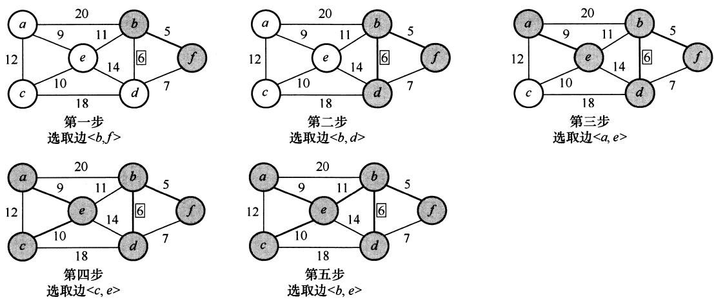
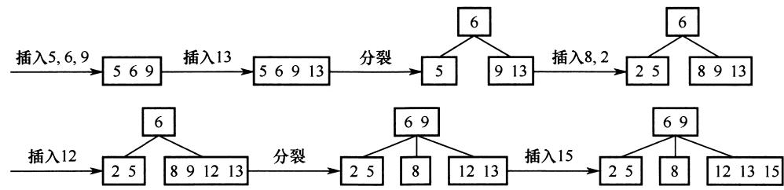
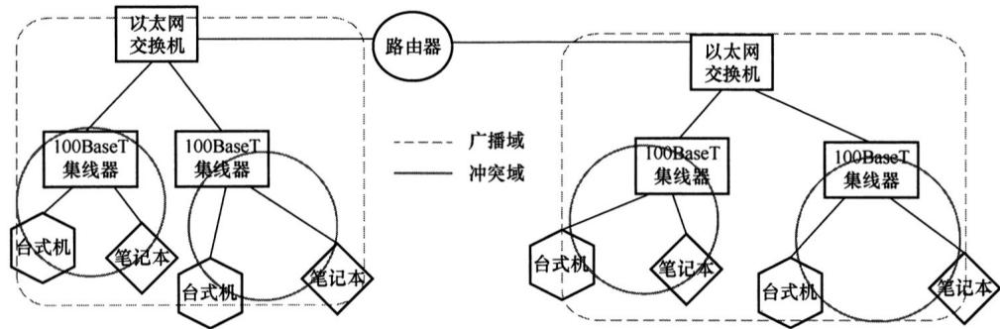
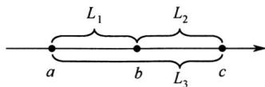
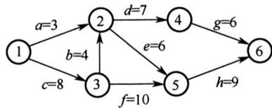

# 2020年计算机408统考真题解析.pdf

# 2020 全国硕士研究生招生考试计算机学科专业基础试题参考答案

## 一、单项选择题

<table><tr><td>01.</td><td>C</td><td>02.</td><td>D</td><td>03.</td><td>A</td><td>04.</td><td>C</td><td>05.</td><td>B</td><td>06.</td><td>B</td><td>07.</td><td>A</td><td>08.</td><td>B</td></tr><tr><td>09.</td><td>C</td><td>10.</td><td>B</td><td>11.</td><td>A</td><td>12.</td><td>B</td><td>13.</td><td>A</td><td>14.</td><td>D</td><td>15.</td><td>D</td><td>16.</td><td>A</td></tr><tr><td>17.</td><td>B</td><td>18.</td><td>A</td><td>19.</td><td>C</td><td>20.</td><td>C</td><td>21.</td><td>B</td><td>22.</td><td>C</td><td>23.</td><td>B</td><td>24.</td><td>A</td></tr><tr><td>25.</td><td>D</td><td>26.</td><td>D</td><td>27.</td><td>B</td><td>28.</td><td>D</td><td>29.</td><td>B</td><td>30.</td><td>D</td><td>31.</td><td>B</td><td>32.</td><td>C</td></tr><tr><td>33.</td><td>C</td><td>34.</td><td>B</td><td>35.</td><td>C</td><td>36.</td><td>D</td><td>37.</td><td>A</td><td>38.</td><td>D</td><td>39.</td><td>C</td><td>40.</td><td>D</td></tr></table>

## 01.【解析】

上三角矩阵按列优先存储，先存储仅1个元素的第一列，再存储有2个元素的第二列，以此类推。 $m_{7,2}$ 位于左下角，对应右上角的元素为 $m_{2,7}$ ，在 $m_{2,7}$ 之前存有

第1列：1

第2列：2

......

第6列：6

第7列：1

前面共存有 $1 + 2 + 3 + 4 + 5 + 6 + 1 = 22$ 个元素（数组下标范围为 0～21），注意数组下标从 0 开始，故 $m_{2,7}$ 在数组 N 中的下标为 22，即 $m_{7,2}$ 在数组 N 中的下标为 22。

## 02.【解析】

按题意，出入栈操作的过程如下：

<table><tr><td>操作</td><td>栈内元素</td><td>出栈元素</td></tr><tr><td>Push</td><td>a</td><td></td></tr><tr><td>Push</td><td>a b</td><td></td></tr><tr><td>Pop</td><td>a</td><td>b</td></tr><tr><td>Push</td><td>a c</td><td></td></tr><tr><td>Pop</td><td>a</td><td>c</td></tr><tr><td>Push</td><td>a d</td><td></td></tr><tr><td>Push</td><td>a d e</td><td></td></tr><tr><td>Pop</td><td>a d</td><td>e</td></tr></table>

故出栈序列为 b, c, e。

## 03.【解析】

二叉树采用顺序存储时，用数组下标来表示结点之间的父子关系。对于一棵高度为 5 的二叉树，为了满足任意性，其 $1 \sim 5$ 层的所有结点都要被存储起来，即考虑为一棵高度为5的满二叉树，总共需要存储单元的数量为 $1 + 2 + 4 + 8 + 16 = 31$ 。

## 04.【解析】

森林 F 的先根遍历序列对应其二叉树 T 的先序遍历序列，森林 F 的中根遍历序列对应其二叉树 T 的中序遍历序列。即 T 的先序遍历序列为 a, b, c, d, e, f，中序遍历序列为 b, a, d, f, e, c。根据二叉树 T 的先序序列和中序序列可以唯一确定它的结构，构造过程如下：



可以得到二叉树 T 的后序序列为 b, f, e, d, c, a。

## 05.【解析】

每个选项都逐一验证，选项 B 生成二叉排序树的过程如下：



显然选项B错误。

## 06.【解析】

DFS 是一个递归算法，在遍历过程中，先访问的顶点被压入栈底。设在图中有顶点 $v_{i}$ ，它有后继顶点 $v_{j}$ ，即存在边 $<v_{i}, v_{j}>$ 。根据 DFS 的规则， $v_{i}$ 入栈后，必先遍历完其后继顶点后 $v_{i}$ 才会出栈，也就是说 $v_{i}$ 会在 $v_{j}$ 之后出栈，在如题所指的过程中， $v_{i}$ 在 $v_{j}$ 后打印。由于 $v_{i}$ 和 $v_{j}$ 具有任意性，从上面的规律可以看出，输出顶点的序列是逆拓扑有序序列。

## 07.【解析】

Kruskal 算法：按权值递增顺序依次选取 $n - 1$ 条边，并保证这 $n - 1$ 条边不构成回路。初始构造一个仅含 $n$ 个顶点的森林；第一步，选取权值最小的边 $(b, f)$ 加入最小生成树；第二步，剩余边中权值最小的边为 $(b, d)$ ，加入最小生成树，第二步操作后权值最小的边 $(d, f)$ 不能选，因为会与之前已选取的边形成回路；接下来依次选取权值9,10,11对应的边加入最小生成树，此时6个顶点形成了一棵树，最小生成树构造完成。按照上述过程，加到最小生成树的边依次为 $(b, f), (b, d), (a, e), (c, e), (b, e)$ 。其生成过程如下所示。



## 08.【解析】

关键路径是指权值之和最大而非边数最多的路径，故选项 A 错误。选项 B 正确，是关键路径的概念。无论是存在一条还是存在多条关键路径，增加任一关键活动的时间都会延长工程的工期，因为关键路径始终是权值之和最大的那条路径，选项 C 错误。仅有一条关键路径时，减少关键活动的时间会缩短工程的工期；存在多条关键路径时，缩短一条关键活动的时间不一定会缩短工程的工期，缩短了路径长度的那条关键路径不一定还是关键路径，选项 D 错误。

## 09.【解析】

这是一道简单的概念题。堆是一棵完全树，采用一维数组存储，故 I 正确，II 正确。大根堆只要求根结点值大于左右孩子值，并不要求左右孩子值有序，III 错误。堆的定义是递归的，所以其左右子树也是大根堆，所以堆的次大值一定是其左孩子或右孩子，IV 正确。

## 10.【解析】

一个4阶B树的任意非叶结点至多含有 $m - 1 = 3$ 个关键字，在关键字依次插入的过程中，会导致结点的不断分裂，插入过程如下所示。

  
得到根结点包含的关键字为6，9。

## 11.【解析】

考虑较极端的情况，对于有序数组，直接插入排序的比较次数为 n-1，简单选择排序的比较次数始终为 $1+2+\cdots+n-1=n(n-1)/2$ ，I 正确。两种排序方法的辅助空间都是 $O(1)$ ，无差别，II 错误。初始有序时，移动次数均为 0；对于通常情况，直接插入排序每趟插入都需要依次向后挪位，而简单选择排序只需与找到的最小元素交换位置，后者的移动次数少很多，III错误。

## 12.【解析】

机器字长是指 CPU 内部用于整数运算的数据通路的宽度。CPU 内部数据通路是指 CPU 内部的数据流经的路径及路径上的部件，主要是 CPU 内部进行数据运算、存储和传送的部件，这些部件的宽度基本上要一致才能相互匹配。因此，机器字长等于 CPU 内部用于整数运算的运算器位数和通用寄存器宽度。

## 13.【解析】

C800 0000H = 1100 1000 0000 0000 0000 0000 0000 0000 0000。

将其转换为对应的 float 型或 int 型:

1）为 float 型时，尾数隐藏最高位 1，数符为 1 表示负数，阶码 $1001\ 0000 = 2^{7} + 2^{4} = 128 + 16$ ，再减去偏置值 127 得到 17，算出 x 值为 $-2^{17}$ 。

2）为int型时，带符号补码，为负数，数值部分取反加1，得011 1000 0000 0000 0000 0000 0000 0000，算出 $x$ 值为 $-7 \times 2^{27}$ 。

## 14.【解析】

在32位计算机中，按字节编址，根据小端方式和按边界对齐的定义，给出变量a的存放方式如下：

<table><tr><td rowspan="2">地址</td><td>2020 FE00H</td><td>2020 FE01H</td><td>2020 FE02H</td><td>2020 FE03H</td></tr><tr><td>未知</td><td>未知</td><td></td><td></td></tr><tr><td>说明</td><td>x1 (LSB)</td><td>x1 (MSB)</td><td></td><td></td></tr><tr><td rowspan="2">地址</td><td>2020 FE04H</td><td>2020 FE05H</td><td>2020 FE06H</td><td>2020 FE07H</td></tr><tr><td>00H</td><td>00H</td><td>34H</td><td>12H</td></tr><tr><td>说明</td><td>x2 (LSB)</td><td></td><td></td><td>x2 (MSB)</td></tr></table>

于是，34H 所在存储单元的地址为 2020 FE06H。

## 15.【解析】

Cache 由 SRAM 组成；TLB 通常由相联存储器组成，也可由 SRAM 组成。DRAM 需要不断刷新，性能偏低，不适合组成 TLB 和 Cache。选项 A、B 和 C 都是 TLB 和 Cache 的特点。

## 16.【解析】

48 条指令需要 6 位操作码字段 $(2^{5}<48<2^{6})$ ，4 种寻址方式需要 2 位寻址特征位 $(4=2^{2})$ ，还剩 16-6-2=8 位作为地址码，故直接寻址范围为 0～255。注意，主存地址不能为负。

## 17.【解析】

CPI 表示执行指令所需的时钟周期数。对于一个程序或一台机器来说，其 CPI 指执行该程序或机器指令集中的所有指令所需的平均时钟周期数。对于单周期 CPU，令指令周期 = 时钟周期，CPI = 1，I 正确。对于多周期 CPU，CPU 的执行过程分成几个阶段，每个阶段用一个时钟去完成，每种指令所用的时钟数可以不同，CPI > 1，II 错误。对于基本流水线 CPU，让每个时钟周期流出一条指令，CPI = 1，III 正确。超标量流水线 CPU 在每个时钟周期内并发执行多条独立的指令，每个时钟周期流出多条指令，CPI < 1，IV 错误。

## 18.【解析】

自陷是一种内部异常，A 错误。在 80x86 中，用于程序调试的“断点设置”功能是通过“自陷”方式实现的，选项 B 正确。执行到自陷指令时，无条件或有条件地自动调出操作系统内核程序进行执行，选项 C 正确。CPU 执行“陷阱指令”后，会自动地根据不同“陷阱”类型进行相应的处理，然后返回到“陷阱指令”的下一条指令执行，选项 D 正确。

## 19.【解析】

每个时钟周期传送2次，故每秒传送的次数 = 时钟频率×2 = 2.4G×2/s。

总线带宽 = 每秒传送次数×2B×2 = 2.4G×2×2B×2/s = 19.2GB/s。

题中已给出总线带宽公式，降低了难度。公式中的“×2B”是因为每次传输16位数据，“×2”是因为采用点对点全双工总线，两个方向可同时传输信息。

## 20.【解析】

访存时缺页属于内部异常，I 错误；定时器到时描述的是时钟中断，属于外部中断，II 正确；网络数据包到达描述的是 CPU 执行指令以外的事件，属于外部中断，III 正确。

## 21.【解析】

由 CPU 内部产生的异常称为内中断，内中断都是不可屏蔽中断。通过中断请求线 INTR 和 NMI，从 CPU 外部发出的中断请求为外中断，通过 INTR 信号线发出的外中断是可屏蔽中断，而通过 NMI 信号线发出的是不可屏蔽中断。不可屏蔽中断不受中断标志位的影响，即使在关中断的情况下也会被响应，选项 A 正确。不可屏蔽中断的处理优先级最高，任何时候只要发生不可屏蔽中断，都要中止现行程序的执行，转到不可屏蔽中断处理程序执行，选项 C 正确。CPU 响应中断需要满足 3 个条件：① 中断源有中断请求；② CPU 允许中断及开中断；③ 一条指令执行完毕，且没有更紧迫的任务。故选项 B 错误。

## 22.【解析】

周期挪用法由 DMA 控制器挪用一个或几个主存周期来访问主存，传送完一个数据字后立即释放总线，是一种单字传送方式，每个字传送完后 CPU 可以访问主存，选项 C 错误。停止 CPU 访存法则是指在整个数据块的传送过程中，使 CPU 脱离总线，停止访问主存。

## 23.【解析】

多个进程可同时以“读”或“写”方式打开文件，操作系统并不保证写操作的互斥性，进程可通过系统调用对文件加锁，保证互斥写（读者-写者问题），选项A错误。整个系统只有一个系统打开文件表，同一个文件打开多次只需改变引用计数，选项B正确。用户进程的打开文件表关于同一个文件不一定相同，例如读写指针位置不一定相同，选项C错误。进程关闭文件时，文件的引用计数减1，引用计数变为0时才删除系统打开文件表中的表项，选项D错误。

## 24.【解析】

索引分配支持变长的文件，同时可以随机访问文件的指定数据块，选项 A 正确。链接分配不支持随机访问，需要依靠指针依次访问，选项 B 错误。连续分配的文件长度固定，不支持可变文件长度（连续分配的文件长度虽然也可变，但是需大量移动数据，代价较大，相比之下不太合适），选项 C 错误。动态分区分配是内存管理方式，不是磁盘空间的管理方式，选项 D 错误。

## 25.【解析】

当 CPU 检测到中断信号后，由硬件自动保存被中断程序的断点（即程序计数器 PC），I 错误。之后，硬件找到该中断信号对应的中断向量，中断向量指明中断服务程序入口地址（各中断向量统一存放在中断向量表中，该表由操作系统初始化，III 正确）。接下来开始执行中断服务程序，保存 PSW、保存中断屏蔽字、保存各通用寄存器的值，并提供与中断信号对应的中断服务，中断服务程序属于操作系统内核，II 和 IV 正确。

## 26.【解析】

多级反馈队列调度算法需要综合考虑优先级数量、优先级之间的转换规则等，就绪队列的数量会影响长进程的最终完成时间，I 正确；就绪队列的优先级会影响进程执行的顺序，II 正确；各就绪队列的调度算法会影响各队列中进程的调度顺序，III 正确；进程在就绪队列中的迁移条件会影响各进程在各队列中的执行时间，IV 正确。

## 27.【解析】

首先求出需求矩阵：

$$
\text { Need } = \text { Max } - \text { Allocation } = \left[ \begin{array}{l l} 4 & 4 \\ 3 & 1 \\ 3 & 4 \end{array} \right] - \left[ \begin{array}{l l} 2 & 3 \\ 2 & 1 \\ 1 & 2 \end{array} \right] = \left[ \begin{array}{l l} 2 & 1 \\ 1 & 0 \\ 2 & 2 \end{array} \right]
$$

由 Allocation 得知当前 Available 为(1, 0)。由需求矩阵可知，初始只能满足 P2 的需求，选项 A 错误。P2 释放资源后 Available 变为(3, 1)，此时仅能满足 P1 的需求，选项 C 错误。P1 释放资源后 Available 变为(5, 4)，可以满足 P3 的需求，得到的安全序列为 P2, P1, P3，选项 B 正确，选项 D 错误。

## 28.【解析】

I 影响缺页中断的频率，缺页率越高，平均访存时间越长；II 和 IV 影响缺页中断的处理时间，中断处理时间越长，平均访存时间越长；III 影响访问页表和访问目标物理地址的时间，故 I、II、III 和 IV 均正确。

## 29.【解析】

父进程与子进程当然可以并发执行，选项 A 正确。父进程可与子进程共享一部分资源，但不能共享虚拟地址空间，在创建子进程时，会为子进程分配资源，如虚拟地址空间等，选项 B 错误。临界资源一次只能为一个进程所用，选项 D 正确。进程控制块 PCB 是进程存在的唯一标志，每个进程都有自己的 PCB，选项 C 正确。

## 30.【解析】

设备可视为特殊文件，选项 A 正确。用户使用逻辑设备名来访问物理文件，有利于设备独立性，选项 B 正确。通过逻辑设备名访问物理设备时，需要建立逻辑设备和物理设备之间的映射关系，选项 C 正确。应用程序按逻辑设备名访问设备，再经驱动程序的处理来控制物理设备, 若更换物理设备, 则只需更换驱动程序, 而无须修改应用程序, 选项 D 错误。

## 31.【解析】

在总长为 64 字节的目录项中，索引结点占 4 字节，即 32 位。不同目录下的文件的文件名可以相同，所以在考虑系统创建最多文件数量时，只需考虑索引结点的个数，即创建文件数量上限 = 索引结点数量上限。整个系统中最多存储 $2^{32}$ 个索引结点，因此整个系统最多可以表示 $2^{32}$ 个文件，选项 B 正确。

## 32.【解析】

实现临界区互斥需满足多个准则。“忙则等待”准则，即两个进程不能同时访问临界区，I 正确。“空闲让进”准则，若临界区空闲，则允许其他进程访问，II 正确。“有限等待”准则，即进程应该在有限时间内访问临界区，III 正确。I、II 和 III 是互斥机制必须遵循的原则。IV 是“让权等待”准则，不一定非得实现，如皮特森算法。

## 33.【解析】

协议由语法、语义和时序（又称同步）三部分组成。语法规定了通信双方彼此“如何讲”，即规定了传输数据的格式。语义规定了通信双方彼此“讲什么”，规定了所要完成的功能，如通信双方要发出什么控制信息、执行的动作和返回的应答。时序规定了信息交流的次序。由图可知发送方与接收方依次交换信息，体现了协议三要素中的时序要素。

## 34.【解析】

虚电路服务需要有建立连接过程，每个分组使用短的虚电路号，属于同一条虚电路的分组按照同一路由进行转发，分组到达终点的顺序与发送顺序相同，可以保证有序传输，不需要为每条虚电路预分配带宽。

## 35.【解析】

网络层设备路由器可以隔离广播域和冲突域；链路层设备普通交换机只能隔离冲突域；物理层设备集线器、中继器既不能隔离冲突域又不能隔离广播域。因此，题中共有2个广播域、4个冲突域。



## 36.【解析】

发送数据帧和确认帧的时间均为 $t = 1000 \times 8 \, b/10 \, kbps = 800 \, ms$ 。

发送周期 $T = 800 \, ms + 200 \, ms + 800 \, ms + 200 \, ms = 2000 \, ms$ 。

信道利用率 $= t / T \times 100\% = 800 / 2000 \times 100\% = 40\%$ 。

## 37.【解析】

为了尽量避免碰撞，802.11规定，所有站在完成发送后，必须等待一段很短的时间（继续监听）才能发送下一帧。这段时间称为帧间间隔（InterFrame Space，IFS）。帧间间隔的长短取决于该站要发送的帧的类型。IEEE 802.11使用3种帧间间隔：

DIFS（分布式协调 IFS）：最长的 IFS，优先级最低，用于异步帧竞争访问的时延。

PIFS（点协调 IFS）：中等长度的 IFS，优先级居中，在 PCF 操作中使用。

SIFS（短 IFS）：最短的 IFS，优先级最高，用于需要立即响应的操作。

网络中的控制帧及所接收数据的确认帧都采用 SIFS 作为发送之前的等待时延。当结点要发送数据帧时，载波监听到信道空闲时，需等待 DIFS 后发送 RTS 预约信道，图中 IFS1 对应的是帧间间隔 DIFS，时间最长，图中 IFS2、IFS3、IFS4 对应 SIFS。

## 38.【解析】

由于慢开始门限 ssthresh 可以根据需求设置，为了求拥塞窗口从 8KB 增长到 32KB 所需的最长时间，可以假定慢开始门限小于等于 8KB，只要不出现拥塞，拥塞窗口就都是加法增大，每经历一个传输轮次(RTT)，拥塞窗口逐次加 1，所需最长时间为 $(32-8)\times2\mathrm{ms}=48\mathrm{ms}$ 。

## 39.【解析】

甲与乙建立 TCP 连接时发送的 SYN 段中的序号为 1000，则在数据传输阶段所用的起始序号为 1001；断开连接时，甲发送给乙的 FIN 段中的序号为 5001，在无任何重传的情况下，甲向乙已经发送的应用层数据的字节数为 5001 - 1001 = 4000。

## 40.【解析】

题中 RTT 均为局域网内主机（主机 H、本地域名服务器）访问 Internet 上各服务器的往返时间，且忽略其他时延，因此主机 H 向本地域名服务器的查询时延忽略不计。最短时间：本地主机中有该域名到 IP 地址对应的记录，因此不需要 DNS 查询时延，直接和 www.abc.com 服务器建立 TCP 连接再进行资源访问，TCP 连接建立需要 1 个 RTT，接着发送访问请求并收到服务器资源响应需要 1 个 RTT，共计 2 个 RTT，即 20ms；最长时间：本地主机递归查询本地域名服务器（延时忽略），本地服务器依次迭代查询根域名服务器、com 顶级域名服务器、abc.com 域名服务器，共 3 个 RTT，查询到 IP 地址后，将该映射返回给主机 H，主机 H 和 www.abc.com 服务器建立 TCP 连接再进行资源访问，共 2 个 RTT，因此最长时间需要 $3 + 2 = 5$ 个 RTT，即 50ms。

## 二、综合应用题

## 41.【解析】

分析。由 $D = |a - b| + |b - c| + |c - a| \geqslant 0$ 得：

① 当 a=b=c 时，距离最小。

② 其余情况。不失一般性，假设 $a \leqslant b \leqslant c$ ，观察下面的数轴：



$$
L _ {1} = | a - b |, L _ {2} = | b - c |, L _ {3} = | c - a |, D = | a - b | + | b - c | + | c - a | = L _ {1} + L _ {2} + L _ {3} = 2 L _ {3}
$$

由 $D$ 的表达式可知，事实上决定 $D$ 大小的关键是 $a$ 和 $c$ 之间的距离，于是问题就可以简化为每次固定 $c$ 找一个 $a$ 使得 $L_{3} = |c - a|$ 最小。

## 1）算法的基本设计思想

① 使用 $D_{min}$ 记录所有已处理过的三元组的最小距离，初值为一个足够大的整数。

② 集合 $S_{1}$ 、 $S_{2}$ 和 $S_{3}$ 分别保存在数组 A、B、C 中。数组的下标变量 i=j=k=0，当 $i<|S_{1}|$ 、 $j<|S_{2}|$ 且 $k<|S_{3}|$ 时（ $|S|$ 表示集合 S 中的元素个数），循环执行 a)～c)。

a) 计算（A[i], B[j], C[k]）的距离 D；（计算 D）

b) 若 $D < D_{\min}$ ，则 $D_{\min} = D;$ （更新 D）

c) 将 A[i], B[j], C[k] 中的最小值的下标 +1; （对照分析：最小值为 a，最大值为 c，这里 c 不变而更新 a，试图寻找更小距离 D）

③ 输出 $D_{min}$ ，结束。

2）算法实现：

```c
#define INT_MAX 0x7fffffff
int abs_(int a){//计算绝对值
    if(a<0) return -a;
    else return a;
}
bool xls_min(int a, int b, int c){//a 是否是三个数中的最小值
    if(a<=b&&a<=c) return true;
    return false;
}
int findMinofTrip(int A[], int n, int B[], int m, int C[], int p){
    //D_min 用于记录三元组的最小距离，初值赋为 INT_MAX
    int i=0, j=0, k=0, D_min=INT_MAX, D;
    while(i<n&&j<m&&k<p&&D_min>0){
    D=abs_(A[i]-B[j])+abs_(B[j]-C[k])+abs_(C[k]-A[i]); //计算 D
    if(D<D_min) D_min=D; //更新 D
    if(xls_min(A[i], B[j], C[k])) i++; //更新 a
    else if(xls_min(B[j], C[k], A[i])) j++;
    else k++;
    }
    return D_min;
```

3）设 $n=\left|S_{1}\right|+\left|S_{2}\right|+\left|S_{3}\right|$ ，时间复杂度为 $O(n)$ ，空间复杂度为 $O(1)$ 。

## 42.【解析】

1) 使用一棵二叉树保存字符集中各字符的编码，每个编码对应于从根开始到达某叶结点的一条路径，路径长度等于编码位数，路径到达的叶结点中保存该编码对应的字符。

2）从左至右依次扫描 0/1 串中的各位。从根开始，根据串中当前位沿当前结点的左子指针或右子指针下移，直到移动到叶结点时为止。输出叶结点中保存的字符。然后从根开始重复这个过程，直到扫描到 0/1 串结束，译码完成。

3) 二叉树既可用于保存各字符的编码，又可用于检测编码是否具有前缀特性。判定编码是否具有前缀特性的过程，也是构建二叉树的过程。初始时，二叉树中仅含有根结点，其左子指针和右子指针均为空。

依次读入每个编码 C，建立/寻找从根开始对应于该编码的一条路径，过程如下：

对每个编码，从左至右扫描 C 的各位，根据 C 的当前位（0 或 1）沿结点的指针（左子指针或右子指针）向下移动。当遇到空指针时，创建新结点，让空指针指向该新结点并继续移动。沿指针移动的过程中，可能遇到三种情况：

① 若遇到了叶结点（非根），则表明不具有前缀特性，返回。

② 若在处理 C 的所有位的过程中，均没有创建新结点，则表明不具有前缀特性，返回。

③ 若在处理 C 的最后一个编码位时创建了新结点，则继续验证下一个编码。

若所有编码均通过验证，则编码具有前缀特性。

## 43.【解析】

1）乘法运算可以通过加法和移位来实现。编译器可以将乘法运算转换为一个循环代码段，在循环代码段中通过比较、加法和移位等指令实现乘法运算。

2）控制逻辑的作用是控制循环次数，控制加法和移位操作。

3) ①最长, ③最短。对于①, 需要用循环代码段 (即软件) 实现乘法操作, 因而需要反复执行很多条指令, 而每条指令都需要取指令、译码、取数、执行并保存结果, 所以执行时间很长; 对于②和③, 都只需用一条乘法指令实现乘法操作, 不过②中的乘法指令需要多个时钟周期才能完成, 而③中的乘法指令可以在一个时钟周期内完成, 所以③的执行时间最短。

4) 当 $n = 32, x = 2^{31} - 1, y = 2$ 时，带符号整数和无符号整数乘法指令得到的64位乘积都是00000000FFFFFFFEH。int型的表示范围为 $[-2^{31}, 2^{31} - 1]$ ，故函数imul()的结果溢出；unsigned int型的表示范围为 $[0, 2^{32} - 1]$ ，故函数umul()的结果不溢出。对于无符号整数乘法，若乘积高 $n$ 位全为0，即使低 $n$ 位全为1也正好是 $2^{32} - 1$ ，不溢出，否则溢出。

## 44.【解析】

1）主存块大小为 $64B = 2^{6}$ 字节，所以主存地址低 6 位为块内地址，Cache 组数为 $32KB/(64B \times 8) = 64 = 2^{6}$ ，故主存地址中间 6 位为 Cache 组号，主存地址中高 32 - 6 - 6 = 20 位为标记，采用 8 路组相联映射，故每行中的 LRU 位占 3 位，采用直写方式，故没有修改位。

2）0080 00C0H = 0000 0000 1000 0000 0000 0000 1100 0000B，主存地址的低6位为块内地址，为全0，故s位于一个主存块的开始处，占 $1024 \times 4B / 64B = 64$ 个主存块；在执行程序段的过程中，每个主存块中的 $64B / 4B = 16$ 个数组元素依次读、写1次，因而对每个主存块，总是第一次访问缺失，此时会将整个主存块调入Cache，之后每次都命中。综上，数组s的数据Cache访问缺失次数为64次。

3）0001 0003H = 0000 0000 0000 0001 0000 000000 000011B，根据主存地址划分可知，组索引为 0，故该地址所在主存块被映射到指令 Cache 的第 0 组；因为 Cache 初始为空，所有 Cache 行的有效位均为 0，所以 Cache 访问缺失。此时，将该主存块取出后存入指令 Cache 的第 0 组的任意一行，并将主存地址高 20 位（00010H）填入该行标记字段，设置有效位，修改 LRU 位，最后根据块内地址 000011B 从该行中取出相应的内容。

## 45.【解析】

本题要求实现操作的先后顺序，没有互斥关系，是一个简单的同步问题。

本题虽然有 5 个操作，但是只有 4 个同步关系，因此分别设置信号量 SAC、SBC、SCE 和 SDE 对应 4 个同步关系。

```txt
Semaphore SAC = 0; //控制 A 和 C 的执行顺序
Semaphore SBC = 0; //控制 B 和 C 的执行顺序
Semaphore SCE = 0; //控制 C 和 E 的执行顺序
Semaphore SDE = 0; //控制 D 和 E 的执行顺序
```

5 个操作可描述为如下。

```txt
CoBegin
A() {
    完成动作 A;
    V(SAC); // 实现 A、C 之间的同步关系
}
B() {
    完成动作 B;
    V(SBC); // 实现 B、C 之间的同步关系
}
C() {
    // C 必须在 A、B 都完成后才能完成
    P(SAC);
    P(SBC);
    完成动作 C;
    V(SCE); // 实现 C、E 之间的同步关系
}
D() {
    完成动作 D;
    V(SDE); // 实现 D、E 之间的同步关系
}
E() {
    // E 必须在完成 C、D 之后执行
    P(SCE);
    P(SDE)
    完成动作 E;
}
CoEnd
```

## 46.【解析】

1) ① 页面大小 $= 2^{12} \mathrm{~B} = 4096 \mathrm{~B} = 4 \mathrm{~KB}$ 。每个数组元素 4B，每个页面可以存放 $4 \mathrm{~KB} / 4 \mathrm{~B} = 1024$ 个数组元素，正好是数组的一行，数组 a 按行优先方式存放。10800000H 的虚页号为 $10800 \mathrm{~H}$ ，因此 a[0] 行存放在虚页号为 $10800 \mathrm{~H}$ 的页面中，a[1] 行存放在页号为 $10801 \mathrm{~H}$ 的页面中。a[1][2] 的虚拟地址为 $10801000 \mathrm{~H} + 4 \times 2 = 10801008 \mathrm{~H}$ 。

② 转换为二进制 0001000010 0000000001 000000001000，根据虚拟地址结构可知，对应的页目录号为 042H，页号为 001H。

③ 进程的页目录表起始地址为 0020 1000H，每个页目录项长 4B，因此 042H 号页目录项的物理地址是 0020 1000H + 4×42H = 0020 1108H。

④ 页目录项存放的页框号为 00301H，二级页表的起始地址为 00301 000H，因此 a[1][2] 所在页的页号为 001H，每个页表项 4B，因此对应的页表项物理地址是 00301 000H + 001H×4 = 00301 004H。

2) 根据数组的随机存取特点, 数组 a 在虚拟地址空间中所占的区域必须连续, 由于数组 a 不止占用一页, 相邻逻辑页在物理上不一定相邻, 因此数组 a 在物理地址空间中所占的区域可以不连续。

3）由1）可知每个页面正好可以存放一整行的数组元素，“按行优先方式存放”意味着数组的同一行的所有元素都存放在同一个页面中，同一列的各个元素都存放在不同的页面中，因此数组a按行遍历的局部性较好。

## 47.【解析】

1) 两个子网使用了相同的网段，且路由器开启了 NAT 功能，加上题干给出了 NAT 表的结构，因此需要配置 NAT 表。路由器 R2 开启 NAT 服务，当路由器 R2 从 WAN 口收到 H2 或 H3 发来的数据时，根据 NAT 表发送给 Web 服务器的对应端口。外网 IP 地址应该为路由器的外端 IP 地址，内网 IP 地址应该为 Web 服务器的地址，Web 服务器的默认端口为 80，因此内网端口号固定为 80，当其他网络的主机访问 Web 服务器时，默认访问的端口应该也是 80，但是访问的目的 IP 是路由器的 IP 地址，因此 NAT 表中的外部端口最好也统一为 80。题目中并未要求对 H1 进行访问，因此 H1 的 NAT 表项可以不写。R2 的 NAT 表配置如下：

<table><tr><td colspan="2">外网</td><td colspan="2">内网</td></tr><tr><td>IP地址</td><td>端口号</td><td>IP地址</td><td>端口号</td></tr><tr><td>203.10.2.2</td><td>80</td><td>192.168.1.2</td><td>80</td></tr></table>

2）由于启用了 NAT 服务，H2 发送的 P 的源 IP 地址应该是 H2 的内网地址，目的地址应该是 R2 的外网 IP 地址，源 IP 地址是 192.168.1.2，目的 IP 地址是 203.10.2.2。R3 转发后，将 P 的源 IP 地址改为 R3 的外网 IP 地址，目的 IP 地址仍然不变，源 IP 地址是 203.10.2.6，目的 IP 地址是 203.10.2.2。R2 转发后，将 P 的目的 IP 地址改为 Web 服务器的内网地址，源地址仍然不变，源 IP 地址是 203.10.2.6，目的 IP 地址是 192.168.1.2。

# 2019 全国硕士研究生招生考试计算机学科专业基础试题

## 一、单项选择题

第 01～40 小题，每小题 2 分，共 80 分。下列每题给出的四个选项中，只有一个选项最符合试题要求。

01. 设 n 是描述问题规模的非负整数，下列程序段的时间复杂度是（）。  
x=0;  
while $(n=(x+1)*(x+1))$ x=x+1;
A. $O(\log n)$ B. $O(n^{1/2})$ C. $O(n)$ D. $O(n^{2})$

02. 若将一棵树 $T$ 转化为对应的二叉树 BT, 则下列对 BT 的遍历中, 其遍历序列与 $T$ 的后根遍历序列相同的是 ( )。 A. 先序遍历 B. 中序遍历 C. 后序遍历 D. 按层遍历

03. 对 $n$ 个互不相同的符号进行哈夫曼编码。若生成的哈夫曼树共有 115 个结点, 则 $n$ 的值是 ( )。 A. 56 B. 57 C. 58 D. 60

04. 在任意一棵非空平衡二叉树（AVL 树） $T_{1}$ 中，删除某结点 $v$ 之后形成平衡二叉树 $T_{2}$ ，再将 $v$ 插入 $T_{2}$ 形成平衡二叉树 $T_{3}$ 。下列关于 $T_{1}$ 与 $T_{3}$ 的叙述中，正确的是（）。I. 若 $v$ 是 $T_{1}$ 的叶结点，则 $T_{1}$ 与 $T_{3}$ 可能不相同II. 若 $v$ 不是 $T_{1}$ 的叶结点，则 $T_{1}$ 与 $T_{3}$ 一定不相同III. 若 $v$ 不是 $T_{1}$ 的叶结点，则 $T_{1}$ 与 $T_{3}$ 一定相同A. 仅 I B. 仅 II C. 仅 I、II D. 仅 I、III

05. 下图所示的 AOE 网表示一项包含 8 个活动的工程。活动 d 的最早开始时间和最迟开始时间分别是（）。



A. 3 和 7 B. 12 和 12 C. 12 和 14 D. 15 和 15

06. 用有向无环图描述表达式 $(x + y)((x + y) / x)$ , 需要的顶点个数至少是 ( )。
