# 2021年计算机408统考真题解析.docx — 图像索引

> 由 MinerU 结构化结果生成。题目若依赖树形、拓扑、流程、曲线、区域、时序或其他空间关系，应核对这里的原图，不要只依据 OCR 文本推断。

## 图 1

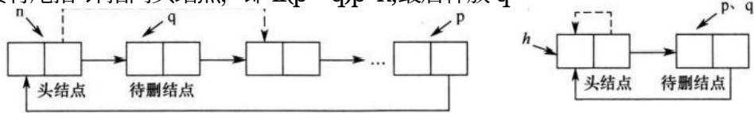

原文页码：1；bbox：`[174, 553, 836, 623]`

**图注：** 图1 图2

## 图 2

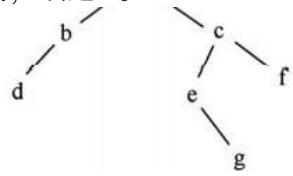

原文页码：3；bbox：`[423, 239, 627, 325]`

## 图 3

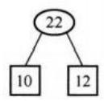

原文页码：3；bbox：`[143, 450, 233, 512]`

## 图 4

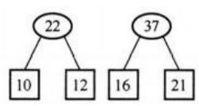

原文页码：3；bbox：`[254, 447, 429, 513]`

**图注：** 第二步

## 图 5

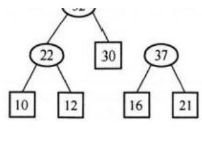

原文页码：3；bbox：`[460, 421, 666, 537]`

## 图 6

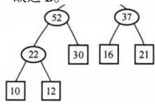

原文页码：3；bbox：`[681, 409, 895, 510]`

## 图 7

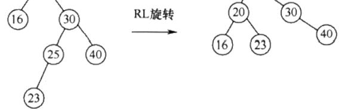

原文页码：3；bbox：`[326, 679, 722, 771]`

## 图 8

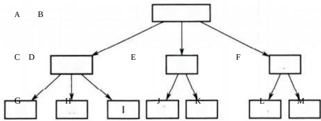

原文页码：5；bbox：`[306, 340, 753, 460]`

## 图 9

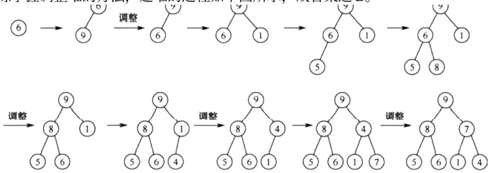

原文页码：5；bbox：`[184, 675, 846, 842]`

## 图 10

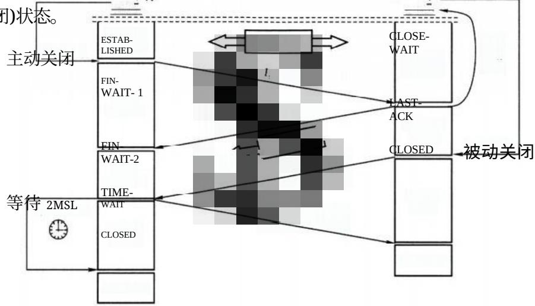

原文页码：15；bbox：`[229, 175, 858, 429]`

## 图 11

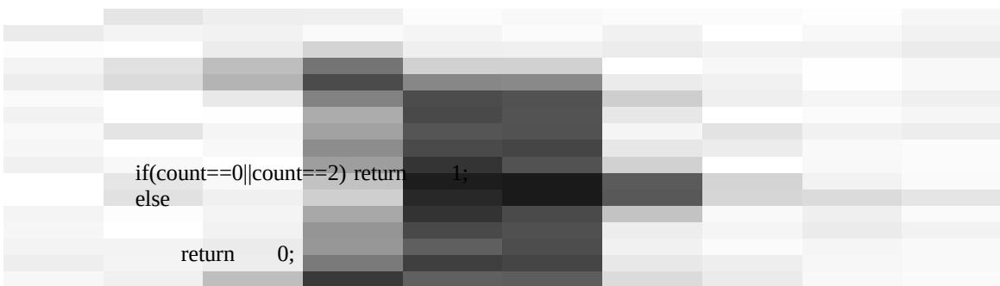

原文页码：17；bbox：`[104, 50, 914, 214]`
