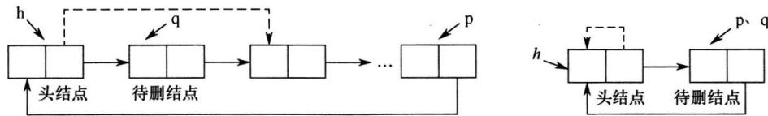
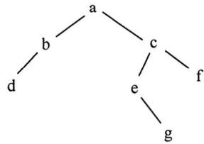
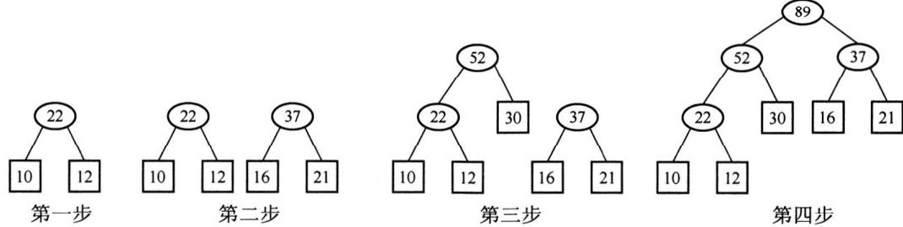
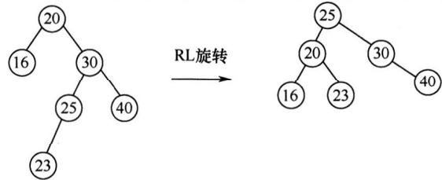
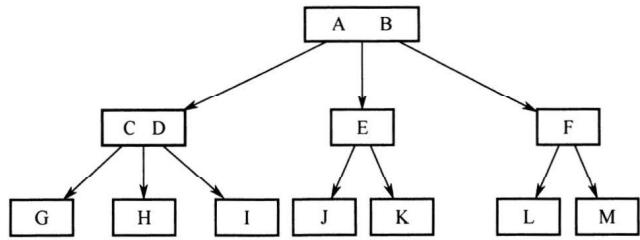
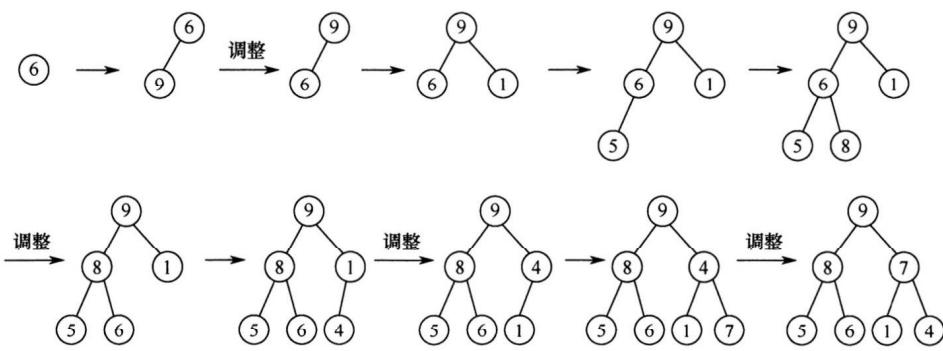
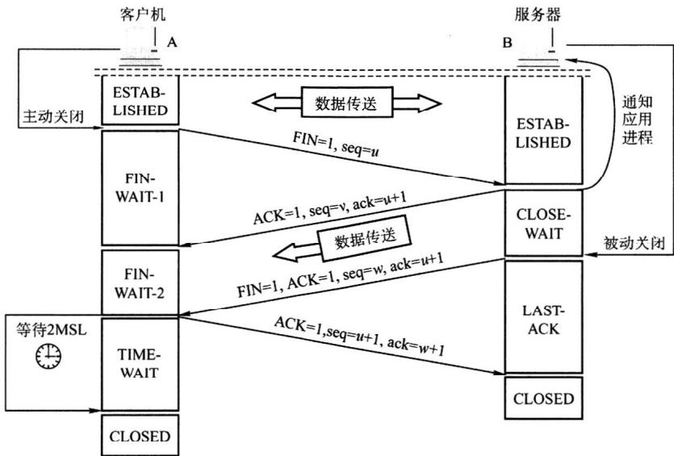

# 2021年计算机408统考真题解析.pdf — 图像索引

> 由 MinerU 结构化结果生成。题目若依赖树形、拓扑、流程、曲线、区域、时序或其他空间关系，应核对这里的原图，不要只依据 OCR 文本推断。

## 图 1

原文页码：1；bbox：`[174, 545, 834, 615]`

**图注：** 图 1 图 2

## 图 2

原文页码：2；bbox：`[425, 233, 625, 333]`

## 图 3

原文页码：2；bbox：`[145, 395, 893, 528]`

## 图 4

原文页码：2；bbox：`[328, 631, 720, 744]`

## 图 5

原文页码：3；bbox：`[289, 313, 735, 431]`

## 图 6

原文页码：3；bbox：`[186, 598, 844, 771]`

## 图 7

原文页码：8；bbox：`[236, 175, 819, 454]`
