# 2022年计算机408统考真题解析.docx — 图像索引

> 由 MinerU 结构化结果生成。题目若依赖树形、拓扑、流程、曲线、区域、时序或其他空间关系，应核对这里的原图，不要只依据 OCR 文本推断。

## 图 1

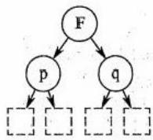

原文页码：1；bbox：`[488, 612, 624, 699]`

## 图 2

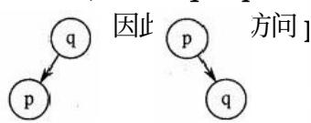

原文页码：1；bbox：`[249, 632, 486, 697]`

## 图 3

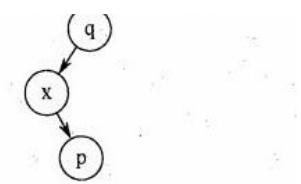

原文页码：1；bbox：`[661, 670, 871, 759]`

**图注：** 图1 图2 图3 图4

## 图 4

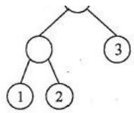

原文页码：3；bbox：`[298, 45, 430, 122]`

**图注：** 图1

## 图 5

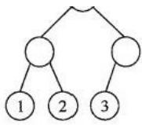

原文页码：3；bbox：`[567, 47, 693, 124]`

**图注：** 图2

## 图 6

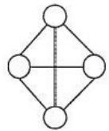

原文页码：3；bbox：`[169, 236, 265, 315]`

**图注：** 图1

## 图 7

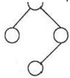

原文页码：3；bbox：`[415, 236, 510, 310]`

**图注：** 图2 图3

## 图 8

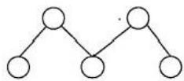

原文页码：3；bbox：`[660, 265, 824, 315]`

## 图 9

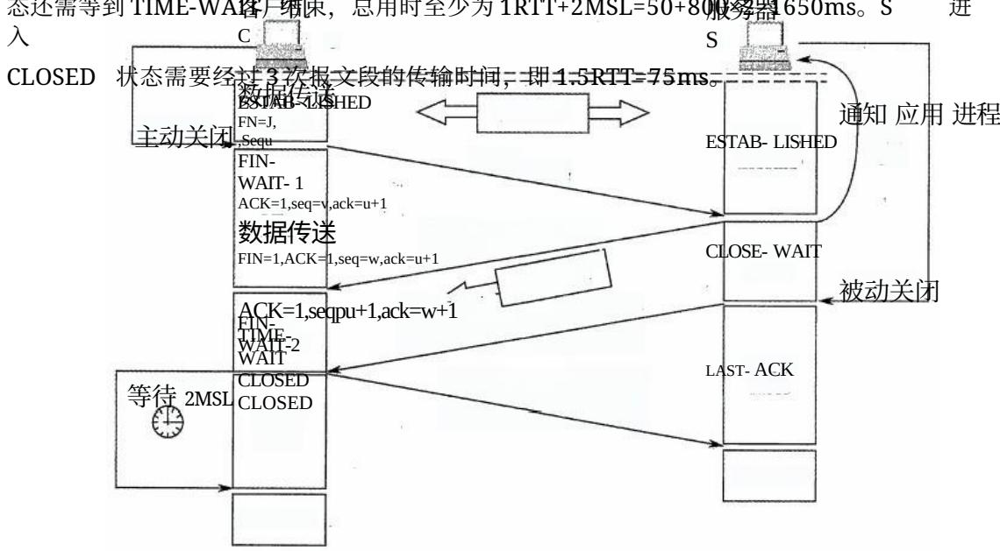

原文页码：11；bbox：`[120, 106, 920, 412]`

## 图 10

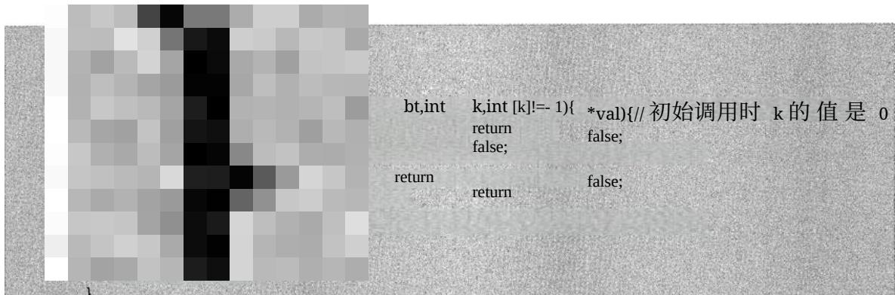

原文页码：13；bbox：`[107, 22, 939, 213]`

## 图 11

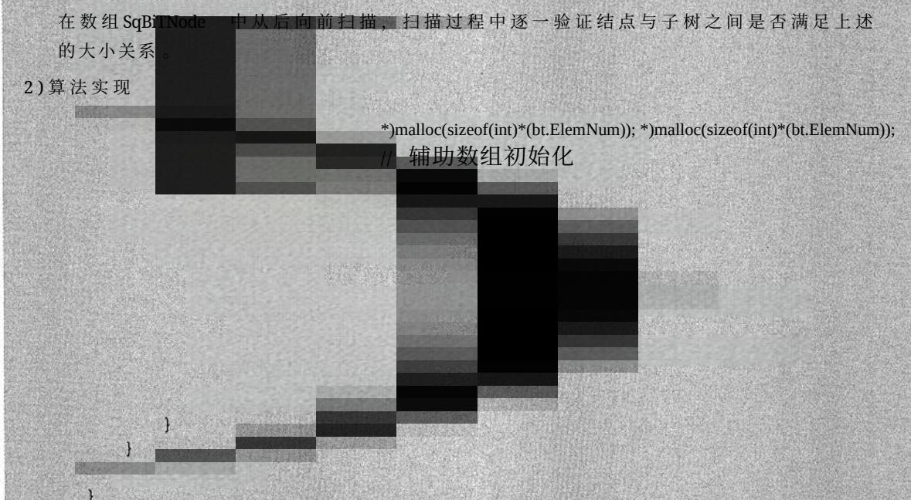

原文页码：13；bbox：`[111, 497, 939, 812]`
