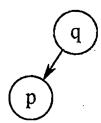
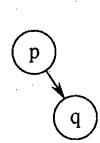
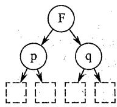
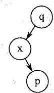
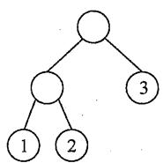
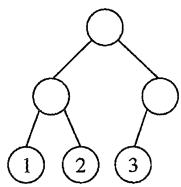
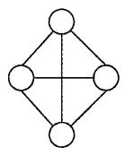
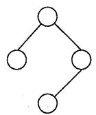
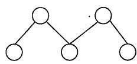
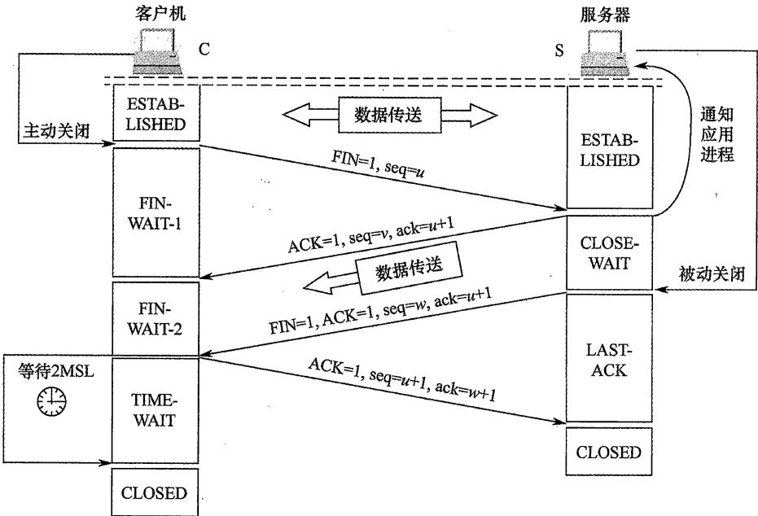

# 2022年计算机408统考真题解析.pdf — 图像索引

> 由 MinerU 结构化结果生成。题目若依赖树形、拓扑、流程、曲线、区域、时序或其他空间关系，应核对这里的原图，不要只依据 OCR 文本推断。

## 图 1

原文页码：1；bbox：`[249, 636, 319, 696]`

**图注：** 图1

## 图 2

原文页码：1；bbox：`[368, 627, 438, 696]`

**图注：** 图2

## 图 3

原文页码：1；bbox：`[489, 612, 623, 697]`

**图注：** 图3

## 图 4

原文页码：1；bbox：`[668, 605, 742, 695]`

**图注：** 图4

## 图 5

原文页码：2；bbox：`[300, 50, 428, 139]`

**图注：** 图1

## 图 6

原文页码：2；bbox：`[567, 50, 693, 140]`

**图注：** 图2

## 图 7

原文页码：2；bbox：`[169, 235, 272, 314]`

## 图 8

原文页码：2；bbox：`[415, 235, 512, 316]`

**图注：** 图1

## 图 9

原文页码：2；bbox：`[660, 264, 822, 317]`

**图注：** 图2 图3

## 图 10

原文页码：6；bbox：`[192, 125, 846, 433]`
