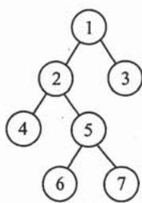
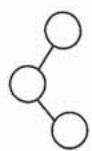
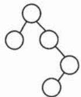
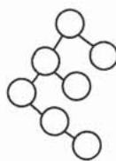
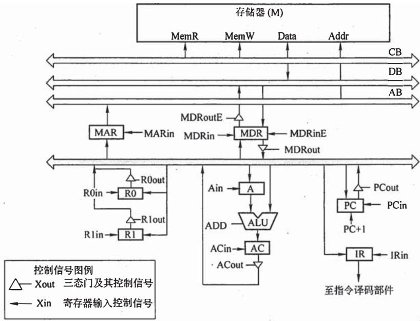
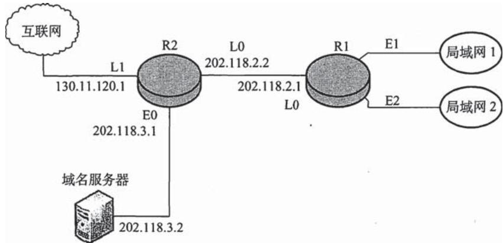

# 2009年计算机408统考真题.pdf — 图像索引

> 由 MinerU 结构化结果生成。题目若依赖树形、拓扑、流程、曲线、区域、时序或其他空间关系，应核对这里的原图，不要只依据 OCR 文本推断。

## 图 1

原文页码：1；bbox：`[784, 467, 892, 576]`

## 图 2

原文页码：1；bbox：`[166, 595, 221, 659]`

## 图 3

原文页码：1；bbox：`[326, 593, 413, 657]`

## 图 4

原文页码：1；bbox：`[517, 587, 601, 659]`

## 图 5

原文页码：1；bbox：`[707, 583, 786, 660]`

## 图 6

原文页码：5；bbox：`[253, 668, 747, 934]`

## 图 7

原文页码：6；bbox：`[240, 733, 754, 909]`
