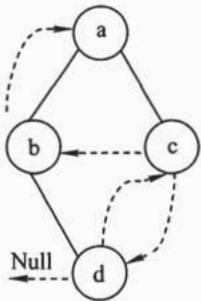
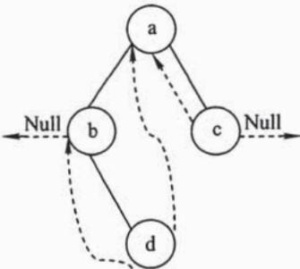
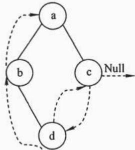
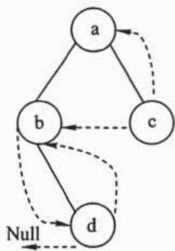
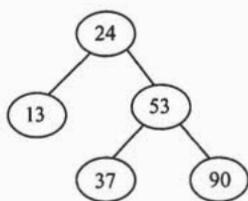
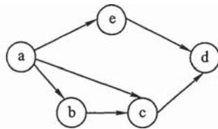
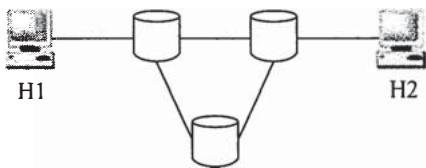
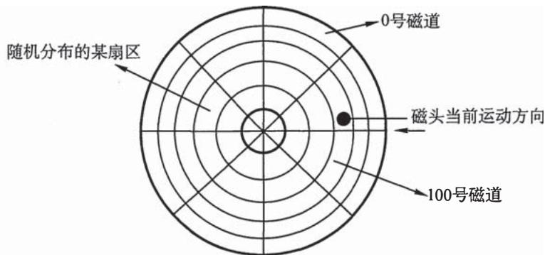
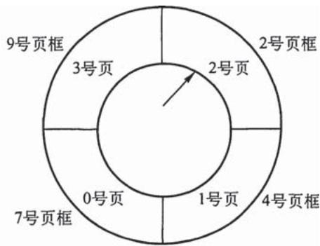

# 2010年计算机408统考真题.pdf — 图像索引

> 由 MinerU 结构化结果生成。题目若依赖树形、拓扑、流程、曲线、区域、时序或其他空间关系，应核对这里的原图，不要只依据 OCR 文本推断。

## 图 1

原文页码：1；bbox：`[147, 461, 268, 590]`

## 图 2

原文页码：1；bbox：`[280, 461, 482, 590]`

## 图 3

原文页码：1；bbox：`[507, 461, 670, 590]`

## 图 4

原文页码：1；bbox：`[690, 459, 820, 591]`

## 图 5

原文页码：1；bbox：`[715, 631, 865, 717]`

## 图 6

原文页码：2；bbox：`[722, 144, 910, 223]`

## 图 7

原文页码：5；bbox：`[616, 119, 873, 191]`

## 图 8

原文页码：7；bbox：`[247, 295, 709, 448]`

## 图 9

原文页码：7；bbox：`[337, 755, 613, 904]`
