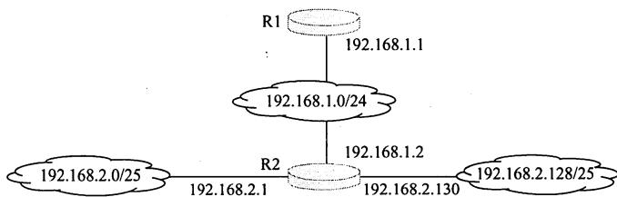
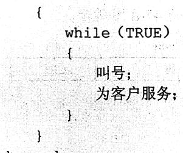
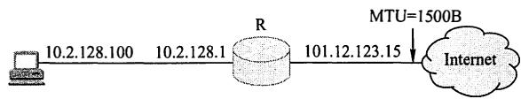
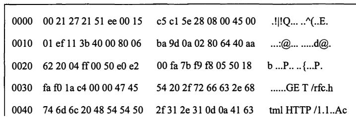
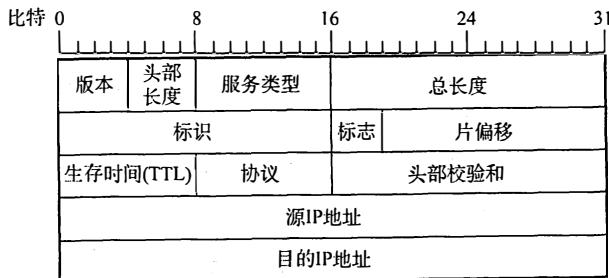

# 2011年计算机408统考真题.pdf — 图像索引

> 由 MinerU 结构化结果生成。题目若依赖树形、拓扑、流程、曲线、区域、时序或其他空间关系，应核对这里的原图，不要只依据 OCR 文本推断。

## 图 1

原文页码：4；bbox：`[287, 665, 761, 770]`

## 图 2

原文页码：7；bbox：`[144, 76, 353, 198]`

## 图 3

原文页码：7；bbox：`[277, 442, 685, 495]`

## 图 4

原文页码：7；bbox：`[229, 528, 727, 642]`

**图注：** 题47-a图 网络拓扑 题 47-b 图 以太网数据帧（前 80B）

## 图 5

原文页码：8；bbox：`[298, 179, 720, 314]`

**图注：** 题 47-d 图 IP 分组头结构
