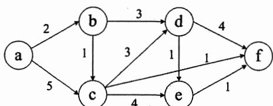
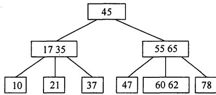
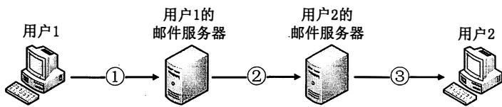
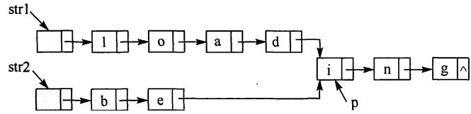
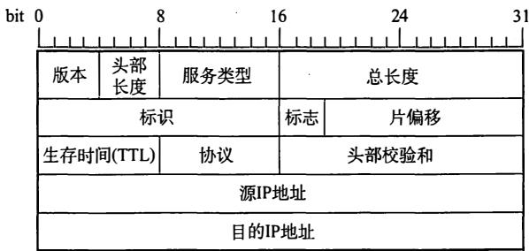
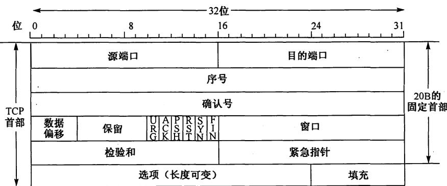

# 2012年计算机408统考真题.pdf — 图像索引

> 由 MinerU 结构化结果生成。题目若依赖树形、拓扑、流程、曲线、区域、时序或其他空间关系，应核对这里的原图，不要只依据 OCR 文本推断。

## 图 1

原文页码：1；bbox：`[566, 777, 889, 864]`

## 图 2

原文页码：2；bbox：`[355, 212, 658, 304]`

## 图 3

原文页码：5；bbox：`[239, 645, 729, 718]`

## 图 4

原文页码：6；bbox：`[282, 108, 744, 186]`

## 图 5

原文页码：8；bbox：`[301, 561, 717, 697]`

## 图 6

原文页码：8；bbox：`[206, 732, 816, 908]`

**图注：** 题 47-a 图 IP 分组头结构 题 47-b 图 TCP 段头结构
