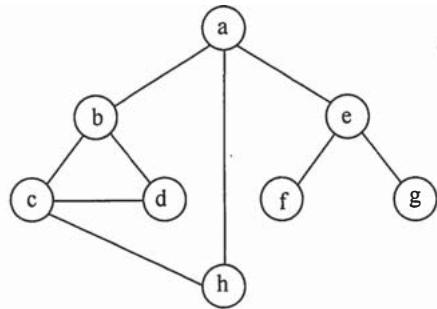
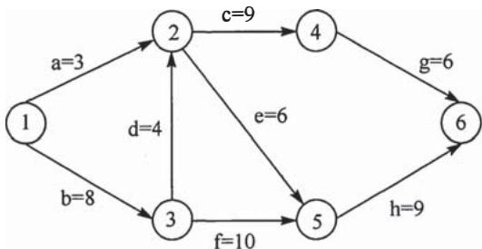
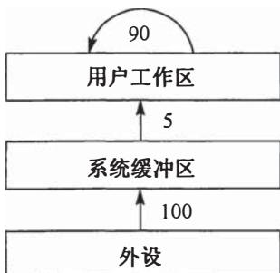
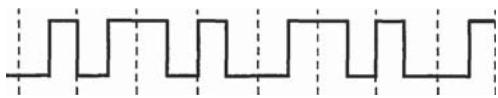
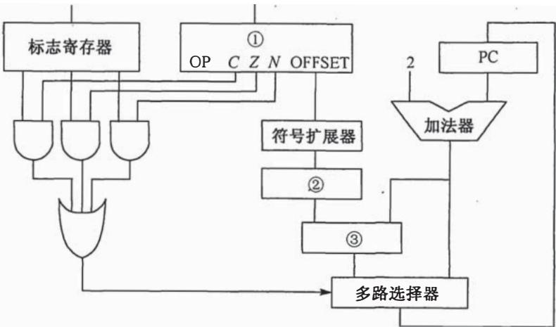
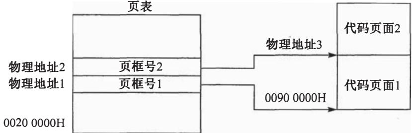
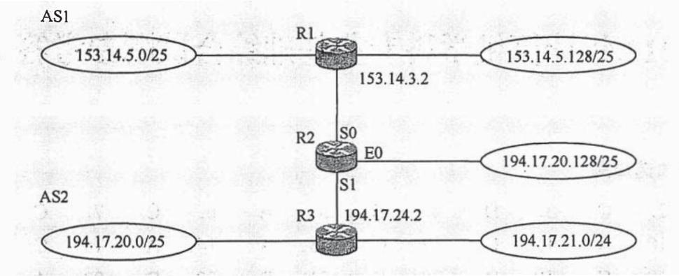

# 2013年计算机408统考真题.pdf — 图像索引

> 由 MinerU 结构化结果生成。题目若依赖树形、拓扑、流程、曲线、区域、时序或其他空间关系，应核对这里的原图，不要只依据 OCR 文本推断。

## 图 1

原文页码：2；bbox：`[364, 133, 628, 264]`

## 图 2

原文页码：2；bbox：`[337, 309, 658, 427]`

## 图 3

原文页码：4；bbox：`[403, 258, 589, 387]`

## 图 4

原文页码：5；bbox：`[347, 87, 648, 129]`

## 图 5

原文页码：7；bbox：`[268, 87, 746, 286]`

## 图 6

原文页码：7；bbox：`[253, 796, 754, 910]`

## 图 7

原文页码：8；bbox：`[186, 136, 773, 305]`

**图注：** 题 47 图 网络拓扑结构 请回答下列问题。
