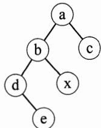
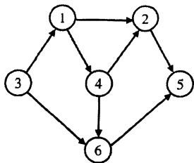
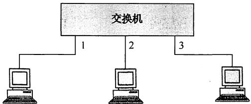
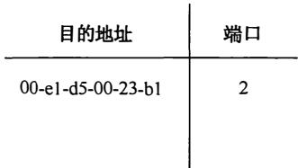
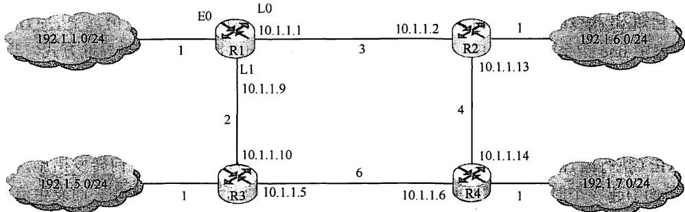

# 2014年计算机408统考真题.pdf — 图像索引

> 由 MinerU 结构化结果生成。题目若依赖树形、拓扑、流程、曲线、区域、时序或其他空间关系，应核对这里的原图，不要只依据 OCR 文本推断。

## 图 1

原文页码：1；bbox：`[433, 660, 549, 761]`

## 图 2

原文页码：2；bbox：`[399, 122, 590, 233]`

## 图 3

原文页码：4；bbox：`[204, 430, 554, 530]`

## 图 4

原文页码：4；bbox：`[608, 432, 837, 522]`

## 图 5

原文页码：5；bbox：`[144, 694, 836, 843]`

**图注：** 题 42 图 R1 构造的网络拓扑
