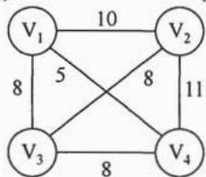
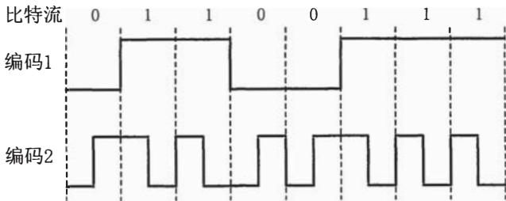
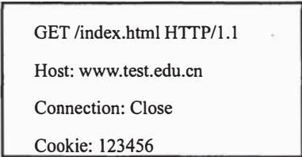
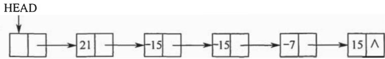
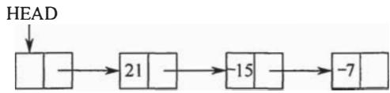
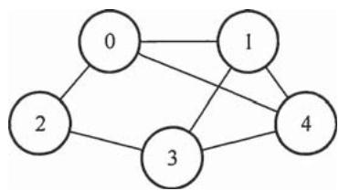
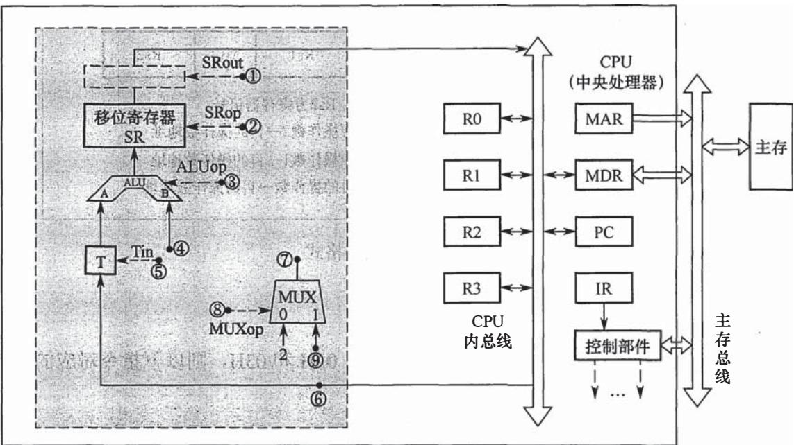
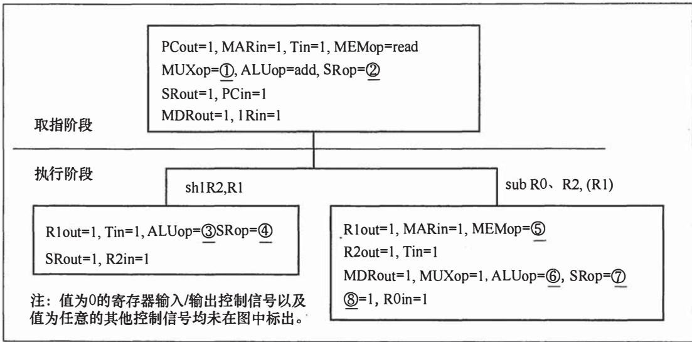
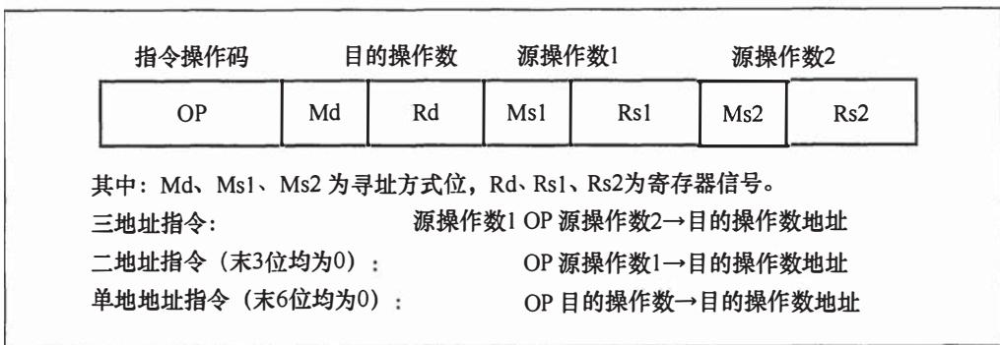
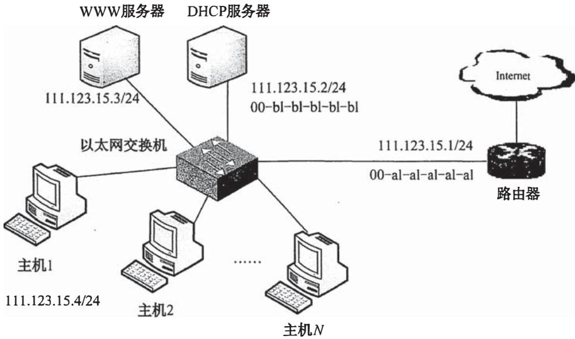

# 2015年计算机408统考真题.pdf — 图像索引

> 由 MinerU 结构化结果生成。题目若依赖树形、拓扑、流程、曲线、区域、时序或其他空间关系，应核对这里的原图，不要只依据 OCR 文本推断。

## 图 1

原文页码：1；bbox：`[443, 815, 579, 899]`

## 图 2

原文页码：4；bbox：`[285, 467, 670, 576]`

## 图 3

原文页码：5；bbox：`[391, 365, 621, 450]`

## 图 4

原文页码：5；bbox：`[275, 654, 734, 704]`

## 图 5

原文页码：5；bbox：`[356, 738, 653, 788]`

## 图 6

原文页码：6；bbox：`[379, 99, 603, 188]`

## 图 7

原文页码：6；bbox：`[147, 420, 838, 694]`

## 图 8

原文页码：7；bbox：`[173, 90, 840, 323]`

**图注：** 题 44 图 a 部分指令控制信号

## 图 9

原文页码：7；bbox：`[200, 404, 813, 554]`

**图注：** 题 44 图 b 指令格式

## 图 10

原文页码：8；bbox：`[200, 615, 793, 862]`
