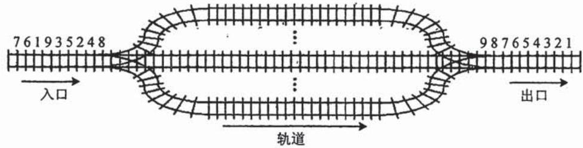
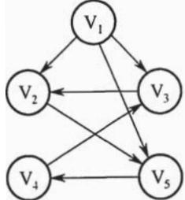
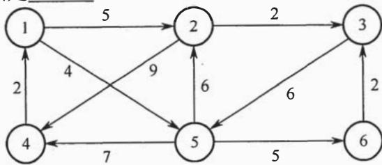
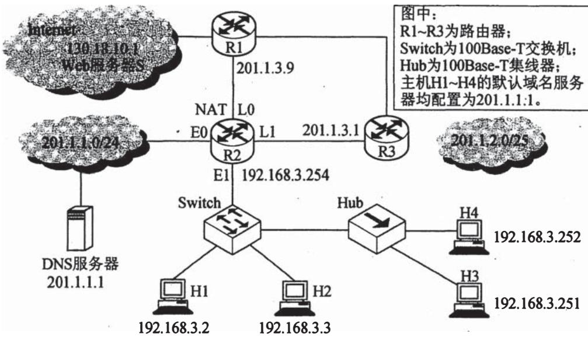
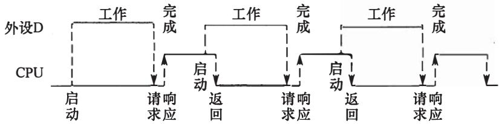
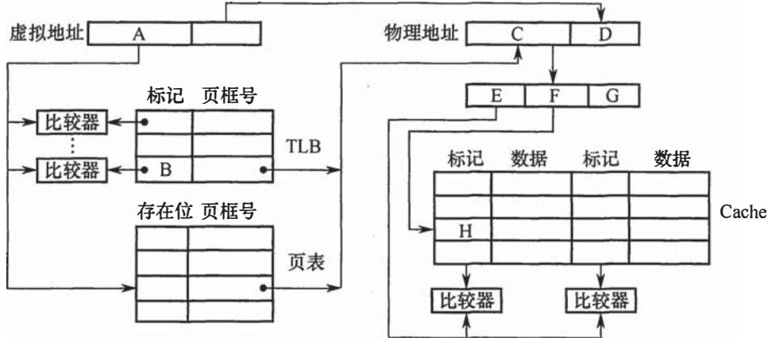
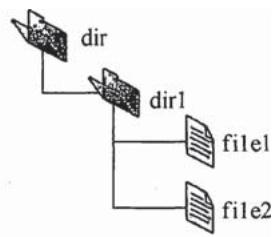

# 2016年计算机408统考真题.pdf — 图像索引

> 由 MinerU 结构化结果生成。题目若依赖树形、拓扑、流程、曲线、区域、时序或其他空间关系，应核对这里的原图，不要只依据 OCR 文本推断。

## 图 1

原文页码：1；bbox：`[208, 777, 798, 883]`

## 图 2

原文页码：2；bbox：`[416, 194, 557, 302]`

## 图 3

原文页码：2；bbox：`[322, 429, 653, 530]`

## 图 4

原文页码：6；bbox：`[184, 95, 793, 342]`

**图注：** 题 33\~41 图

## 图 5

原文页码：7；bbox：`[257, 720, 756, 808]`

## 图 6

原文页码：8；bbox：`[194, 115, 779, 296]`

## 图 7

原文页码：8；bbox：`[290, 700, 457, 801]`
