# 2017-2022计算机网络考研真题.pdf — 图像索引

> 由 MinerU 结构化结果生成。题目若依赖树形、拓扑、流程、曲线、区域、时序或其他空间关系，应核对这里的原图，不要只依据 OCR 文本推断。

## 图 1

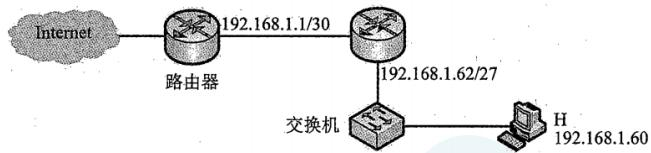

原文页码：1；bbox：`[275, 289, 730, 363]`

## 图 2

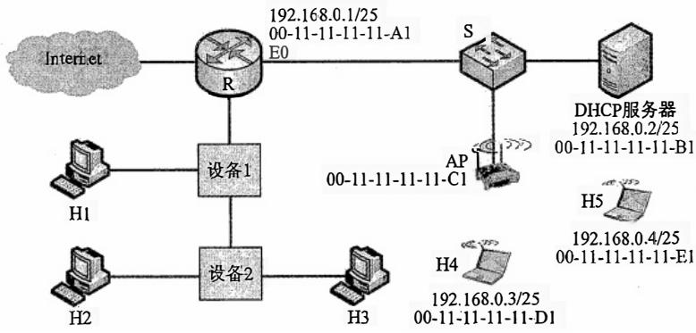

原文页码：2；bbox：`[234, 135, 778, 315]`

**图注：** 题47图

## 图 3

原文页码：3；bbox：`[282, 183, 713, 268]`

## 图 4

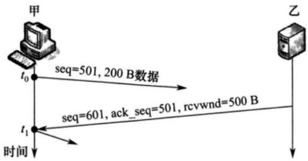

原文页码：4；bbox：`[321, 157, 688, 289]`

## 图 5

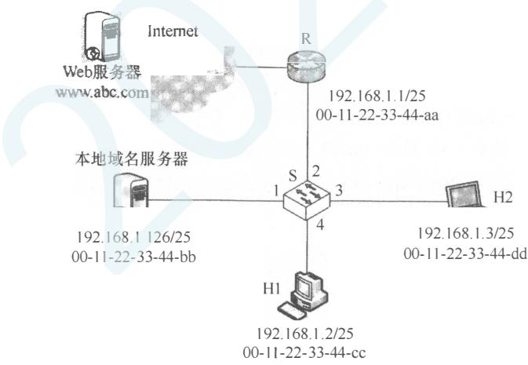

原文页码：4；bbox：`[287, 485, 767, 712]`

**图注：** 题47图

## 图 6

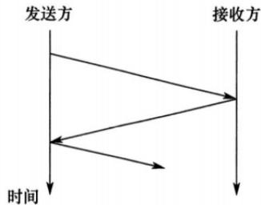

原文页码：5；bbox：`[463, 101, 695, 226]`

## 图 7

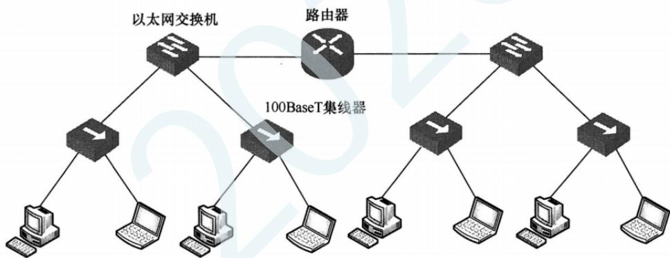

原文页码：5；bbox：`[155, 460, 846, 642]`

## 图 8

原文页码：6；bbox：`[335, 100, 668, 382]`

## 图 9

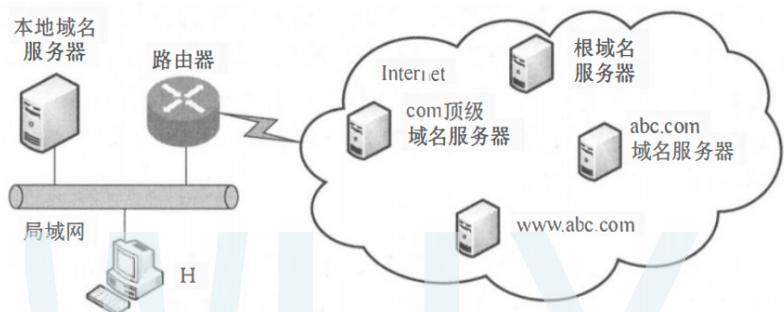

原文页码：6；bbox：`[238, 736, 794, 887]`

## 图 10

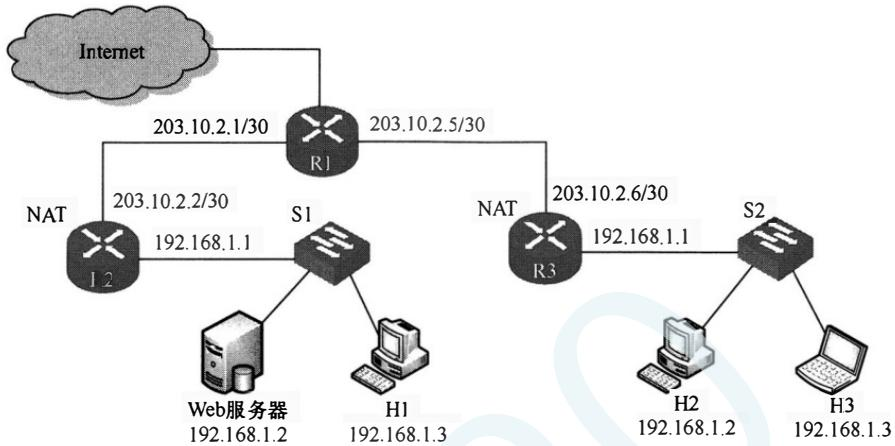

原文页码：7；bbox：`[159, 214, 800, 432]`

## 图 11

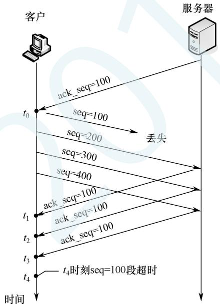

原文页码：8；bbox：`[314, 432, 606, 722]`

**图注：** 题38图

## 图 12

原文页码：9；bbox：`[247, 832, 756, 1000]`

## 图 13

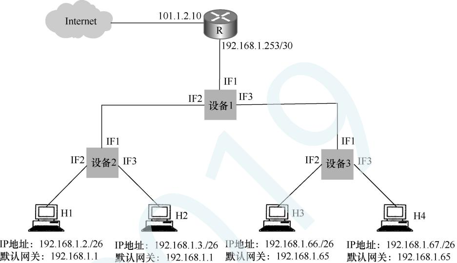

原文页码：9；bbox：`[190, 287, 813, 545]`

**图注：** 题47图

## 图 14

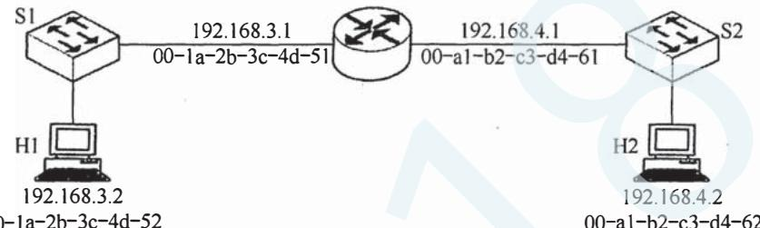

原文页码：10；bbox：`[213, 361, 719, 467]`

**图注：** 00-1a-2b-3c-4d-52 00-a1-b2-c3-d4-62

## 图 15

原文页码：10；bbox：`[685, 619, 751, 640]`

## 图 16

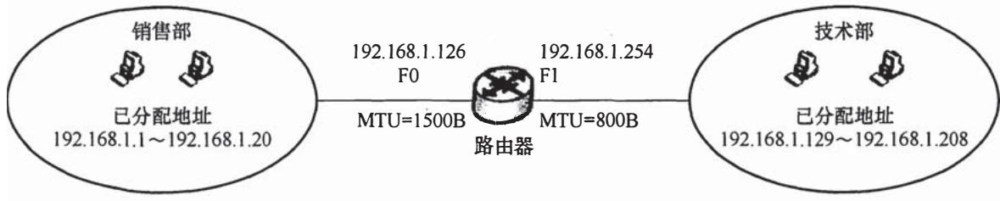

原文页码：11；bbox：`[137, 138, 850, 239]`

**图注：** 题47图

## 图 17

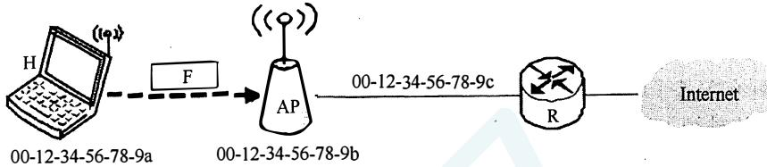

原文页码：12；bbox：`[213, 286, 807, 376]`

## 图 18

原文页码：13；bbox：`[318, 268, 471, 517]`

**图注：** (a)

## 图 19

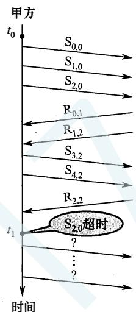

原文页码：13；bbox：`[509, 267, 664, 514]`

**图注：** (b)
