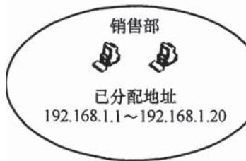
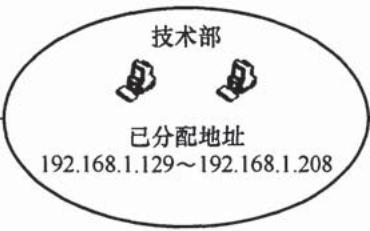

# 2017-2022计算机网络考研真题.pdf

## 一、单项选择题：01～40 小题，每小题 2 分，共 80 分。下列每题给出的四个选项中，只有一个选项是最符合题目要求的。

33. 在 ISO/OSI 参考模型中, 实现两个相邻结点间流量控制功能的是 ( )。 A. 物理层 B. 数据链路层 C. 网络层 D. 传输层

34. 在一条带宽为 $200 \mathrm{kHz}$ 的无噪声信道上, 若采用 4 个幅值的 ASK 调制, 则该信道的最大数据传输速率是 ( )。 A. $200 \mathrm{kbps}$ B. $400 \mathrm{kbps}$ C. $800 \mathrm{kbps}$ D. $1600 \mathrm{kbps}$

35. 若某主机的 IP 地址是 183.80.72.48，子网掩码是 255.255.192.0，则该主机所在网络的网络地址是（）。A. 183.80.0.0 B. 183.80.64.0 C. 183.80.72.0 D. 183.80.192.0

36. 下图所示网络中的主机 H 的子网掩码与默认网关分别是（）。

A. 255.255.255.192, 192.168.1.1 B. 255.255.255.192, 192.168.1.62 C. 255.255.255.224, 192.168.1.1 D. 255.255.255.224, 192.168.1.62

37. 在 SDN 网络体系结构中，SDN 控制器向数据平面的 SDN 交换机下发流表时所使用的接口是（）。A. 东向接口 B. 南向接口 C. 西向接口 D. 北向接口

38. 假设主机甲和主机乙已建立一个 TCP 连接，最大段长 MSS = 1 KB，甲一直有数据向乙发送当甲的拥塞窗口为 16 KB 时，计时器发生了超时，则甲的拥塞窗口再次增长到 16 KB 所需要的时间至少是（）。A. 4 RTT B. 5 RTT C. 11 RTT D. 16 RTT

39. 假设客户 C 和服务器 S 已建立一个 TCP 连接，通信往返时间 RTT = 50 ms，最长报文段寿命 MSL = 800 ms，数据传输结束后，C 主动请求断开连接。若从 C 主动向 S 发出 FIN 段时刻算起，则 C 和 S 进入 CLOSED 状态所需的时间至少分别是（）。A. 850 ms, 50 ms B. 1650 ms, 50 ms C. 850 ms, 75 ms D. 1650 ms, 75 ms

40. 假设主机 H 通过 HTTP/1.1 请求浏览某 Web 服务器 S 上的 Web 页 news408.html, news408.html

引用了同目录下的1幅图像，news408.html文件大小为1MSS（最大段长），图像文件大小为3MSS，H访问S的往返时间RTT=10ms，忽略HTTP响应报文的首部开销和TCP段传输时延。若H已完成域名解析，则从H请求与S建立TCP连接时刻起，到接收到全部内容止，所需的时间至少是（）。A. 30 ms B. 40 ms C. 50 ms D. 60 ms

## 二、综合应用题：41～47 小题，共 70 分。

47.（9分）某网络拓扑如题47图所示，R为路由器，S为以太网交换机，AP是802.11接入点，路由器的E0接口和DHCP服务器的IP地址配置如图中所示；H1与H2属于同一个广播域，但不属于同一个冲突域；H2和H3属于同一个冲突域；H4和H5已经接入网络，并通过DHCP动态获取了IP地址。现有路由器、100BaseT以太网交换机和100BaseT集线器（Hub）三类设备各若干台。

  
题47图

请回答下列问题。

1）设备 1 和设备 2 应该分别选择哪类设备？

2）若信号传播速度为 $2 \times 10^{8} \mathrm{~m} / \mathrm{s}$ ，以太网最小帧长为 $64 \mathrm{~B}$ ，信号通过设备 2 时会产生额外的 $1.51 \mu \mathrm{s}$ 的时间延迟，则 H2 与 H3 之间可以相距的最远距离是多少？

3）在 H4 通过 DHCP 动态获取 IP 地址过程中，H4 首先发送了 DHCP 报文 M，M 是哪种 DHCP 报文？路由器 E0 接口能否收到封装 M 的以太网帧？S 向 DHCP 服务器转发的封装 M 的以太网帧的目的 MAC 地址是什么？

4）若 H4 向 H5 发送一个 IP 分组 P，则 H5 收到的封装 P 的 802.11 帧的地址 1、地址 2 和地址 3 分别是什么？

33. 在 TCP/IP 参考模型中，由传输层相邻的下一层实现的主要功能是（）。A. 对话管理 B. 路由选择 C. 端到端报文段传输 D. 结点到结点流量控制

34. 若下图为一段差分曼彻斯特编码信号波形，则其编码的二进制位串是（）。

A. 1011 1001 B. 1101 0001 C. 0010 1110 D. 1011 0110

35. 现将一个 IP 网络划分为 3 个子网，若其中一个子网是 192.168.9.128/26，则下列网络中，不可能是另外两个子网之一的是（）。A. 192.168.9.0/25 B. 192.168.9.0/26 C. 192.168.9.192/26 D. 192.168.9.192/27

36. 若路由器向 MTU = 800B 的链路转发一个总长度为 1580B 的 IP 数据报（首部长度为 20B）时，进行了分片，且每个分片尽可能大，则第 2 个分片的总长度字段和 MF 标志位的值分别是（）。A. 796,0 B. 796,1 C. 800,0 D. 800,1

37. 某网络中的所有路由器均采用距离向量路由算法计算路由。若路由器 E 与邻居路由器 A, B, C 和 D 之间的直接链路距离分别是 8, 10, 12 和 6，且 E 收到邻居路由器的距离向量如下表所示，则路由器 E 更新后的到达目的网络 Net1～Net4 的距离分别是（）。

<table><tr><td>目的网络</td><td>A 的距离向量</td><td>B 的距离向量</td><td>C 的距离向量</td><td>D 的距离向量</td></tr><tr><td>Net1</td><td>1</td><td>23</td><td>20</td><td>22</td></tr><tr><td>Net2</td><td>12</td><td>35</td><td>30</td><td>28</td></tr><tr><td>Net3</td><td>24</td><td>18</td><td>16</td><td>36</td></tr><tr><td>Net4</td><td>36</td><td>30</td><td>8</td><td>24</td></tr></table>

A. 9, 10, 12, 6 B. 9, 10, 28, 20 C. 9, 20, 12, 20 D. 9, 20, 28, 20

38. 若客户首先向服务器发送 FIN 段请求断开 TCP 连接，则当客户收到服务器发送的 FIN 段并向服务器发送了 ACK 段后，客户的 TCP 状态转换为（）。A. CLOSE\_WAIT B. TIME\_WAIT C. FIN\_WAIT\_1 D. FIN\_WAIT\_2

39. 若大小为 12B 的应用层数据分别通过 1 个 UDP 数据报和 1 个 TCP 段传输，则该 UDP 数据报和 TCP 段实现的有效载荷（应用层数据）最大传输效率分别是（）。A. 37.5%, 16.7% B. 37.5%, 37.5% C. 60.0%, 16.7% D. 60.0%, 37.5%

40. 设主机甲通过 TCP 向主机乙发送数据，部分过程如下图所示。甲在 $t_0$ 时刻发送一个序号 seq = 501、封装 200B 数据的段，在 $t_1$ 时刻收到乙发送的序号 seq = 601、确认序号 ack\_seq = 501、接收窗口 rcvwnd = 500B 的段，则甲在未收到新的确认段之前，可以继续向乙发送的数据序号范围是（）。

## 二、综合应用题

47. （9分）某网络拓扑如题47图所示，以太网交换机S通过路由器R与Internet互联。路由器部分接口、本地域名服务器、H1、H2的地址和地址如图中所示。在 $t_0$ 时刻1的ARP表和S的交换表均为空，H1在此刻利用浏览器通过域名www.abc.com请求访问Web服务器，在 $t_1$ 时刻 $(t_1 > t_0)$ S第一次收到了封装HTTP请求报文的以太网帧，假设从 $t_0$ 到 $t_1$ 期间网络未发生任何与此次Web访问无关的网络通信。

  
题47图

请回答下列问题。

1）从 $t_{0}$ 到 $t_{1}$ 期间，H1 除了 HTTP 之外还运行了哪个应用层协议？从应用层到数据链路层，该应用层协议报文是通过哪些协议进行逐层封装的？

2）若 S 的交换表结构为<MAC 地址，端口>，则 $t_{1}$ 时刻 S 交换表的内容是什么？

3）从 $t_0$ 到 $t_1$ 期间，H2至少会接收到几个与此次Web访问相关的帧？接收到的是什么帧？帧的目的MAC地址是什么？

33. 下图描述的协议要素是（）。

I. 语法 II. 语义 III. 时序 A. 仅 I B. 仅 II C. 仅 III D. I、II 和 III

34. 下列关于虚电路网络的叙述中，错误的是（ ）。A. 可以确保数据分组传输顺序B. 需要为每条虚电路预分配带宽C. 建立虚电路时需要进行路由选择D. 依据虚电路号（VCID）进行数据分组转发

35. 在下图所示的网络中，冲突域和广播域的个数分别是（）。

A. 2,2 B. 2,4 C. 4,2 D. 4,4

36. 假设主机甲采用停-等协议向主机乙发送数据帧，数据帧长与确认帧长均为 1000B，数据传输速率是 10kbps，单项传播延时是 200ms。则甲的最大信道利用率为（）。A. 80% B. 66.7% C. 44.4% D. 40%

37. 某 IEEE 802.11 无线局域网中，主机 H 与 AP 之间发送或接收 CSMA/CA 帧的过程如下图所示。在 H 或 AP 发送帧前所等待的帧间间隔时间（IFS）中，最长的是（）。

A. IFS1 B. IFS2 C. IFS3 D. IFS4

38. 若主机甲与主机乙已建立一条 TCP 连接，最大段长（MSS）为 1KB，往返时间（RTT）为 2ms，则在不出现拥塞的前提下，拥塞窗口从 8KB 增长到 32KB 所需的最长时间是（）。A. 4ms B. 8ms C. 24ms D. 48ms

39. 若主机甲与主机乙建立 TCP 连接时，发送的 SYN 段中的序号为 1000，在断开连接时，甲发送给乙的 FIN 段中的序号为 5001，则在无任何重传的情况下，甲向乙已经发送的应用层数据的字节数为（）。A. 4002 B. 4001 C. 4000 D. 3999

40. 假设下图所示网络中的本地域名服务器只提供递归查询服务，其他域名服务器均只提供迭代查询服务；局域网内主机访问 Internet 上各服务器的往返时间（RTT）均为 10ms，忽略其他各种时延。若主机 H 通过超链接 http://www.abc.com/index.html 请求浏览纯文本 Web 页 index.html，则从点击超链接开始到浏览器接收到 index.html 页面为止，所需的最短时间与最长时间分别是（）。

A. 10ms, 40ms B. 10ms, 50ms C. 20ms, 40ms D. 20ms, 50ms

## 二、综合应用题

47.（9 分）某校园网有两个局域网，通过路由器 R1、R2 和 R3 互联后接入 Internet，S1 和 S2 为以太网交换机。局域网采用静态 IP 地址配置，路由器部分接口以及各主机的 IP 地址如下图所示。

  
假设 NAT 转换表结构为

<table><tr><td colspan="2">外网</td><td colspan="2">内网</td></tr><tr><td>IP地址</td><td>端口号</td><td>IP地址</td><td>端口号</td></tr><tr><td></td><td></td><td></td><td></td></tr></table>

请回答下列问题:

1）为使 H2 和 H3 能够访问 Web 服务器（使用默认端口号），需要进行什么配置？

2）若 H2 主动访问 Web 服务器时，将 HTTP 请求报文封装到 IP 数据报 P 中发送，则 H2 发送 P 的源 IP 地址和目的 IP 地址分别是什么？经过 R3 转发后，P 的源 IP 地址和目的 IP 地址分别是什么？经过 R2 转发后，P 的源 IP 地址和目的 IP 地址分别是什么？

33. OSI 参考模型的第 5 层（自下而上）完成的主要功能是\_\_\_\_。
A. 差错控制    B. 路由选择    C. 会话管理    D. 数据表示转换

34. 100BaseT 快速以太网使用的导向传输介质是\_\_\_\_。
A. 双绞线    B. 单模光纤    C. 多模光纤    D. 同轴电缆

35. 对于滑动窗口协议，若分组序号采用 3 比特编号，发送窗口大小为 5，则接收窗口最大是 \_\_\_\_。
A. 2 B. 3 C. 4 D. 5

36. 假设一个采用 CSMA/CD 协议的 10Mb/s 局域网，最小帧长是 128B，则在一个冲突域内两个站点之间的单向传播延时最多是 \_\_\_\_。
A. 2.56μs    B. 5.12μs    C. 10.24μs    D. 20.48μs

37. 若将 101.200.16.0/20 划分为 5 个子网, 则可能的最小子网的可分配 IP 地址数是 \_\_\_\_。
A. 126    B. 254    C. 510    D. 1022

38. 某客户通过一个 TCP 连接向服务器发送数据的部分过程如题 38 图所示。客户在 $t_0$ 时刻第一次收到确认序列号 ack\_seq = 100 的段，并发送序列号 seq = 100 的段，但发生丢失。若 TCP 支持快速重传，则客户重新发送 seq = 100 段的时刻是 \_\_\_\_。
A. $t_1$ B. $t_2$ C. $t_3$ D. $t_4$

  
题38图

39. 若主机甲主动发起一个与主机乙的 TCP 连接，甲、乙选择的初始序列号分别为 2018 和 2046，则第三次握手 TCP 段的确认序列号是 \_\_\_\_。
A. 2018    B. 2019    C. 2046    D. 2047

40. 下列关于网络应用模型的叙述中，错误的是\_\_\_\_。
A. 在 P2P 模型中，结点之间具有对等关系
B. 在客户/服务器（C/S）模型中，客户与客户之间可以直接通信
C. 在 C/S 模型中，主动发起通信的是客户，被动通信的是服务器
D. 在向多用户分发一个文件时，P2P 模型通常比 C/S 模型所需的时间短

## 二、综合应用题（第 41～47 小题，共 70 分）

47.（9 分）某网络拓扑如题 47 图所示，其中 R 为路由器，主机 H1～H4 的 IP 地址配置以及 R 的各接口 IP 地址配置如图中所示。现有若干以太网交换机（无 VLAN 功能）和路由器两类网络互连设备可供选择。

  
题47图

请回答下列问题:

（1）设备 1、设备 2 和设备 3 分别应选择什么类型的网络设备？

（2）设备 1、设备 2 和设备 3 中，哪几个设备的接口需要配置 IP 地址？为对应的接口配置正确的 IP 地址。

（3）为确保主机 H1～H4 能够访问 Internet，R 需要提供什么服务？

（4）若主机 H3 发送一个目的地址为 192.168.1.127 的 IP 数据报，网络中哪几个主机会接收该数据报？

33. 下列 TCP/P 应用层协议中，可以使用传输层无连接服务的是\_\_\_\_。
A. FTP    B. DNS    C. SMTP    D. HTTP

34. 下列选项中，不属于物理层接口规范定义范畴的是\_\_\_\_。
A. 接口形状    B. 引脚功能    C. 物理地址    D. 信号电平

35. IEEE 802.11 无线局域网的 MAC 协议 CSMA/CA 进行信道预约的方法是 \_\_\_\_。
A. 发送确认帧    B. 采用二进制指数退避
C. 使用多个 MAC 地址    D. 交换 RTS 与 CTS 帧

36. 主机甲采用停-等协议向主机乙发送数据, 数据传输速率是 $3 \mathrm{kbps}$ , 单向传播延时是 $200 \mathrm{~ms}$ , 忽略确认帧的传输延时。当信道利用率等于 $40 \%$ 时, 数据帧的长度为 \_\_\_\_ 。A. 240 比特 B. 400 比特 C. 480 比特 D. 800 比特

37. 路由器 R 通过以太网交换机 S1 和 S2 连接两个网络，R 的接口、主机 H1 和 H2 的 IP 地址与 MAC 地址如下图所示。若 H1 向 H2 发送 1 个 IP 分组 P，则 H1 发出的封装 P 的以太网帧的目的 MAC 地址、H2 收到的封装 P 的以太网帧的源 MAC 地址分别是 \_\_\_\_。

  
00-1a-2b-3c-4d-52  
00-a1-b2-c3-d4-62

A. 00-a1-b2-c3-d4-62, 00-1a-2b-3c-4d-52  
B. 00-a1-b2-c3-d4-62, 00-a1-b2-c3-d4-61  
C. 00-1a-2b-3c-4d-51, 00-1a-2b-3c-4d-52  
D. 00-1a-2b-3c-4d-51, 00-a1-b2-c3-d4-61

38. 某路由表中有转发接口相同的 4 条路由表项，其目的网络地址分别为 35.230.32.0/21, 35.230.40.0/21, 35.230.48.0/21 和 35.230.56.0/21，将该 4 条路由聚合后的目的网络地址为 \_\_\_\_。
A. 35.230.0.0/19
B. 35.230.0.0/20
C. 35.230.32.0/19
D. 35.230.32.0/20

39. UDP 协议实现分用（demultiplexing）时所依据的头部字段是\_\_\_\_。
A. 源端口号 B. 目的端口号 C. 长度 D. 校验和

40. 无须转换即可由 SMTP 协议直接传输的内容是\_\_\_\_。
A. JPEG 图像    B. MPEG 视频    C. EXE 文件    D. ASCII 文本

## 二、综合应用题（第 41～47 小题，共 70 分）

47. （7 分）某公司的网络如题 47 图所示。IP 地址空间 192.168.1.0/24 被均分给销售部和技术部两个子网，并已分别为部分主机和路由器接口分配了 IP 地址，销售部子网的 MTU = 1500B，技术部子网的 MTU = 800B。

请回答下列问题。

（1）销售部子网的广播地址是什么？技术部子网的子网地址是什么？若每个主机仅分配一个IP地址，则技术部子网还可以连接多少台主机？

  
题47图

（2）假设主机 192.168.1.1 向主机 192.168.1.208 发送一个总长度为 1500B 的 IP 分组，IP 分组的头部长度为 20B，路由器在通过接口 F1 转发该 IP 分组时进行了分片。若分片时尽可能分为最大片，则一个最大 IP 分片封装数据的字节数是多少？至少需要分为几个分片？每个分片的片偏移量是多少？

33. 假设 OSI 参考模型的应用层欲发送 400B 的数据（无拆分），除物理层和应用层之外，其他各层在封装 PDU 时均引入 20B 的额外开销，则应用层数据传输效率约为 \_\_\_\_。
A. 80%
B. 83%
C. 87%
D. 91%

34. 若信道在无噪声情况下的极限数据传输速率不小于信噪比为 30dB 条件下的极限数据传输速率，则信号状态数至少是\_\_\_\_。
A. 4 B. 8 C. 16 D. 32

35. 在下图所示的网络中，若主机 H 发送一个封装访问 Internet 的 IP 分组的 IEEE 802.11 数据帧 F，则帧 F 的地址 1、地址 2 和地址 3 分别是 \_\_\_\_。

A. 00-12-34-56-78-9a, 00-12-34-56-78-9b, 00-12-34-56-78-9c  
B. 00-12-34-56-78-9b, 00-12-34-56-78-9a, 00-12-34-56-78-9c  
C. 00-12-34-56-78-9b, 00-12-34-56-78-9c, 00-12-34-56-78-9a  
D. 00-12-34-56-78-9a, 00-12-34-56-78-9c, 00-12-34-56-78-9b

36. 下列 IP 地址中，只能作为 IP 分组的源 IP 地址但不能作为目的 IP 地址的是 \_\_\_\_。
A. 0.0.0.0
B. 127.0.0.1
C. 200.10.10.3
D. 255.255.255.255

37. 直接封装 RIP、OSPF、BGP 报文的协议分别是\_\_\_\_。
A. TCP、UDP、IP B. TCP、IP、UDP C. UDP、TCP、IP D. UDP、IP、TCP

38. 若将网络 21.3.0.0/16 划分为 128 个规模相同的子网，则每个子网可分配的最大 IP 地址个数是 \_\_\_\_。
A. 254 B. 256 C. 510 D. 512

39. 若甲向乙发起一个 TCP 连接，最大段长 MSS = 1KB，RTT = 5ms，乙开辟的接收缓存为 64KB，则甲从连接建立成功至发送窗口达到 32KB，需经过的时间至少是 \_\_\_\_。
A. 25ms    B. 30ms    C. 160ms    D. 165ms

40. 下列关于 FTP 协议的叙述中，错误的是\_\_\_\_。
A. 数据连接在每次数据传输完毕后就关闭
B. 控制连接在整个会话期间保持打开状态
C. 服务器与客户端的 TCP 20 端口建立数据连接
D. 客户端与服务器的 TCP 21 端口建立控制连接

## 二、综合应用题（第41～47小题，共70分）

47.（9分）甲乙双方均采用后退 $N$ 帧协议（GBN）进行持续的双向数据传输，且双方始终采用捎带确认，帧长均为 $1000\mathrm{B}$ 。 $\mathbf{S}_{x,y}$ 和 $\mathbb{R}_{x,y}$ 分别表示甲方和乙方发送的数据帧，其中 $x$ 是发送序号， $y$ 是确认序号（表示希望接收对方的下一帧序号）；数据帧的发送序号和确认序号字段均为3比特。信道传输速率为 $100\mathrm{Mbps}$ ， $\mathrm{RTT} = 0.96\mathrm{ms}$ 。下图给出了甲方发送数据帧和接收数据帧的两种场景，其中 $t_0$ 为初始时刻，此时甲方的发送和确认序号均为0， $t_1$ 时刻甲方有足够多的数据待发送。

  
(a)

  
(b)

请回答下列问题。

(1) 对于图 (a), $t_0$ 时刻到 $t_1$ 时刻期间, 甲方可以断定乙方已正确接收的数据帧数是多少? 正确接收的是哪几个帧? (请用 $\mathbf{S}_{x,y}$ 形式给出。)

（2）对于图（a），从 $t_{1}$ 时刻起，甲方在不出现超时且未收到乙方新的数据帧之前，最多还可以发送多少个数据帧？其中第一个帧和最后一个帧分别是哪个？（请用 $S_{x,y}$ 形式给出。）

（3）对于图（b），从 $t_1$ 时刻起，甲方在不出现新的超时且未收到乙方新的数据帧之前，需要重发多少个数据帧？重发的第一个帧是哪个？（请用 $\mathbf{S}_{xy}$ 形式给出。）

（4）甲方可以达到的最大信道利用率是多少？
