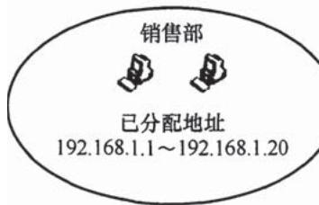
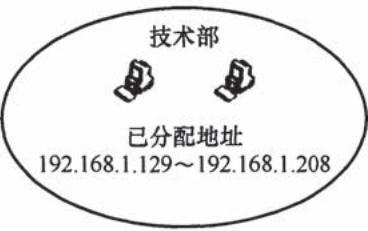

# 2018年计算机408统考真题.pdf

33. 下列 TCP/P 应用层协议中, 可以使用传输层无连接服务的是\_\_\_\_。
A. FTP 
B. DNS 
C. SMTP 
D. HTTP

34. 下列选项中，不属于物理层接口规范定义范畴的是\_\_\_\_。
A. 接口形状    B. 引脚功能    C. 物理地址    D. 信号电平

35. IEEE 802.11 无线局域网的 MAC 协议 CSMA/CA 进行信道预约的方法是 \_\_\_\_。
A. 发送确认帧    B. 采用二进制指数退避
C. 使用多个 MAC 地址    D. 交换 RTS 与 CTS 帧

36. 主机甲采用停-等协议向主机乙发送数据, 数据传输速率是 $3 \mathrm{kbps}$ , 单向传播延时是 $200 \mathrm{~ms}$ , 忽略确认帧的传输延时。当信道利用率等于 $40 \%$ 时, 数据帧的长度为 \_\_\_\_ 。A. 240 比特 B. 400 比特 C. 480 比特 D. 800 比特

37. 路由器 R 通过以太网交换机 S1 和 S2 连接两个网络，R 的接口、主机 H1 和 H2 的 IP 地址与 MAC 地址如下图所示。若 H1 向 H2 发送 1 个 IP 分组 P，则 H1 发出的封装 P 的以太网帧的目的 MAC 地址、H2 收到的封装 P 的以太网帧的源 MAC 地址分别是 \_\_\_\_。

  
00-1a-2b-3c-4d-52  
00-a1-b2-c3-d4-62

A. 00-a1-b2-c3-d4-62, 00-1a-2b-3c-4d-52  
B. 00-a1-b2-c3-d4-62, 00-a1-b2-c3-d4-61  
C. 00-1a-2b-3c-4d-51, 00-1a-2b-3c-4d-52  
D. 00-1a-2b-3c-4d-51, 00-a1-b2-c3-d4-61

38. 某路由表中有转发接口相同的 4 条路由表项，其目的网络地址分别为 35.230.32.0/21, 35.230.40.0/21, 35.230.48.0/21 和 35.230.56.0/21，将该 4 条路由聚合后的目的网络地址为 \_\_\_\_。
A. 35.230.0.0/19
B. 35.230.0.0/20
C. 35.230.32.0/19
D. 35.230.32.0/20

39. UDP 协议实现分用（demultiplexing）时所依据的头部字段是\_\_\_\_。
A. 源端口号 B. 目的端口号 C. 长度 D. 校验和

40. 无须转换即可由 SMTP 协议直接传输的内容是\_\_\_\_。
A. JPEG 图像    B. MPEG 视频    C. EXE 文件    D. ASCII 文本

## 二、综合应用题（第 41～47 小题，共 70 分）

47. （7 分）某公司的网络如题 47 图所示。IP 地址空间 192.168.1.0/24 被均分给销售部和技术部两个子网，并已分别为部分主机和路由器接口分配了 IP 地址，销售部子网的 MTU = 1500B，技术部子网的 MTU = 800B。

请回答下列问题。

（1）销售部子网的广播地址是什么？技术部子网的子网地址是什么？若每个主机仅分配一个IP地址，则技术部子网还可以连接多少台主机？

  
题47图

（2）假设主机 192.168.1.1 向主机 192.168.1.208 发送一个总长度为 1500B 的 IP 分组，IP 分组的头部长度为 20B，路由器在通过接口 F1 转发该 IP 分组时进行了分片。若分片时尽可能分为最大片，则一个最大 IP 分片封装数据的字节数是多少？至少需要分为几个分片？每个分片的片偏移量是多少？
