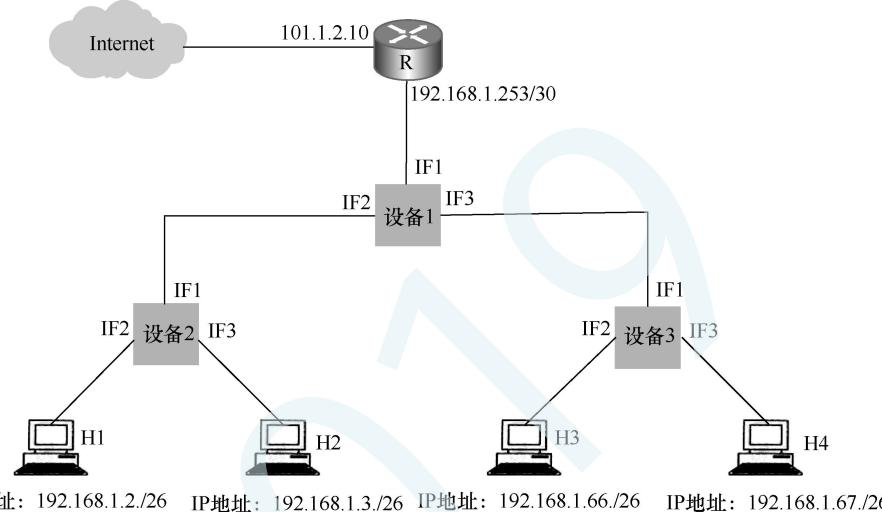

# 2019年计算机408统考真题.pdf — 图像索引

> 由 MinerU 结构化结果生成。题目若依赖树形、拓扑、流程、曲线、区域、时序或其他空间关系，应核对这里的原图，不要只依据 OCR 文本推断。

## 图 1

原文页码：1；bbox：`[314, 432, 606, 722]`

**图注：** 题38图

## 图 2

原文页码：2；bbox：`[219, 287, 805, 531]`

**图注：** 题 47 图
