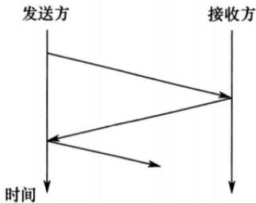
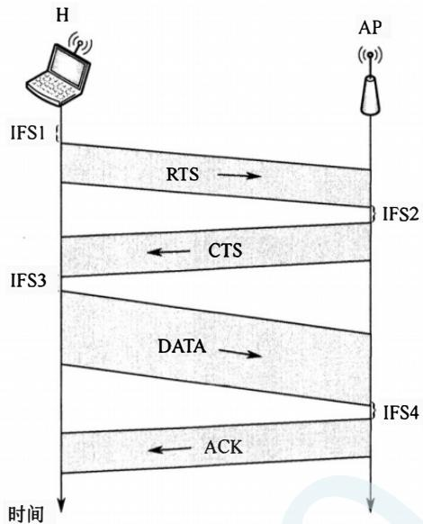
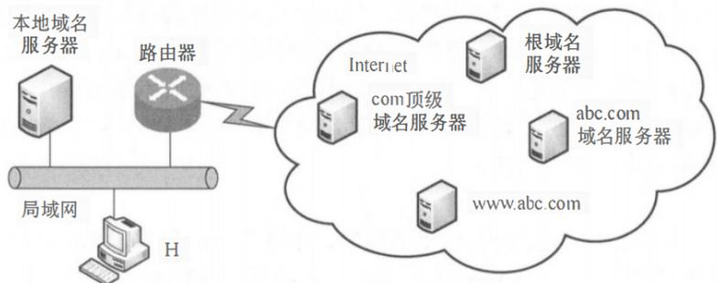
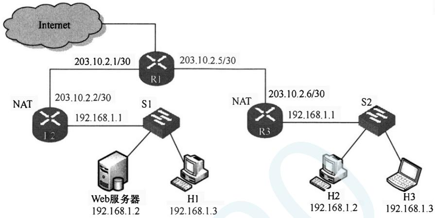

# 2020年计算机408统考真题.pdf — 图像索引

> 由 MinerU 结构化结果生成。题目若依赖树形、拓扑、流程、曲线、区域、时序或其他空间关系，应核对这里的原图，不要只依据 OCR 文本推断。

## 图 1

原文页码：1；bbox：`[465, 101, 695, 226]`

## 图 2

原文页码：1；bbox：`[155, 461, 846, 642]`

## 图 3

原文页码：2；bbox：`[335, 100, 668, 382]`

## 图 4

原文页码：2；bbox：`[238, 737, 794, 887]`

## 图 5

原文页码：3；bbox：`[159, 214, 800, 434]`
