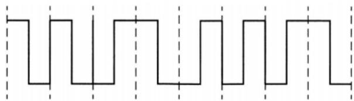
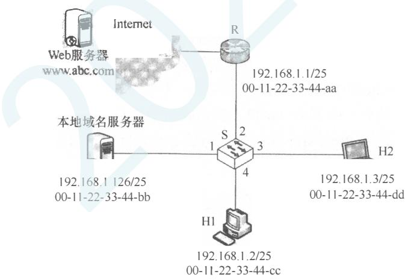

# 2021年计算机408统考真题.pdf

33. 在 TCP/IP 参考模型中，由传输层相邻的下一层实现的主要功能是（）。A. 对话管理 B. 路由选择 C. 端到端报文段传输 D. 结点到结点流量控制

34. 若下图为一段差分曼彻斯特编码信号波形，则其编码的二进制位串是（）。

A. 1011 1001 B. 1101 0001 C. 0010 1110 D. 1011 0110

35. 现将一个 IP 网络划分为 3 个子网，若其中一个子网是 192.168.9.128/26，则下列网络中，不可能是另外两个子网之一的是（）。A. 192.168.9.0/25 B. 192.168.9.0/26 C. 192.168.9.192/26 D. 192.168.9.192/27

36. 若路由器向 MTU = 800B 的链路转发一个总长度为 1580B 的 IP 数据报（首部长度为 20B）时，进行了分片，且每个分片尽可能大，则第 2 个分片的总长度字段和 MF 标志位的值分别是（）。A. 796,0 B. 796,1 C. 800,0 D. 800,1

37. 某网络中的所有路由器均采用距离向量路由算法计算路由。若路由器 E 与邻居路由器 A, B, C 和 D 之间的直接链路距离分别是 8, 10, 12 和 6，且 E 收到邻居路由器的距离向量如下表所示，则路由器 E 更新后的到达目的网络 Net1～Net4 的距离分别是（）。

<table><tr><td>目的网络</td><td>A 的距离向量</td><td>B 的距离向量</td><td>C 的距离向量</td><td>D 的距离向量</td></tr><tr><td>Net1</td><td>1</td><td>23</td><td>20</td><td>22</td></tr><tr><td>Net2</td><td>12</td><td>35</td><td>30</td><td>28</td></tr><tr><td>Net3</td><td>24</td><td>18</td><td>16</td><td>36</td></tr><tr><td>Net4</td><td>36</td><td>30</td><td>8</td><td>24</td></tr></table>

A. 9, 10, 12, 6 B. 9, 10, 28, 20 C. 9, 20, 12, 20 D. 9, 20, 28, 20

38. 若客户首先向服务器发送 FIN 段请求断开 TCP 连接，则当客户收到服务器发送的 FIN 段并向服务器发送了 ACK 段后，客户的 TCP 状态转换为（）。A. CLOSE\_WAIT B. TIME\_WAIT C. FIN\_WAIT\_1 D. FIN\_WAIT\_2

39. 若大小为 12B 的应用层数据分别通过 1 个 UDP 数据报和 1 个 TCP 段传输，则该 UDP 数据报和 TCP 段实现的有效载荷（应用层数据）最大传输效率分别是（）。A. 37.5%, 16.7% B. 37.5%, 37.5% C. 60.0%, 16.7% D. 60.0%, 37.5%

40. 设主机甲通过 TCP 向主机乙发送数据，部分过程如下图所示。甲在 $t_0$ 时刻发送一个序号 seq = 501、封装 200B 数据的段，在 $t_1$ 时刻收到乙发送的序号 seq = 601、确认序号 ack\_seq = 501、接收窗口 rcvwnd = 500B 的段，则甲在未收到新的确认段之前，可以继续向乙发送的数据序号范围是（）。

## 二、综合应用题

47. （9分）某网络拓扑如题47图所示，以太网交换机S通过路由器R与Internet互联。路由器部分接口、本地域名服务器、H1、H2的地址和地址如图中所示。在 $t_0$ 时刻1的ARP表和S的交换表均为空，H1在此刻利用浏览器通过域名www.abc.com请求访问Web服务器，在 $t_1$ 时刻 $(t_1 > t_0)$ S第一次收到了封装HTTP请求报文的以太网帧，假设从 $t_0$ 到 $t_1$ 期间网络未发生任何与此次Web访问无关的网络通信。

  
题47图

请回答下列问题。

1）从 $t_{0}$ 到 $t_{1}$ 期间，H1 除了 HTTP 之外还运行了哪个应用层协议？从应用层到数据链路层，该应用层协议报文是通过哪些协议进行逐层封装的？

2）若 S 的交换表结构为<MAC 地址，端口>，则 $t_{1}$ 时刻 S 交换表的内容是什么？

3）从 $t_0$ 到 $t_1$ 期间，H2至少会接收到几个与此次Web访问相关的帧？接收到的是什么帧？帧的目的MAC地址是什么？
