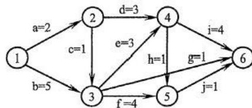
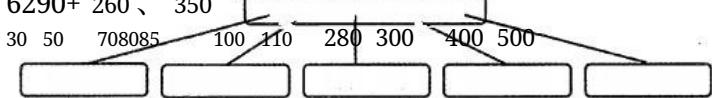
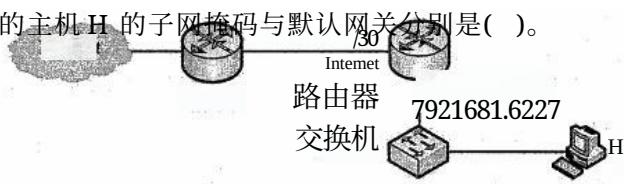
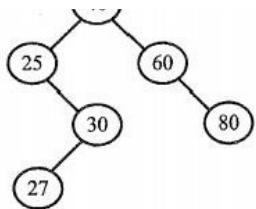
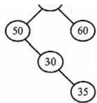
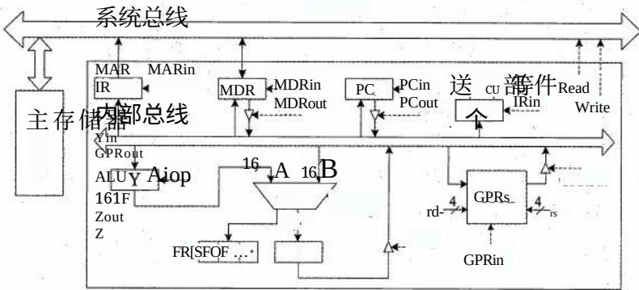
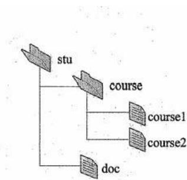
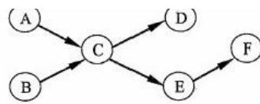
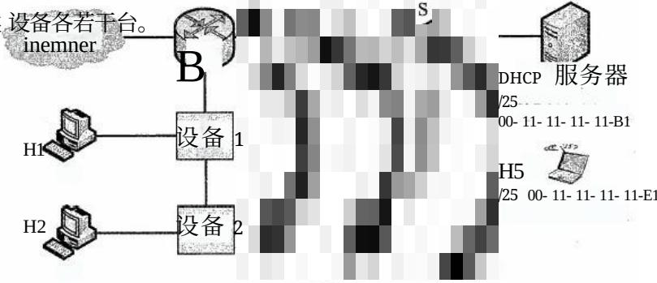

# 2022年计算机408统考真题.docx — 图像索引

> 由 MinerU 结构化结果生成。题目若依赖树形、拓扑、流程、曲线、区域、时序或其他空间关系，应核对这里的原图，不要只依据 OCR 文本推断。

## 图 1

原文页码：2；bbox：`[625, 586, 924, 675]`

## 图 2

原文页码：2；bbox：`[302, 776, 800, 823]`

## 图 3

原文页码：6；bbox：`[255, 566, 692, 655]`

## 图 4

原文页码：8；bbox：`[338, 324, 517, 425]`

## 图 5

原文页码：8；bbox：`[589, 324, 723, 422]`

**图注：** 二叉树 T2

## 图 6

原文页码：9；bbox：`[255, 26, 810, 200]`

**图注：** 题43图

## 图 7

原文页码：10；bbox：`[85, 57, 308, 204]`

**图注：** 题45(a)图

## 图 8

原文页码：11；bbox：`[685, 262, 914, 325]`

**图注：** 题46图

## 图 9

原文页码：11；bbox：`[238, 514, 803, 682]`

**图注：** 题47图
