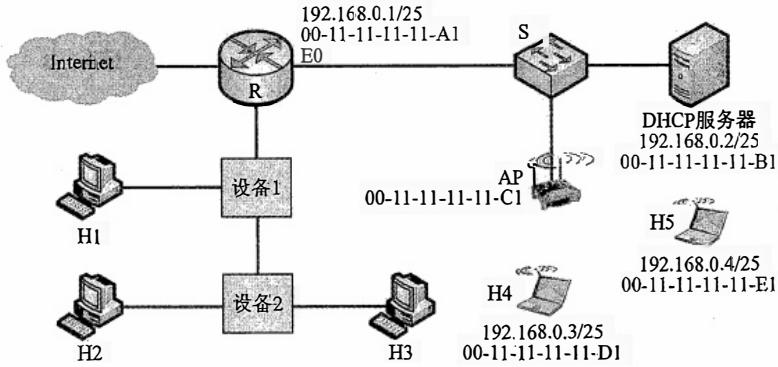

# 2022年计算机408统考真题.pdf

## 一、单项选择题：01～40 小题，每小题 2 分，共 80 分。下列每题给出的四个选项中，只有一个选项是最符合题目要求的。

33. 在 ISO/OSI 参考模型中, 实现两个相邻结点间流量控制功能的是 ( )。 A. 物理层 B. 数据链路层 C. 网络层 D. 传输层

34. 在一条带宽为 $200 \mathrm{kHz}$ 的无噪声信道上, 若采用 4 个幅值的 ASK 调制, 则该信道的最大数据传输速率是 ( )。 A. $200 \mathrm{kbps}$ B. $400 \mathrm{kbps}$ C. $800 \mathrm{kbps}$ D. $1600 \mathrm{kbps}$

35. 若某主机的 IP 地址是 183.80.72.48，子网掩码是 255.255.192.0，则该主机所在网络的网络地址是（）。A. 183.80.0.0 B. 183.80.64.0 C. 183.80.72.0 D. 183.80.192.0

36. 下图所示网络中的主机 H 的子网掩码与默认网关分别是（）。

交换机
A. 255.255.255.192, 192.168.1.1
B. 255.255.255.192, 192.168.1.62
C. 255.255.255.224, 192.168.1.1
D. 255.255.255.224, 192.168.1.62

37. 在 SDN 网络体系结构中，SDN 控制器向数据平面的 SDN 交换机下发流表时所使用的接口是（）。A. 东向接口 B. 南向接口 C. 西向接口 D. 北向接口

38. 假设主机甲和主机乙已建立一个 TCP 连接，最大段长 MSS = 1 KB，甲一直有数据向乙发送当甲的拥塞窗口为 16 KB 时，计时器发生了超时，则甲的拥塞窗口再次增长到 16 KB 所需要的时间至少是（）。A. 4 RTT B. 5 RTT C. 11 RTT D. 16 RTT

39. 假设客户 C 和服务器 S 已建立一个 TCP 连接，通信往返时间 RTT = 50 ms，最长报文段寿命 MSL = 800 ms，数据传输结束后，C 主动请求断开连接。若从 C 主动向 S 发出 FIN 段时刻算起，则 C 和 S 进入 CLOSED 状态所需的时间至少分别是（）。A. 850 ms, 50 ms B. 1650 ms, 50 ms C. 850 ms, 75 ms D. 1650 ms, 75 ms

40. 假设主机 H 通过 HTTP/1.1 请求浏览某 Web 服务器 S 上的 Web 页 news408.html, news408.html

引用了同目录下的1幅图像，news408.html文件大小为1MSS（最大段长），图像文件大小为3MSS，H访问S的往返时间RTT=10ms，忽略HTTP响应报文的首部开销和TCP段传输时延。若H已完成域名解析，则从H请求与S建立TCP连接时刻起，到接收到全部内容止，所需的时间至少是（）。A. 30 ms B. 40 ms C. 50 ms D. 60 ms

## 二、综合应用题：41～47 小题，共 70 分。

47.（9分）某网络拓扑如题47图所示，R为路由器，S为以太网交换机，AP是802.11接入点，路由器的E0接口和DHCP服务器的IP地址配置如图中所示；H1与H2属于同一个广播域，但不属于同一个冲突域；H2和H3属于同一个冲突域；H4和H5已经接入网络，并通过DHCP动态获取了IP地址。现有路由器、100BaseT以太网交换机和100BaseT集线器（Hub）三类设备各若干台。

  
题47图

请回答下列问题。

1）设备 1 和设备 2 应该分别选择哪类设备？

2）若信号传播速度为 $2 \times 10^{8} \mathrm{~m} / \mathrm{s}$ ，以太网最小帧长为 $64 \mathrm{~B}$ ，信号通过设备 2 时会产生额外的 $1.51 \mu \mathrm{s}$ 的时间延迟，则 H2 与 H3 之间可以相距的最远距离是多少？

3）在 H4 通过 DHCP 动态获取 IP 地址过程中，H4 首先发送了 DHCP 报文 M，M 是哪种 DHCP 报文？路由器 E0 接口能否收到封装 M 的以太网帧？S 向 DHCP 服务器转发的封装 M 的以太网帧的目的 MAC 地址是什么？

4）若 H4 向 H5 发送一个 IP 分组 P，则 H5 收到的封装 P 的 802.11 帧的地址 1、地址 2 和地址 3 分别是什么？
