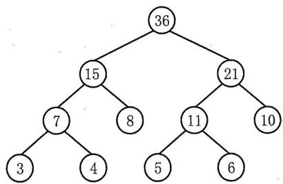
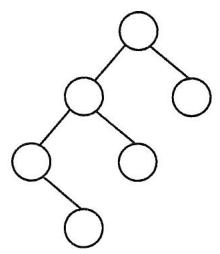
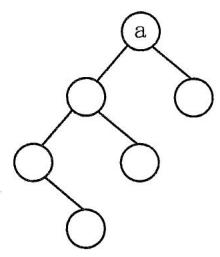
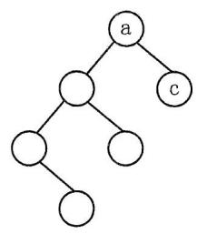
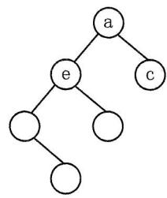
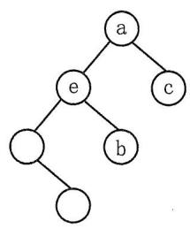
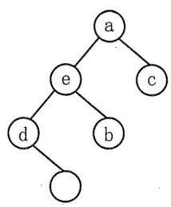
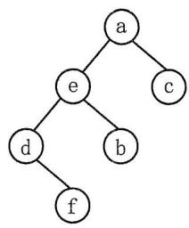

# 2023年计算机408统考真题解析.pdf — 图像索引

> 由 MinerU 结构化结果生成。题目若依赖树形、拓扑、流程、曲线、区域、时序或其他空间关系，应核对这里的原图，不要只依据 OCR 文本推断。

## 图 1

原文页码：1；bbox：`[354, 780, 641, 909]`

## 图 2

原文页码：2；bbox：`[164, 221, 318, 345]`

**图注：** 1

## 图 3

原文页码：2；bbox：`[340, 221, 495, 346]`

## 图 4

原文页码：2；bbox：`[518, 221, 671, 346]`

**图注：** 2

## 图 5

原文页码：2；bbox：`[696, 223, 845, 345]`

**图注：** 3

## 图 6

原文页码：2；bbox：`[164, 364, 315, 489]`

**图注：** 4

## 图 7

原文页码：2；bbox：`[342, 364, 493, 489]`

**图注：** 5

## 图 8

原文页码：2；bbox：`[520, 365, 669, 489]`

**图注：** 6
