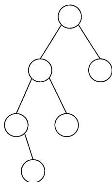
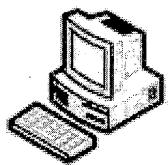
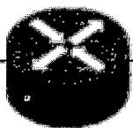
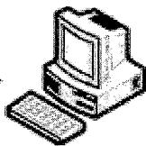
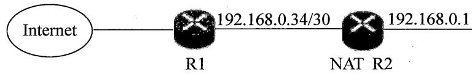
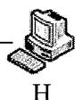
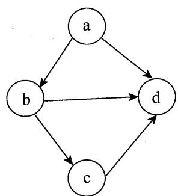

# 2023计算机考研408真题.pdf — 图像索引

> 由 MinerU 结构化结果生成。题目若依赖树形、拓扑、流程、曲线、区域、时序或其他空间关系，应核对这里的原图，不要只依据 OCR 文本推断。

## 图 1

原文页码：2；bbox：`[771, 645, 910, 806]`

## 图 2

原文页码：6；bbox：`[139, 413, 240, 483]`

**图注：** H1

## 图 3

原文页码：6；bbox：`[467, 428, 557, 489]`

**图注：** R

## 图 4

原文页码：6；bbox：`[757, 419, 855, 488]`

**图注：** H2

## 图 5

原文页码：7；bbox：`[191, 124, 655, 175]`

## 图 6

原文页码：7；bbox：`[662, 124, 712, 172]`

## 图 7

原文页码：7；bbox：`[727, 592, 905, 731]`
