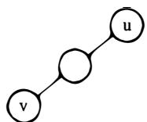
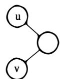
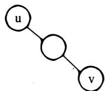
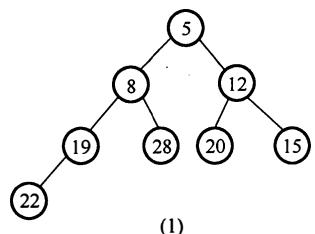
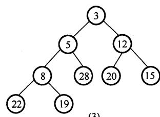
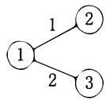

# 2009年计算机408统考真题解析.pdf

# 2009年计算机学科专业基础综合试题参考答案

## 一、单项选择题

<table><tr><td>1.</td><td>B</td><td>2.</td><td>C</td><td>3.</td><td>D</td><td>4.</td><td>B</td><td>5.</td><td>C</td><td>6.</td><td>B</td><td>7.</td><td>A</td><td>8.</td><td>D</td></tr><tr><td>9.</td><td>A</td><td>10.</td><td>B</td><td>11.</td><td>C</td><td>12.</td><td>D</td><td>13.</td><td>D</td><td>14.</td><td>C</td><td>15.</td><td>D</td><td>16.</td><td>C</td></tr><tr><td>17.</td><td>A</td><td>18.</td><td>A</td><td>19.</td><td>D</td><td>20.</td><td>B</td><td>21.</td><td>D</td><td>22.</td><td>A</td><td>23.</td><td>D</td><td>24.</td><td>D</td></tr><tr><td>25.</td><td>C</td><td>26.</td><td>A</td><td>27.</td><td>C</td><td>28.</td><td>B</td><td>29.</td><td>A</td><td>30.</td><td>A</td><td>31.</td><td>B</td><td>32.</td><td>A</td></tr><tr><td>33.</td><td>B</td><td>34.</td><td>B</td><td>35.</td><td>C</td><td>36.</td><td>A</td><td>37.</td><td>D</td><td>38.</td><td>D</td><td>39.</td><td>C</td><td>40.</td><td>A</td></tr></table>

## 1. 解析:

缓冲区的概念出现在操作系统的设备管理中，其特点是先进先出。缓冲区的作用是解决主机与打印机之间速度不匹配的问题，而不应改变打印数据的顺序。若用栈，先进入缓冲区的数据则要排队到最后才能打印，显然不符题意，故选 B。

## 2. 解析:

由于队列的特点是先进先出，即栈 S 的出栈顺序就是队 Q 的出队顺序。故本题只需注意栈的特点是先进后出。出入栈的详细过程见下表。

<table><tr><td>序号</td><td>说明</td><td>栈内</td><td>栈外</td><td>序号</td><td>说明</td><td>栈内</td><td>栈外</td></tr><tr><td>1</td><td>a入栈</td><td>A</td><td></td><td>8</td><td>e入栈</td><td>ae</td><td>bdc</td></tr><tr><td>2</td><td>b入栈</td><td>Ab</td><td></td><td>9</td><td>f入栈</td><td>aef</td><td>bdc</td></tr><tr><td>3</td><td>b出栈</td><td>A</td><td>b</td><td>10</td><td>f出栈</td><td>ae</td><td>bdcf</td></tr><tr><td>4</td><td>c入栈</td><td>Ac</td><td>b</td><td>11</td><td>e出栈</td><td>a</td><td>bdcfe</td></tr><tr><td>5</td><td>d入栈</td><td>Acd</td><td>b</td><td>12</td><td>a出栈</td><td></td><td>bdcfea</td></tr><tr><td>6</td><td>d出栈</td><td>Ac</td><td>bd</td><td>13</td><td>g入栈</td><td>g</td><td>bdcfea</td></tr><tr><td>7</td><td>c出栈</td><td>A</td><td>bdc</td><td>14</td><td>g出栈</td><td></td><td>bdcfeag</td></tr></table>

栈内的最大深度为 3，故栈 S 的容量至少是 3。

【另解】元素的出栈顺序是 b, d, c, f, e, a, g，可推出进栈出栈顺序为 Push(S, a), Push(S, b), Pop(S, b), Push(S, c), Push(S, d), Pop(S, d), Pop(S, c), Push(S, e), Push(S, f), Pop(S, f), Pop(S, e), Pop(S, a), Push(S, g), Pop(S, g)。假设初始所需容量为 0，每做一次 Push 进行一次 “+1” 操作，每做一次 Pop 进行一次 “-1” 操作，记录容量的最大值为 3，所以选 C。

## 3. 解析:

分析遍历后的结点序列，可以看出根结点是在中间访问，而右子树结点在左子树之前，即遍历的方式是 RNL。本题考查的遍历方法并不是二叉树的 3 种基本遍历方法，对于考生而言，重要的是要掌握遍历的思想。

## 4. 解析:

根据平衡二叉树的定义有，任意结点的左、右子树高度差的绝对值不超过 1。而其余 3 个选项均可以找到不符合该条件的结点。在做题过程中，如果答案不太明显，可以把每个非叶结点的平衡因子都写出来再进行判断。

## 5. 解析:

完全二叉树比满二叉树只是在最下面一层的右边缺少了部分叶结点，而最后一层之上是个满二叉树，并且只有最后两层有叶结点。第6层有叶结点则完全二叉树的高度可能为6或7，显然树高为7时结点更多。若第6层上有8个叶结点，则前六层为满二叉树，而第7层缺失了 $8\times2=16$ 个叶结点，故完全二叉树的结点个数最多为 $(2^{7}-1)-16=111$ 个结点。

## 6. 解析:

森林与二叉树的转换规则为“左孩子右兄弟”。在最后生成的二叉树中，父子关系在对应森林关系中可能是兄弟关系或原本就是父子关系。

情形 I：若结点 v 是结点 u 的第二个孩子结点，在转换时，结点 v 就变成结点 u 第一个孩子的右孩子，符合要求。

情形 II：结点 u 和 v 是兄弟结点的关系，但二者之中还有一个兄弟结点 k，则转换后，结点 v 就变为结点 k 的右孩子，而结点 k 则是结点 u 的右孩子，符合要求。


  
I  
II

情形 III：若结点 u 的父结点与 v 的父结点是兄弟关系，则转换后，结点 u 和 v 分别在两者最左父结点的两棵子树中，不可能出现在同一条路径中。


  
图 III

【逆向法】由题意可知 u 是 v 的父结点的父结点，如下图所示有 4 种情况：

  
(1)

  
(2)

  
(3)

  
(4)

根据树与二叉树的转换规则，将这4种情况转换成树种结点的关系。(1)在原来的树中u是v的父结点的父结点；(2)在树中u是v的父结点；(3)在树中u是v的父结点的兄弟；(4)在树中u与v是兄弟关系。由此可知I和II正确。

## 7. 解析:

每条边都连接了两个结点，在计算顶点的度之和时每条边都被计算了两次（出度和入度），故所有顶点的度之和为边数的两倍，I 正确。n 个顶点、n-1 条边可以构成无向连通图，比如树，II 错误。顶点数为 $N (N \geqslant 1)$ 的无向完全图中不存在度为 1 的顶点，III 错误。

8. 解析:

选项 A、B 和 C 都是 B-树的特点，而选项 D 则是 B+树的特点。注意区别 B-树和 B+树各

自的特点。

## 9. 解析:

根据关键字序列得到的小顶堆的二叉树形式如下图所示。

  
(1)

  
(2)

  
(3)

插入关键字 3 时，先将其放在小顶堆的末端，如图(2)所示。再将该关键字向上进行调整，得到的结果如图(3)所示。所以，调整后的小顶堆序列为 3, 5, 12, 8, 28, 20, 15, 22, 19。

## 10. 解析:

解答本题需要对各种排序算法的特点极为清楚。对于冒泡排序和选择排序，每一趟都能确定一个元素的最终位置，而题目中，前2个元素和后2个元素均不是最小或最大的2个元素并按序排列。选项D中的2路归并排序，第一趟排序结束都可以得到若干个有序子序列，而此时的序列中并没有两两元素有序排列。插入排序在每趟排序后能确定前面的若干元素是有序的，而此时第二趟排序后，序列的前三个元素是有序的，符合其特征。

## 11. 解析:

虽然指令和数据都是以二进制形式存放在存储器中，但 CPU 可以根据指令周期的不同阶段来区分是指令还是数据，通常在取指阶段取出的是指令，在执行阶段取出的是数据。本题容易误选 A，需要清楚的是，CPU 只有在确定取出的是指令之后，才会将其操作码送去译码，因此，不可能依据译码的结果来区分指令和数据。

## 12. 解析:

C 语言中的整型数据为补码形式，int 为 32 位，short 为 16 位，故 x、y 转换成十六进制为 0000007FH、FFF7H。执行 $z = x + y$ 时，由于 x 是 int 型，y 为 short 型，需将短字长数据转换成长字长数据，称之为“符号扩展”。由于 y 的符号位为 1，故在 y 的前面添加 16 个 1，即可将 y 上升为 int 型，其十六进制形式为 FFFFFFF7H。最后执行加法，即 0000007FH + FFFFFFF7H = 00000076H，其中最高位的进位 1 自然丢弃。故选 D。

【排除法】对于 x 的值，4 个选项都一样，无须计算； $z = x + y = 127 - 9 = 118 > 0$ ，前 4 个字节必然全 0，排除 BC；只需算出 y = -9 的值即可，其十六进制形式为 FFF7H，排除 A。

【提示】解题时，应先排除明显错误的选项，然后再推敲剩下的选项。

## 13. 解析:

X 的浮点数格式为 00,111;00,11101（分号前为阶码，分号后为尾数），Y 的浮点数格式为 00,101;00,10100。然后根据浮点数的加法步骤进行运算。

第一步：对阶。X、Y阶码相减，即00,111-00,101=00,111+11,0111=00,010，可知X的阶码比Y的价码大2（这一步可直接目测）。根据小阶向大阶看齐的原则，将Y的阶码加2，尾数右移2位，将Y变为00,111;00,00101。

第二步：尾数相加。即 00, 11101 + 00, 00101 = 01, 00010，尾数相加结果符号位为 01，故需右规。

第三步：规格化。将尾数右移1位，阶码加1，得 $X+Y$ 为01,000;00,10001。

第四步：判溢出。阶码符号位为 01，说明发生溢出。

本题容易误选选项 B、C，这是因为选项 B、C 本身并没有计算错误，只是它们不是最终结果，选项 B 少了第 3 步和第 4 步，选项 C 少了第 4 步。

【偷懒法】本题也可以直接用数学知识对原数进行计算，然后将计算的结果转换成浮点数的格式。 $X + Y = 29/32 \times 2^{7} + 5/8 \times 2^{5} = 29/32 \times 2^{7} + 5/32 \times 2^{7} = (29/32 + 5/32) \times 2^{7} = 34/32 \times 2^{7} = 17/32 \times 2^{8}$ ，阶码用补码表示，数值位3位，最大只能表示7，即 $X + Y$ 的结果的阶码8超出了该浮点数的表示范围，故溢出。“你在做题时想到过这种方法吗？”

## 14. 解析:

由于 Cache 共有 16 块，采用 2 路组相联，因此共分为 8 组，组号为 0, 1, 2, …, 7。主存的某一字块按模 8 映射到 Cache 某组的任一字块中，即主存的第 0, 8, 16, … 字块可以映射到 Cache 第 0 组的任一字块中。每个主存块大小为 32 字节，故 129 号单元位于第 4 块主存块（注意是从 0 开始），因此将映射到 Cache 第 4 组的任一字块中。

## 15. 解析:

首先确定 ROM 的个数，ROM 区为 4KB，选用 2K×8 位的 ROM 芯片，需要 $\frac{4K \times 8}{2K \times 8} = 2$ 片，采用字扩展方式；RAM 区为 60KB，选用 4K×4 位的 RAM 芯片，需要 $\frac{60K \times 8}{4K \times 4} = 30$ 片，采用字和位同时扩展方式。

## 16. 解析:

相对寻址 $EA = (PC) + A$ ，首先要求的是取指令后 PC 的值。转移指令由两个字节组成，每取一个字节 PC 值自动加 1，因此取指令后 PC 值为 $2000H + 2H = 2002H$ ，故 $EA = (PC) + A = 2002H + 06H = 2008H$ 。

【易错点】本题易误选 A 或 B。选项 A 没有考虑 PC 值的自动更新，选项 B 虽然考虑了 PC 值要自动更新，但没有注意到该转移指令是一条两字节指令，PC 值仅仅 “+1” 而不是 “+2”。

## 17. 解析:

相对于 CISC，RISC 的特点是指令条数少；指令长度固定，指令格式和寻址种类少；只有取数/存数指令访问存储器，其余指令的操作均在寄存器之间进行；CPU 中通用寄存器多；大部分指令在一个或者小于一个机器周期内完成；以硬布线逻辑为主，不用或者少用微程序控制。选项 B、C、D 都是 RISC 的特点，选项 A 是错误的，因为 RISC 的速度快，所以普遍采用硬布线控制器，而非微程序控制器。

## 18. 解析:

流水线的时钟周期应以最长的执行时间为准，否则用时长的流水段的功能将不能正确完成。

## 19. 解析:

微程序控制器采用了“存储程序”的原理，每条机器指令对应一个微程序，因此修改和扩充容易，灵活性好，但每条指令的执行都要访问控制存储器，所以速度慢。硬布线控制器采用专门的逻辑电路实现，其速度主要取决于逻辑电路的延迟，因此速度快，但修改和扩展困难，灵活性差。

## 20. 解析:

总线带宽是指单位时间内总线上传输数据的位数，通常用每秒钟传送信息的字节数来衡量，单位 B/s。由题意可知，在 1 个总线周期（=2 个时钟周期）内传输了 4 字节信息，时钟周期 = 1/10MHz = 0.1μs，故总线带宽为 $4\mathrm{B}/(2\times0.1\mu\mathrm{s})=4\mathrm{B}/(0.2\times10^{-6}\mathrm{s})=20\mathrm{MB}/\mathrm{s}$ 。

## 21. 解析:

命中率 = Cache 命中次数/总访问次数。需要注意的是看清题，题中说明的是缺失 50 次，而不是命中 50 次，仔细审题是做对题的第一步。

## 22. 解析:

外部中断指的是 CPU 执行指令以外的事件产生的中断，通常是指来自 CPU 与内存以外的中断。A 中键盘输入属于外部事件，每次键盘输入 CPU 都需要执行中断以读入输入数据，所以能引起外部中断。B 中除数为 0 属于异常，也就是内中断，发生在 CPU 内部。C 中浮点运算下溢将按机器零处理，不会产生中断。而 D 访存缺页属于 CPU 执行指令时产生的中断，也不属于外部中断。所以能产生外部中断的只能是输入设备键盘。

## 23. 解析:

在单处理机系统（不包含多核的情况）中，同一时刻只能有一个进程占用处理机，因此进程之间不能并行执行。通道是独立于 CPU 的控制输入/输出的设备，两者可以并行，显然，设备与设备之间也是可以并行的。

## 24. 解析:

在高响应比优先调度算法中，选出响应比最高的进程投入执行，响应比 R 定义如下：响应比 $R = (\text{等待时间} + \text{执行时间}) / \text{执行时间}$ 。它综合考虑了每个进程的等待时间和执行时间，对于同时到达的长进程和短进程，短进程会优先执行，以提高系统吞吐量；而长进程的响应比可以随等待时间的增加而提高，不会产生进程无法调度的情况。

## 25. 解析:

这种题用到组合数学中鸽巢原理的思想。考虑最极端情况，因为每个进程最多需要3台打印机，如果每个进程已经占有了2台打印机，那么只要还有多的打印机，总能满足一个进程达到3台的条件，然后顺利执行，所以将8台打印机分给K个进程，每个进程有2台打印机，这个情况就是极端情况，K为4。

## 26. 解析:

每个进程都拥有自己独立的进程空间，若一个进程在运行时所产生的地址在其地址空间之外，则发生地址越界，因此需要进行界地址保护，即当程序要访问某个内存单元时，由硬件检查是否允许，如果允许则执行，否则产生地址越界中断。

## 27. 解析:

分段存储管理的逻辑地址分为段号和位移量两部分，段内位移的最大值就是最大段长。地址长度为32位，段号占8位，则位移量占 $32 - 8 = 24$ 位，故最大段长为 $2^{24}\mathrm{B}$ 。

## 28. 解析:

文件的物理结构包括连续、链式、索引三种，其中链式结构不能实现随机访问，连续结构的文件不易于扩展。因此随机访问且易于扩展是索引结构的特性。

## 29. 解析:

SCAN 算法类似电梯的工作原理。首先，当磁头从 105 道向序号增加的方向移动时，便会按照从小到大的顺序服务所有大于 105 的磁道号（110, 170, 180, 195）；往回移动时又会按照从大到小的顺序进行服务（68, 45, 35, 12）。

## 30. 解析:

为了实现 “按名存取”，在文件系统中为每个文件设置用于描述和控制文件的数据结构，称之为文件控制块（FCB）。在文件控制块中，通常包含以下三类信息，即基本信息、存取控制信息及使用信息。

## 31. 解析:

建立符号链接时，引用计数值直接复制；建立硬链接时，引用计数值加1。删除文件时，删除操作对于符号链接是不可见的，这并不影响文件系统，当以后再通过符号链接访问时，发现文件不存在，直接删除符号链接；但对于硬链接则不可以直接删除，引用计数值减1，若值不为0，则不能删除此文件，因为还有其他硬链接指向此文件。

当建立 F2 时，F1 和 F2 的引用计数值都为 1。当再建立 F3 时，F1 和 F3 的引用计数值就都变成了 2。当后来删除 F1 时，F3 的引用计数值为 2-1=1，F2 的引用计数值一直不变。

## 32. 解析:

设备管理具有设备独立性的特点，操作系统以系统调用方式来请求某类设备时，使用的是逻辑设备名。而在程序实际执行时，将逻辑设备名转换为对应的物理设备名。

## 33. 解析:

传输层提供应用进程间的逻辑通信（通过端口号），即端到端的通信。而数据链路层负责相邻结点之间的通信，这个结点包括了交换机和路由器等数据通信设备，这些设备不能称为端系统。网络层负责主机到主机的逻辑通信。因此选 B。

## 34. 解析:

采用 4 个相位，每个相位有 4 种幅度的 QAM 调制方法，每个信号可以有 16 种变化，传输 4bit 的数据。根据奈奎斯特定理，信息的最大传输速率为 $2 \times 3k \times 4 = 24kbps$ 。

## 35. 解析:

在后退 N 帧协议中，当接收方检测到某个帧出错后，则简单地丢弃该帧及其后所有的后续帧，发送方超时后需重传该数据帧及其后续的所有帧。这里应注意，连续 ARQ 协议中，接收方一般采用累积确认的方式，即接收方对按序到达的最后一个分组发送确认，因此本题中收到 3 的确认帧就表示编号为 0, 1, 2, 3 的帧已接收，而此时发送方未收到 1 号帧的确认只能代表确认帧在返回的过程中丢失了，而不代表 1 号帧未到达接收方。因此需要重传的帧为编号是 4, 5, 6, 7 的帧。

## 36. 解析:

交换机实质上是一个多端口网桥，工作在数据链路层，数据链路层使用物理地址进行转发，而转发到目的地通常是使用目的地址。因此 PDU 地址是目的物理地址。

## 37. 解析:

若最短帧长减少，而数据传输速率不变，则需要使冲突域的最大距离变短来实现碰撞窗口的减少。碰撞窗口是指网络中收发结点间的往返时延，因此假设需要减少的最小距离为 s，则可以得到如下公式（注意单位的转换）：

减少的往返时延 = 减少的发送时延，即 $2 \times \left[ s / (2 \times 10^{8}) \right] = 800 / (1 \times 10^{9})$ 。即，由于帧长减少而缩短的发送时延，应等于由于距离减少而缩短的传播时延的 2 倍。

可得 s = 80，即最远的两个站点之间的距离最少需要减少 80m。

【注意】CSMA/CD 的碰撞窗口 = 2 倍传播时延，报文发送时间 >> 碰撞窗口。

## 38. 解析:

返回的确认序列号是接收端期待收到对方下一个报文段数据部分的第一个字节的序号，因此乙在正确接收到两个段后，返回给甲的确认序列号是 $200 + 300 + 500 = 1000$ 。

## 39. 解析:

在发生超时后，慢开始门限 ssthresh 变为 16KB/2 = 8KB，拥塞窗口变为 1KB。在接下来的 3 个 RTT 内，执行慢开始算法，拥塞窗口大小依次为 2KB、4KB、8KB，由于慢开始门限 ssthresh为 8KB，因此之后转而执行拥塞避免算法，即拥塞窗口开始 “加法增大”。因此第 4 个 RTT 结束后，拥塞窗口的大小为 9KB。

## 40. 解析:

对于 FTP 文件传输，为了保证可靠性，选择 TCP 协议，排除 C、D。FTP 的控制信息是带外传送的，也即 FTP 使用了一个分离的控制连接来传送命令，故选 A。

## 二、综合应用题

41. 解答:

该方法不一定能（或不能）求得最短路径。（4分）

举例说明：（6分）

图（1）中，设初始顶点为 1，目标顶点为 4，欲求从顶点 1 到顶点 4 之间的最短路径，显然这两点之间的最短路径长度为 2。利用给定方法求得的路径长度为 3，但这条路径并不是这两点之间的最短路径。

图（2）中，设初始顶点为1，目标顶点为3，欲求从顶点1到顶点3之间的最短路径。利用给定的方法，无法求出顶点1到顶点3的路径。

  
(1)

  
(2)

【评分说明】①若考生回答“能求得最短路径”，无论给出何种证明，均不给分。

② 考生只要举出类似上述的一个反例说明 “不能求得最短路径” 或答案中体现了 “局部最优不等于全局最优” 的思想，均可给 6 分；若举例说明不完全正确，可酌情给分。

42. 解答:

1）算法的基本设计思想：

问题的关键是设计一个尽可能高效的算法，通过链表的一趟遍历，找到倒数第 k 个结点的位置。算法的基本设计思想：定义两个指针变量 p 和 q，初始时均指向头结点的下一个结点（链表的第一个结点）。p 指针沿链表移动，当 p 指针移动到第 k 个结点时，q 指针开始与 p 指针同步移动；当 p 指针移动到最后一个结点时，q 指针所指示结点为倒数第 k 个结点。以上过程对链表仅进行一遍扫描。

2）算法的详细实现步骤：

① count = 0, p 和 q 指向链表表头结点的下一个结点;

② 若 p 为空，转⑤；

③ 若 count 等于 k，则 q 指向下一个结点；否则，count = count + 1；

④ p 指向下一个结点，转②;

⑤ 若 count 等于 $k$ ，则查找成功，输出该结点的 data 域的值，返回 1；否则，说明 $k$ 值超过了线性表的长度，查找失败，返回 0；

⑥ 算法结束。

3）算法实现：

typedef int ElemType;
typedef struct LNode{
    ElemType data;
    struct Lnode \*link;

//链表数据的类型定义  
//链表结点的结构定义  
//结点数据  
//结点链接指针

```c
} *LinkList;
int Search_k(LinkList list, int k) {
    //查找链表 list 倒数第 k 个结点，并输出该结点 data 域的值
    LinkList p=list->link, q=list->link;    //指针 p、q 指示第一个结点
    int count=0;
    while (p!=NULL) {    //遍历链表直到最后一个结点
    if(count<k) count++;    //计数，若 count<k 只移动 p
    else q=q->link; p=p->link;    //之后让 p、q 同步移动
    } //while
    if(count<k)
    return 0;    //查找失败返回 0
    else {    //否则打印并返回 1
    printf("%d", q->data);
    return 1;
    }
} //Search_k
```

提示：算法程序题，如果能够写出数据结构类型定义，正确的算法思想都会至少给一半以上分数，如果能用伪代码写出自然更好，比较复杂的地方可以直接用文字表达。

【评分说明】①若所给出的算法采用一遍扫描方式就能得到正确结果，可给满分15分；若采用两遍或多遍扫描才能得到正确结果的，最高给10分；若采用递归算法得到正确结果的，最高给10分；若实现算法的空间复杂度过高（使用了大小与k有关的辅助数组），但结果正确，最高给10分；若实现的算法的空间复杂度过高（使用了大小与k有关的辅助数组），但结果正确，最高给10分。

② 若在算法基本思想描述和算法步骤描述中因文字表达没有非常清晰地反映出算法的思路，但在算法实现中能够清晰看出算法思想和步骤且正确，按照①的标准给分。

③ 若考生的答案中算法基本思想描述、算法步骤描述或算法实现中部分正确，可酌情给分。

## 43. 解答:

1）按题意，外设每秒传送 0.5MB，中断时每次传送 4B。中断方式下，CPU 每次用于数据传送的时钟周期为 $5 \times 18 + 5 \times 2 = 100$ 。(2 分)

为达到外设 0.5MB/s 的数据传输率，外设每秒申请的中断次数为 0.5MB/4B = 125000。（1 分）

1s 内用于中断的开销为 $100 \times 125000 = 12500000 = 12.5M$ 个时钟周期。（1 分）

CPU 用于外设 I/O 的时间占整个 CPU 时间的百分比为 12.5M/500M = 2.5%。（1 分）

2）当外设数据传输率提高到 5MB/s 时，改用 DMA 方式传送，每次 DMA 传送 5000B，1s 内需产生的 DMA 次数为 5MB/5000B = 1000。（1 分）

CPU 用于 DMA 处理的总开销为 $1000 \times 500 = 500000 = 0.5M$ 个时钟周期。（1 分）

CPU 用于外设 I/O 的时间占整个 CPU 时间的百分比为 0.5M/500M = 0.1%。（1 分）

【评分说明】如果考生只给出正确的计算结果，未给出计算过程，每个给2分。

## 44. 解答:

题干已给出取值和译码阶段每个节拍的功能和有效控制信号，我们应以弄清楚取指阶段中数据通路的信息流动作为突破口，读懂每个节拍的功能和有效控制信号。然后应用到解题思路中，包括划分执行步骤、确定完成的功能、需要的控制信号。

先分析题干中提供的示例（本部分解题时不做要求）：

取指令的功能是根据 PC 的内容所指主存地址，取出指令代码，经过 MDR，最终送至 IR。这部分和后面的指令执行阶段的取操作数、存运算结果的方法是相通的。

C1: (PC)→MAR

在读写存储器前，必须先将地址（这里为(PC)）送至 MAR。

C2: M(MAR)→MDR, (PC) + 1→PC

读写的数据必须经过 MDR，指令取出后 PC 自增 1。

C3: (MDR)→IR

然后将读到 MDR 中指令代码送至 IR 进行后续操作。

指令 “ADD (R1), R0” 的操作数一个在主存中，一个在寄存器中，运算结果在主存中。根据指令功能，要读出 R1 的内容所指的主存单元，必须先将 R1 的内容送至 MAR，即 $(R1) \rightarrow MAR$ 。而读出的数据必须经过 MDR，即 $M(MAR) \rightarrow MDR$ 。

因此，将 R1 的内容所指主存单元的数据读出到 MDR 的节拍安排如下：

C5: (R1)→MAR

C6: M(MAR)→MDR

ALU 一端是寄存器 A，MDR 或 R0 中必须有一个先写入 A 中，如 MDR。

C7: (MDR)→A

然后执行加法操作，并将结果送入寄存器 AC。

C8: (A) + (R0) → AC

之后将加法结果写回到 R1 的内容所指主存单元，注意 MAR 中的内容没有改变。

C9: (AC)→MDR

C10: (MDR)→M(MAR)

有效控制信号的安排并不难，只需看数据是流入还是流出，如流入寄存器 X 就是 Xin，流出寄存器 X 就是 Xout。还需注意其他特殊控制信号，如 PC + 1、Add 等。

于是得到参考答案如下：

<table><tr><td>时钟</td><td>功能</td><td>有效控制信号</td></tr><tr><td>C5</td><td>MAR←(R1)</td><td>R1out, MARin</td></tr><tr><td>C6</td><td>MDR←M(MAR)</td><td>MemR, MDRinE</td></tr><tr><td>C7</td><td>A←(MDR)</td><td>MDRout, Ain</td></tr><tr><td>C8</td><td>AC←(A)+(R0)</td><td>R0out, Add, ACin</td></tr><tr><td>C9</td><td>MDR←(AC)</td><td>ACout, MDRin</td></tr><tr><td>C10</td><td>M(MAR)←(MDR)</td><td>MDRoutE, MemW</td></tr></table>

本题答案不唯一，如果在 C6 执行 M(MAR)→MDR 的同时，完成(R0)→A（即选择将(R0)写入 A），并不会发生总线冲突，这种方案可节省 1 个节拍，见下表。

<table><tr><td>时钟</td><td>功能</td><td>有效控制信号</td></tr><tr><td>C5</td><td>MAR←(R1)</td><td>R1out, MARin</td></tr><tr><td>C6</td><td>MDR←M(MAR), A←(R0)</td><td>MemR, MDRinE, R0out, Ain</td></tr><tr><td>C7</td><td>AC←(MDR)+(A)</td><td>MDRout, Add, ACin</td></tr><tr><td>C8</td><td>MDR←(AC)</td><td>ACout, MDRin</td></tr><tr><td>C9</td><td>M(MAR)←(MDR)</td><td>MDRoutE, MemW</td></tr></table>

## 45. 解答:

互斥资源：缓冲区只能互斥访问，因此设置互斥信号量 mutex。

同步问题： $P_{1}$ 、 $P_{2}$ 因为奇数的放置与取用而同步，设同步信号量 odd； $P_{1}$ 、 $P_{3}$ 因为偶数的放置与取用而同步，设置同步信号量 even； $P_{1}$ 、 $P_{2}$ 、 $P_{3}$ 因为共享缓冲区，设同步信号量 empty，初值为 N。程序如下：

```txt
semaphore mutex=1;
semaphore odd=0, even=0;
semaphore empty=N;
main()
cobegin{
    Process P1()
    while(True)
    {
    x=produce();    //生成一个数
    P(empty);    //判断缓冲区是否有空单元
    P(mutex);    //缓冲区是否被占用
    Put();
    V(mutex);    //释放缓冲区
    if(x%2==0)
    V(even);    //如果是偶数，向P3发出信号
    else
    V(odd);    //如果是奇数，向P2发出信号
    }
    Process P2()
    while(True)
    {
    P(odd);    //收到P1发来的信号，已产生一个奇数
    P(mutex);    //缓冲区是否被占用
    getodd();
    V(mutex);    //释放缓冲区
    V(empty);    //向P1发信号，多出一个空单元
    countodd();
    }
    Process P3()
    while(True)
    {
    P(even);    //收到P1发来的信号，已产生一个偶数
    P(mutex);    //缓冲区是否被占用
    geteven();
    V(mutex);    //释放缓冲区
    V(empty);    //向P1发信号，多出一个空单元
    counteven();
    }
} coend
```

## 46. 解答:

1）根据页式管理的工作原理，应先考虑页面大小，以便将页号和页内位移分解出来。页面大小为4KB，即 $2^{12}$ ，则得到页内位移占虚地址的低12位，页号占剩余高位。可得三个虚地址的页号P如下（十六进制的一位数字转换成4位二进制，因此，十六进制的低三位正好为页内位移，最高位为页号）：

· 2362H: P = 2，访问快表 10ns，因初始为空，访问页表 100ns 得到页框号，合成物理地址后访问主存 100ns，共计 $10ns + 100ns + 100ns = 210ns$ 。

1565H: P = 1，访问快表 10ns，落空，访问页表 100ns 落空，进行缺页中断处理 $10^{8}$ ns，访问快表 10ns，合成物理地址后访问主存 100ns，共计 $10ns + 100ns + 10^{8}ns + 10ns + 100ns = 100000220ns$ 。

25A5H: P = 2，访问快表，因第一次访问已将该页号放入快表，因此花费 10ns 便可合成物理地址，访问主存 100ns，共计 $10ns + 100ns = 110ns$ 。

2) 当访问虚地址 1565H 时，产生缺页中断，合法驻留集为 2，必须从页表中淘汰一个页面，根据题目的置换算法，应淘汰 0 号页面，因此 1565H 的对应页框号为 101H。由此可得 1565H 的物理地址为 101565H。

## 47. 解答:

1）CIDR 中的子网号可以全 0 或全 1，但主机号不能全 0 或全 1。

因此若将 IP 地址空间 202.118.1.0/24 划分为 2 个子网，且每个局域网需分配的 IP 地址个数不少于 120 个，子网号至少要占用一位。

由 $2^{6}-2<120<2^{7}-2$ 可知，主机号至少要占用 7 位。

由于源 IP 地址空间的网络前缀为 24 位，因此主机号位数 + 子网号位数 = 8。

综上可得主机号位数为 7，子网号位数为 1。

因此子网的划分结果为子网 1：202.118.1.0/25，子网 2：202.118.1.128/25。

地址分配方案: 子网 1 分配给局域网 1, 子网 2 分配给局域网 2; 或子网 1 分配给局域网 2, 子网 2 分配给局域网 1。

2）由于局域网1和局域网2分别与路由器R1的E1、E2接口直接相连，因此在R1的路由表中，目的网络为局域网1的转发路径是直接通过接口E1转发的，目的网络为局域网2的转发路径是直接通过接口E1转发的。由于局域网1、2的网络前缀均为25位，因此它们的子网掩码均为255.255.255.128。

R1 专门为域名服务器设定了一个特定的路由表项，因此该路由表项中的子网掩码应为 255.255.255.255（只有和全 1 的子网掩码相与才能完全保证和目的 IP 地址一样，从而选择该特定路由）。对应的下一跳转发地址是 202.118.2.2，转发接口是 L0。

R1 到互联网的路由实质上相当于一个默认路由，默认路由一般写为 0/0，即目的地址为 0.0.0.0，子网掩码为 0.0.0.0。对应的下一跳转发地址是 202.118.2.2，转发接口是 L0。

综上可得到路由器 R1 的路由表如下。

若子网1分配给局域网1，子网2分配给局域网2，见下表。

<table><tr><td>目的网络 IP 地址</td><td>子网掩码</td><td>下一跳 IP 地址</td><td>接口</td></tr><tr><td>202.118.1.0</td><td>255.255.255.128</td><td></td><td>E1</td></tr><tr><td>202.118.1.128</td><td>255.255.255.128</td><td></td><td>E2</td></tr><tr><td>202.118.3.2</td><td>255.255.255.255</td><td>202.118.2.2</td><td>L0</td></tr><tr><td>0.0.0.0</td><td>0.0.0.0</td><td>202.118.2.2</td><td>L0</td></tr></table>

若子网 1 分配给局域网 2，子网 2 分配给局域网 1，见下表。

<table><tr><td>目的网络 IP 地址</td><td>子网掩码</td><td>下一跳 IP 地址</td><td>接口</td></tr><tr><td>202.118.1.128</td><td>255.255.255.128</td><td></td><td>E1</td></tr><tr><td>202.118.1.0</td><td>255.255.255.128</td><td></td><td>E2</td></tr><tr><td>202.118.3.2</td><td>255.255.255.255</td><td>202.118.2.2</td><td>.L0</td></tr><tr><td>0.0.0.0</td><td>0.0.0.0</td><td>202.118.2.2</td><td>L0</td></tr></table>

3）局域网1和局域网2的地址可以聚合为202.118.1.0/24，而对于路由器R2来说，通往局域网1和局域网2的转发路径都是从L0接口转发，因此采用路由聚合技术后，路由器R2到局域网1和局域网2的路由，见下表。

<table><tr><td>目的网络 IP 地址</td><td>子网 s 掩码</td><td>下一跳 IP 地址</td><td>接口</td></tr><tr><td>202.118.1.0</td><td>255.255.255.0</td><td>202.118.2.1</td><td>L0</td></tr></table>
