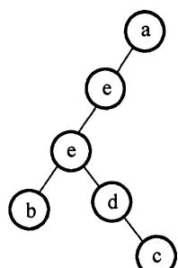
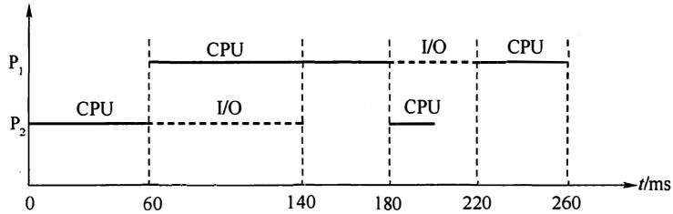
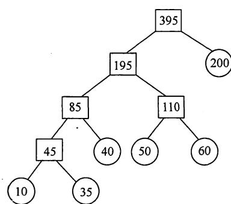

# 2012年计算机408统考真题解析-.pdf

# 2012 年计算机学科专业基础综合试题参考答案

## 一、单项选择题

<table><tr><td>1.</td><td>B</td><td>2.</td><td>A</td><td>3.</td><td>A</td><td>4.</td><td>B</td><td>5.</td><td>C</td><td>6.</td><td>C</td><td>7.</td><td>C</td><td>8.</td><td>A</td></tr><tr><td>9.</td><td>D</td><td>10.</td><td>A</td><td>11.</td><td>D</td><td>12.</td><td>D</td><td>13.</td><td>B</td><td>14.</td><td>D</td><td>15.</td><td>D</td><td>16.</td><td>A</td></tr><tr><td>17.</td><td>C</td><td>18.</td><td>C</td><td>19.</td><td>C</td><td>20.</td><td>D</td><td>21.</td><td>D</td><td>22.</td><td>B</td><td>23.</td><td>C</td><td>24.</td><td>B</td></tr><tr><td>25.</td><td>B</td><td>26.</td><td>A</td><td>27.</td><td>D</td><td>28.</td><td>A</td><td>29.</td><td>B</td><td>30.</td><td>C</td><td>31.</td><td>A</td><td>32.</td><td>B</td></tr><tr><td>33.</td><td>B</td><td>34.</td><td>C</td><td>35.</td><td>A</td><td>36.</td><td>B</td><td>37.</td><td>C</td><td>38.</td><td>A</td><td>39.</td><td>D</td><td>40.</td><td>D</td></tr></table>

## 1. 解析：

本算法是一个递归运算，即算法中出现了调用自身的情形。递归的边界条件是 $n \leqslant 1$ ，每调用一次 fact()，传入该层 fact() 的参数值减 1。采用递归式来表示时间复杂度有

$$
T (n) = \left\{ \begin{array}{c c} O (1) & n \leqslant 1 \\ T (n - 1) + 1 & n > 1 \end{array} \right.
$$

则 $T(n)=T(n-1)+1=T(n-2)+2=\cdots=T(1)+n-1=O(n)$ ，故时间复杂度为 $O(n)$ 。

## 2. 解析：

表达式求值是栈的典型应用。中缀表达式不仅依赖于运算符的优先级，而且要处理括号。后缀表达式的运算符在表达式的后面且没有括号，其形式已经包含了运算符的优先级。所以从中缀表达式转换到后缀表达式需要用运算符进行处理，使其包含运算符优先级的信息，从而转换为后缀表达式的形式。转换过程如下表：

<table><tr><td>运算符栈</td><td>中缀未处理部分</td><td>后缀生成部分</td><td>说明</td></tr><tr><td>#</td><td>a+b-a*((c+d)/e-f)+g</td><td></td><td></td></tr><tr><td>#</td><td>+b-a*((c+d)/e-f)+g</td><td>a</td><td></td></tr><tr><td>+</td><td>b-a*((c+d)/e-f)+g</td><td>a</td><td>“+”入栈</td></tr><tr><td>+</td><td>-a*((c+d)/e-f)+g</td><td>ab</td><td></td></tr><tr><td>-</td><td>a*((c+d)/e-f)+g</td><td>ab+</td><td>“+”出栈,“-”入栈</td></tr><tr><td>-</td><td>*((c+d)/e-f)+g</td><td>ab+a</td><td></td></tr><tr><td>-*</td><td>((c+d)/e-f)+g</td><td>ab+a</td><td>“*”入栈</td></tr><tr><td>-*(-</td><td>c+d)/e-f)+g</td><td>ab+a</td><td>两个“(”依次入栈</td></tr><tr><td>-*(-</td><td>+d)/e-f)+g</td><td>ab+ac</td><td></td></tr><tr><td>-*(-+</td><td>d)/e-f)+g</td><td>ab+ac</td><td>“+”入栈</td></tr><tr><td>-*(-+</td><td>)/e-f)+g</td><td>ab+acd</td><td></td></tr><tr><td>-*(-</td><td>/e-f)+g</td><td>ab+acd+</td><td>“+”和“(”依次出栈</td></tr><tr><td>-*(-/ $- * (/$ </td><td>e-f)+g $-f) + g$ </td><td>ab+acd+ $ab + acd + e$ </td><td>“/”入栈</td></tr><tr><td> $- * (-$ </td><td> $f) + g$ </td><td> $ab + acd + e/$ </td><td>“/”出栈,“-”入栈</td></tr><tr><td> $- * (-$ </td><td> $) + g$ </td><td> $ab + acd + e/f$ </td><td></td></tr><tr><td>-*</td><td> $+g$ </td><td> $ab + acd + e/f-$ </td><td>“-”和“(”依次出栈</td></tr><tr><td>-</td><td> $+g$ </td><td> $ab + acd + e/f-*$ </td><td>“*”出栈</td></tr><tr><td>#</td><td> $+g$ </td><td> $ab + acd + e/f-*-$ </td><td>“-”出栈</td></tr><tr><td>+</td><td> $g$ </td><td> $ab + acd + e/f-*-$ </td><td>“+”入栈</td></tr><tr><td>#</td><td></td><td> $ab + acd + e/f-*-g$ </td><td>“+”出栈</td></tr></table>

可知，栈中的操作符的最大个数为 5。

## 3. 解析:

前序序列和后序序列不能唯一确定一棵二叉树，但可以确定二叉树中结点的祖先关系：当两个结点的前序序列为 XY 与后序序列为 YX 时，则 X 为 Y 的祖先。考虑前序序列 a, e, b, d, c、后序序列 b, c, d, e, a，可知 a 为根结点，e 为 a 的孩子结点。此外，a 的孩子结点的前序序列 e, b, d, c、后序序列 b, c, d, e，可知 e 是 bcd 的祖先，故根结点的孩子结点只有 e。故选 A。

【排除法】显然 a 为根结点，且确定 e 为 a 的孩子结点，排除 D。各种遍历算法中左右子树的遍历次序是固定的，若 b 也为 a 的孩子结点，则在前序序列和后序序列中 e、b 的相对次序应是不变的，故排除 B，同理排除 C。

【特殊法】前序序列和后序序列对应着多棵不同的二叉树树形，我们只需画出满足该条件的任一棵二叉树即可，任意一棵二叉树必定满足正确选项的要求。

  
(a)  
(b)

  
(c)

  
(d)

显然选 A，最终得到的二叉树满足题设中前序序列和后序序列的要求。

## 4. 解析:

所有非叶结点的平衡因子均为 1，即平衡二叉树满足平衡的最少结点情况，如下图所示。对于高度为 N、左右子树的高度分别为 N-1 和 N-2、所有非叶结点的平衡因子均为 1 的平衡二叉树，总结点数的公式为： $C_{N}=C_{N-1}+C_{N-2}+1$ ， $C_{1}=1$ ， $C_{2}=2$ ， $C_{3}=2+1+1=4$ ，可推出 $C_{6}=20$ 。


【画图法】先画出 $T_{1}$ 和 $T_{2}$ ；然后新建一个根结点，连接 $T_{2}$ 、 $T_{1}$ 构成 $T_{3}$ ；新建一个根结点，连接 $T_{3}$ 、 $T_{2}$ 构成 $T_{4}$ ；以此类推，直到画出 $T_{6}$ ，可知 $T_{6}$ 的结点数为 20。

【排除法】对于选项 A，高度为 6、结点数为 10 的树怎么也无法达到平衡。对于选项 C，结点较多时，考虑较极端情形，即第 6 层只有最左叶子的完全二叉树刚好有 32 个结点，虽然满足平衡的条件，但显然再删去部分结点，依然不影响平衡，不是最少结点的情况。同理 D 错误。只可能选 B。

## 5. 解析:

广度优先遍历需要借助队列实现。邻接表的结构包括：顶点表；边表（有向图为出边表）。当采用邻接表存储方式时，在对图进行广度优先遍历时每个顶点均需入队一次（顶点表遍历），故时间复杂度为 $O(n)$ ，在搜索所有顶点的邻接点的过程中，每条边至少访问一次（出边表遍历），故时间复杂度为 $O(e)$ ，算法总的时间复杂度为 $O(n + e)$ 。

## 6. 解析:

对角线以下元素均为零，表明只有顶点 $i$ 到顶点 $j (i < j)$ 可能有边，而顶点 $j$ 到顶点 $i$ 一定没有边，即有向图是一个无环图，因此一定存在拓扑序列。对于拓扑序列是否唯一，试举一例：设有向图的邻接矩阵 $\begin{bmatrix} 0 & 1 & 1 \\ 0 & 0 & 0 \\ 0 & 0 & 0 \end{bmatrix}$ ，则存在两个拓扑序列，因此该图存在可能不唯一的拓扑序列。

## 7. 解析:

结论：对于任一有向图，如果它的邻接矩阵中对角线以下（或以上）的元素均为零，则存在拓扑序列（可能不唯一）。反正，若图存在拓扑序列，却不一定能满足邻接矩阵中主对角线以下的元素均为零，但是可以通过适当地调整结点编号，使其邻接矩阵满足前述性质。

## 从 a 到各顶点的最短路径的求解过程:

<table><tr><td>顶点</td><td>第1趟</td><td>第2趟</td><td>第3趟</td><td>第4趟</td><td>第5趟</td></tr><tr><td>b</td><td>(a, b) 2</td><td></td><td></td><td></td><td></td></tr><tr><td>c</td><td>(a, c) 5</td><td>(a, b, c) 3</td><td></td><td></td><td></td></tr><tr><td>d</td><td>∞</td><td>(a, b, d) 5</td><td>(a, b, d) 5</td><td>(a, b, d) 5</td><td></td></tr><tr><td>e</td><td>∞</td><td>∞</td><td>(a, b, c, f) 4</td><td></td><td></td></tr><tr><td>f</td><td>∞</td><td>∞</td><td>(a, b, c, e) 7</td><td>(a, b, c, e) 7</td><td>(a, b, d, e) 6</td></tr><tr><td>集合S</td><td>{a, b}</td><td>{a, b, c}</td><td>{a, b, c, f}</td><td>{a, b, c, f, d}</td><td>{a, b, c, f, d, e}</td></tr></table>

后续目标顶点依次为 f, d, e。

【排除法】对于 A，若下一个顶点为 d，路径 a, b, d 的长度 5，而 a, b, c, f 的长度仅为 4，显然错误。同理可以排除 B。将 f 加入集合 S 后，采用上述的方法也可以排除 D。

## 8. 解析:

对于 I，最小生成树的树形可能不唯一（这是因为可能存在权值相同的边），但是代价一定是唯一的，I 正确。对于 II，如果权值最小的边有多条并且构成环状，则总有权值最小的边将不出现在某棵最小生成树中，II 错误。对于 III，设 N 个结点构成环，N-1 条边权值相等，则从不同的顶点开始普里姆算法会得到 N-1 中不同的最小生成树，III 错误。对于 IV，当最小生成树唯一时（各边的权值不同），Prim 算法和 Kruskal 算法得到的最小生成树相同，IV 错误。

## 9. 解析:

对于上图所示的3阶B-树，被删关键字78所在结点在删除前的关键字个数 $= 1 = \lceil 3 / 2\rceil -1$ 且其左兄弟结点的关键字个数 $= 2 \geqslant \lceil 3 / 2 \rceil$ ，属于“兄弟够借”的情况，则需把该结点的左兄弟结点中最大的关键字上移到双亲结点中，同时把双亲结点中大于上移关键字的关键字下移到要删除关键字的结点中，这样就达到了新的平衡，如下图所示。


## 10. 解析:

对于 I，简单选择排序每次选择未排序列中的最小元素放入其最终位置。对于 II，希尔排序每次是对划分的子表进行排序，得到局部有序的结果，所以不能保证每一趟排序结束都能确定一个元素的最终位置。对于 III，快速排序每一趟排序结束后都将枢轴元素放到最终位置。对于 IV，堆排序属于选择排序，每次都将大根堆的根结点与表尾结点交换，确定其最终位置。对于 V，二路归并排序每趟对子表进行两两归并从而得到若干个局部有序的结果，但无法确定最终位置。

## 11. 解析:

折半插入排序与直接插入排序都是将待插入元素插入前面的有序子表，区别是：确定当前记录在前面有序子表中的位置时，直接插入排序是采用顺序查找法，而折半插入排序是采用折半查找法。排序的总趟数取决于元素个数 n，两者都是 n-1 趟。元素的移动次数都取决于初试序列，两者相同。使用辅助空间的数量也都是 O(1)。折半插入排序的比较次数与序列初态无关，为 $O(n \log_{2} n)$ ；直接插入排序的比较次数与序列初态有关，为 $O(n) \sim O(n^{2})$ 。

## 12. 解析:

程序 A 的运行时间为 100s，除去 CPU 时间 90s，剩余 10s 为 I/O 时间。CPU 提速后运行基准程序 A 所耗费的时间是 $T = 90/1.5 + 10 = 70s$ 。

【误区】CPU 速度提高 50%，则 CPU 时间减少一半，而误选 A。

## 13. 解析:

将一个 16 位 unsigned short 转换成 32 位形式的 unsigned int，因为都是无符号数，新表示形式的高位用 0 填充。16 位无符号整数所能表示的最大值为 65535，其十六进制表示为 FFFFH，故 x 的十六进制表示为 FFFFH - 5H = FFFAH，所以 y 的十六进制表示为 0000 FFFAH。

【排除法】先直接排除 C、D，然后分析余下选项的特征。由于 A、B 的值相差几乎近 1 倍，可采用算出 0001 0000H（接近 B 且好算的数）的值，再推断出答案。

## 14. 解析:

IEEE754单精度浮点数是尾数用采取隐藏位策略的原码表示，且阶码用移码（偏置值为127）表示的浮点数。规格化的短浮点数的真值为： $(-1)^{S}\times1.m\times2^{E-127}$ ，S为符号位，阶码E的取值为1～254·(8位表示)，尾数m为23位，共32位；故float类型能表示的最大整数是 $1.111\ldots1\times2^{254-127}=2^{127}\times(2-2^{-23})=2^{128}-2^{104}$ ，故选D。

【另解】IEEE 754 单精度浮点数的格式如下图所示。

<table><tr><td>数符(1)</td><td>阶码(8)</td><td>尾数(23)</td></tr></table>

当表示最大正整数时：数符取0；阶码取最大值为127；尾数部分隐含了整数部分的“1”，23位尾数全取1时尾数最大，为 $2-2^{-23}$ ，此时浮点数的大小为 $(2-2^{-23})\times2^{127}=2^{128}-2^{104}$ 。

## 15. 解析:

尽管 record 大小为 7 个字节（成员 a 有 4 个字节，成员 b 有 1 个字节，成员 c 有 2 个字节），由于数据按边界对齐方式存储（见考点笔记），故 record 共占用 8 个字节。record.a 的十六进制表示为 0x00000111，由于采用小端方式存放数据，故地址 0xC008 中内容应为低字节 0x11；record.b 只占 1 个字节，后面的一个字节留空；record.c 占 2 个字节，故其地址为 0xC00E。各字节的存储分配如下图所示。

<table><tr><td>地址</td><td>0xC008</td><td>0xC009</td><td>0xC00A</td><td>0xC00B</td></tr><tr><td>内容</td><td>record.a (0x11)</td><td>record.a (0x01)</td><td>record.a (0x00)</td><td>record.a (0x00)</td></tr><tr><td>地址</td><td>0xC00C</td><td>0xC00D</td><td>0xC00E</td><td>0xC00F</td></tr><tr><td>内容</td><td>record.b</td><td>-</td><td>record.c</td><td>record.c</td></tr></table>

## 16. 解析:

闪存是 EEPROM 的进一步发展，可读可写，用 MOS 管的浮栅上有无电荷来存储信息。闪存依然是 ROM 的一种，写入时必须先擦除原有数据，故写的速度比读的速度要慢不少（硬件常识）。闪存是一种非易失性存储器，它采用随机访问方式。现在常见的 SSD 固态硬盘，即由 Flash 芯片组成。

## 17. 解析:

地址映射采用 2 路组相联，则主存地址为 0～1、4～5、8～9 可映射到第 0 组 Cache 中，主存地址为 2～3、6～7 可映射到第 1 组 Cache 中。Cache 置换过程如下表所示。

<table><tr><td colspan="2">走向</td><td>0</td><td>4</td><td>8</td><td>2</td><td>0</td><td>6</td><td>8</td><td>6</td><td>4</td><td>8</td></tr><tr><td rowspan="2">第0组</td><td>块0</td><td></td><td>0</td><td>4</td><td>4</td><td>8</td><td>8</td><td>0</td><td>0</td><td>8</td><td>4</td></tr><tr><td>块1</td><td> $\underline{0}$ </td><td> $\underline{4}$ </td><td> $\underline{8}$ </td><td>8</td><td> $\underline{0}$ </td><td>0</td><td> $\underline{8}^{*}$ </td><td>8</td><td> $\underline{4}$ </td><td> $\underline{8}^{*}$ </td></tr><tr><td rowspan="2">第1组</td><td>块2</td><td></td><td></td><td></td><td></td><td></td><td>2</td><td>2</td><td>2</td><td>2</td><td>2</td></tr><tr><td>块3</td><td></td><td></td><td></td><td> $\underline{2}$ </td><td>2</td><td> $\underline{6}$ </td><td>6</td><td> $\underline{6}^{*}$ </td><td>6</td><td>6</td></tr></table>

注：“\_”表示当前访问块，“\*”表示本次访问命中。

注意：在不同的《计算机组成原理》教材中，关于组相联映射的介绍并不相同。通常采用唐朔飞教材中的方式，但本题中采用的是蒋本珊教材中的方式。可以推断两次命题的老师应该不是同一位老师，这也给考生答题带来了困扰。

## 18. 解析:

字段直接编码法将微命令字段分成若干个小字段，互斥性微命令组合在同一字段中，相容性微命令分在不同字段中，每个字段还要留出一个状态，表示本字段不发出任何微命令。5个互斥类，分别包含7、3、12、5和6个微命令，需要3、2、4、3和3位，共15位。

## 19. 解析:

总线频率为 100MHz，则时钟周期为 10ns。总线位宽与存储字长都是 32 位，故每一个时钟周期可传送一个 32 位存储字。猝发式发送可以连续传送地址连续的数据，故总的传送时间为：传送地址 10ns，传送 128 位数据 40ns，共需 50ns。

## 20. 解析:

USB（通用串行总线）的特点有：①即插即用；②热插拔；③有很强的连接能力，采用菊花链形式将众多外设连接起来；④有很好的可扩充性，一个 USB 控制器可扩充高达 127 个外部 USB 设备；⑤高速传输，速度可达 480Mbps。所以 A、B、C 选项都符合 USB 总线的特点。对于 D，USB 是串行总线，不能同时传输 2 位数据。

## 21. 解析:

I/O 接口与 CPU 之间的 I/O 总线有数据线、控制线和地址线。控制线和地址线都是单向传输的，从 CPU 传送给 I/O 接口，而 I/O 接口中的命令字、状态字以及中断类型号均是由 I/O 接口发往 CPU 的，故只能通过 I/O 总线的数据线传输。

## 22. 解析:

在响应外部中断的过程中，中断隐指令完成的操作包括：①关中断；②保护断点；③引出中断服务程序（形成中断服务程序入口地址并送PC)，所以只有I、III正确。II中的保存通用寄存器的内容是在进入中断服务程序后首先进行的操作。

## 23. 解析:

本题关键是对 “在用户态发生”（与上题的 “执行” 区分）的理解。对于 A，系统调用是操作系统提供给用户程序的接口，系统调用发生在用户态，被调用程序在核心态下执行。对于 B，外部中断是用户态到核心态的 “门”，也发生在用户态，在核心态完成中断过程。对于 C，进程切换属于系统调用执行过程中的事件，只能发生在核心态。对于 D，缺页产生后，在用户态发生缺页中断，然后进入核心态执行缺页中断服务程序。

## 24. 解析:

子程序调用只需保存程序断点，即该指令的下一条指令的地址；中断调用子程序不仅要保护断点（PC 的内容），而且要保护程序状态字寄存器的内容 PSW。在中断处理中，最重要的两个寄存器是 PC 和 PSWR。

## 25. 解析:

在程序装入时，可以只将程序的一部分装入内存，而将其余部分留在外存，就可以启动程序执行。采用连续分配方式时，会使相当一部分内存空间都处于暂时或“永久”的空闲状态，造成内存资源的严重浪费，也无法从逻辑上扩大内存容量，因此虚拟内存的实现只能建立在离散分配的内存管理的基础上。有以下三种实现方式：①请求分页存储管理；②请求分段存储管理；③请求段页式存储管理。虚拟存储器容量既不受外存容量限制，也不受内存容量限制，而是由CPU的寻址范围决定的。

## 26. 解析:

设备管理软件一般分为四个层次：用户层、与设备无关的系统调用处理层、设备驱动程序以及中断处理程序。

## 27. 解析:

首先求得各进程的需求矩阵 Need 与可利用资源矢量 Available:

<table><tr><td rowspan="2">进程</td><td colspan="3">Need</td></tr><tr><td> $R_1$ </td><td> $R_2$ </td><td> $R_3$ </td></tr><tr><td> $P_0$ </td><td>2</td><td>3</td><td>7</td></tr><tr><td> $P_1$ </td><td>1</td><td>3</td><td>3</td></tr><tr><td> $P_2$ </td><td>0</td><td>0</td><td>6</td></tr><tr><td> $P_3$ </td><td>2</td><td>2</td><td>1</td></tr><tr><td> $P_4$ </td><td>1</td><td>1</td><td>0</td></tr></table>

<table><tr><td rowspan="2">Available</td><td> $R_1$ </td><td> $R_2$ </td><td> $R_3$ </td></tr><tr><td>2</td><td>3</td><td>3</td></tr></table>

比较 Need 和 Available 可以发现，初始时进程 $P_{1}$ 与 $P_{3}$ 可满足需求，排除 A、C。尝试给 $P_{1}$ 分配资源，则 $P_{1}$ 完成后 Available 将变为 $(6, 3, 6)$ ，无法满足 $P_{0}$ 的需求，排除 B。尝试给 $P_{3}$ 分配资源，则 $P_{3}$ 完成后 Available 将变为 $(4, 3, 7)$ ，该向量能满足其他所有进程的需求。所以，以 $P_{3}$

开头的所有序列都是安全序列。

## 28. 解析:

对于 I，当所读文件的数据不在内存时，产生中断（缺页中断），原进程进入阻塞状态，直到所需数据从外存调入内存后，才将该进程唤醒。对于 II，read 系统调用通过陷入将 CPU 从用户态切换到核心态，从而获取操作系统提供的服务。对于 III，要读一个文件首先要用 open 系统调用打开该文件。open 中的参数包含文件的路径名与文件名，而 read 只需要使用 open 返回的文件描述符，并不使用文件名作为参数。read 要求用户提供三个输入参数：①文件描述符 fd；②buf 缓冲区首址；③传送的字节数 n。read 的功能是试图从 fd 所指示的文件中读入 n 个字节的数据，并将它们送至由指针 buf 所指示的缓冲区中。

## 29. 解析:

由于 $P_{2}$ 比 $P_{1}$ 晚 5ms 到达， $P_{1}$ 先占用 CPU，作业运行的甘特图如下所示。



## 30. 解析:

选项 A、B、D 显然是可以进行处理机调度的情况。对于 C，当进程处于临界区时，说明进程正在占用处理机，只要不破坏临界资源的使用规则，是不会影响处理机调度的。比如，通常访问的临界资源可能是慢速的外设（如打印机），如果在进程访问打印机时，不能进行处理机调度，那么系统的性能将是非常差的。

## 31. 解析:

在引入线程后，进程依然还是资源分配的基本单位，线程是调度的基本单位，同一进程中的各个线程共享进程的地址空间。在用户级线程中，有关线程管理的所有工作都由应用程序完成，无须内核的干预，内核意识不到线程的存在。

## 32. 解析:

对于 A，重排 I/O 请求次序也就是进行 I/O 调度，从而使进程之间公平地共享磁盘访问，减少 I/O 完成所需要的平均等待时间。对于 C，缓冲区结合预读和滞后写技术对于具有重复性及阵发性的 I/O 进程改善磁盘 I/O 性能很有帮助。对于 D，优化文件物理块的分布可以减少寻找时间与延迟时间，从而提高磁盘性能。在一个磁盘上设置多个分区与改善设备 I/O 性能并无多大联系，相反还会带来处理的复杂和降低利用率。

## 33. 解析:

ICMP 报文作为数据字段封装在 IP 分组中，因此，IP 协议直接为 ICMP 提供服务。UDP 和 TCP 都是传输层协议，为应用层提供服务。PPP 协议是链路层协议，为网络层提供服务。

## 34. 解析:

此题为概念题，过程特性定义各条物理线路的工作过程和时序关系。

## 35. 解析:

考虑到局域网信道质量好，以太网采取了两项重要的措施以使通信更简便：①采用无连接的工作方式；②不对发送的数据帧进行编号，也不要求对方发回确认。因此，以太网提供的服务是不可靠的服务，即尽最大努力的交付。差错的纠正由高层完成。

## 36. 解析:

本题即求从发送一个帧到接收到这个帧的确认为止的时间内最多可以发送多少数据帧。要尽可能多发帧，应以短的数据帧计算，首先计算出发送一帧的时间： $128 \times 8 / (16 \times 10^{3}) = 64 \text{ms}$ ；发送一帧到收到确认为止的总时间： $64 + 270 \times 2 + 64 = 668 \text{ms}$ ；这段时间总共可以发送 $668 / 64 = 10.4$ （帧），发送这么多帧至少需要用 4 位比特进行编号。

## 37. 解析:

I 和 IV 显然是 IP 路由器的功能。对于 II，当路由器监测到拥塞时，可合理丢弃 IP 分组，并向发出该 IP 分组的源主机发送一个源点抑制的 ICMP 报文。对于 III，路由器对收到的 IP 分组首部进行差错检验，丢弃有差错首部的报文，但不保证 IP 分组不丢失。

## 38. 解析:

在实际网络的数据链路层上传送数据时，最终必须使用硬件地址，ARP 协议是将网络层的 IP 地址解析为数据链路层的 MAC 地址。

## 39. 解析:

子网掩码的第 3 个字节为 11111100，可知前 22 位为子网号、后 10 位为主机号。IP 地址的第 3 个字节为 01001101（下画线为子网号的一部分），将主机号（即后 10 位）全置为 1，可以得到广播地址为 180.80.79.255。

## 40. 解析:

SMTP 采用 “推” 的通信方式，在用户代理向邮件服务器及邮件服务器之间发送邮件时，SMTP 客户主动将邮件 “推” 送到 SMTP 服务器。而 POP3 采用 “拉” 的通信方式，当用户读取邮件时，用户代理向邮件服务器发出请求，“拉” 取用户邮箱中的邮件。

## 二、综合应用题

## 41. 解答:

本题同时对多个知识点进行了综合考查。对有序表进行两两合并考查了归并排序中的merge()函数；对合并过程的设计考查了哈夫曼树和最佳归并树。外部排序属于大纲新增考点。

1) 对于长度分别为 $m, n$ 的两个有序表的合并，最坏情况下是一直比较到两个表尾元素，比较次数为 $m + n - 1$ 次。故最坏情况的比较次数依赖于表长，为了缩短总的比较次数，根据

哈夫曼树（最佳归并树）思想的启发，可采用如图所示的合并顺序。

根据上图中的哈夫曼树，6个序列的合并过程为：

第 1 次合并：表 A 与表 B 合并，生成含有 45 个元素的表 AB；

第 2 次合并：表 AB 与表 C 合并，生成含有 85 个元素的表 ABC；

第 3 次合并：表 D 与表 E 合并，生成含有 110 个元素的表 DE；



第 4 次合并：表 ABC 与表 DE 合并，生成含有 195 个元素的表 ABCDE;

第 5 次合并：表 ABCDE 与表 F 合并，生成含有 395 个元素的最终表。

由上述分析可知，最坏情况下的比较次数为：第1次合并，最多比较次数 $=10+35-1=44$ ；第2次合并，最多比较次数 $=45+40-1=84$ ；第3次合并，最多比较次数 $=50+60-1=109$ ；第4次合并，最多比较次数 $=85+110-1=194$ ；第5次合并，最多比较次数 $=195+200-1=394$ 。

故比较的总次数最多为： $44 + 84 + 109 + 194 + 394 = 825$ 。

2）各表的合并策略是：在对多个有序表进行两两合并时，若表长不同，则最坏情况下总的比较次数依赖于表的合并次序。可以借用哈夫曼树的构造思想，依次选择最短的两个表进行合并，可以获得最坏情况下最佳的合并效率。

【1）2）评分说明】①对于用类似哈夫曼树（或最佳归并树）思想进行合并，过程描述正确，给5分。按其他策略进行合并，过程描述正确，给3分。

② 正确算出与合并过程一致的总比较次数，给 2 分。若计算过程正确，但结果错误，可给 1 分。

③ 考生只要说明采用的是类似哈夫曼树（或最佳归并树）的构造方法作为合并策略，即可给 3 分。如果采用其他策略，只要能够完成合并，给 2 分。

## 42. 解答:

顺序遍历两个链表到尾结点时，并不能保证两个链表同时到达尾结点。这是因为两个链表的长度不同。假设一个链表比另一个链表长 k 个结点，我们先在长链表上遍历 k 个结点，之后同步遍历两个链表，这样就能够保证它们同时到达最后一个结点。由于两个链表从第一个公共结点到链表的尾结点都是重合的，所以它们肯定同时到达第一个公共结点。


算法的基本设计思想：

① 分别求出 str1 和 str2 所指的两个链表的长度 m 和 n。

② 将两个链表以表尾对齐：令指针 p、q 分别指向 str1 和 str2 的头结点，若 $m \geqslant n$ ，则使 p 指向链表中的第 $m - n + 1$ 个结点；若 m < n，则使 q 指向链表中的第 $n - m + 1$ 个结点，即使指针 p 和 q 所指的结点到表尾的长度相等。

③ 反复将指针 p 和 q 同步向后移动，并判断它们是否指向同一结点。若 p 和 q 指向同一结点，则该点即为所求的共同后缀的起始位置。

## 2）算法的 C 语言代码描述：

```c
LinkNode *Find_1st_Common(LinkList str1, LinkList str2) {
    int len1 = Length(str1), len2 = Length(str2);
    LinkNode *p, *q;
    for (p = str1; len1 > len2; len1--) // 使 p 指向的链表与 q 指向的链表等长
    p = p->next;
    for (q = str2; len1 < len2; len2--) // 使 q 指向的链表与 p 指向的链表等长
    q = q->next;
    while (p->next != NULL && p->next != q->next) { // 查找共同后缀起始点
    p = p->next; // 两个指针同步向后移动
    q = q->next;
    }
    return p->next; // 返回共同后缀的起始点
}
```

【1）、2）的评分说明】①若考生所给算法实现正确，且时间复杂度为 $O(m+n)$ ，可给12分；若算法正确，但时间复杂度超过 $O(m+n)$ ，则最高可给9分。

② 若在算法的基本设计思想描述中因文字表达没有非常清晰反映出算法思路，但在算法

实现中能够清晰看出算法思想且正确的，可参照①的标准给分。

③ 若算法的基本设计思想描述或算法实现中部分正确，可参照①中各种情况的相应给分标准酌情给分。

3）时间复杂度为 O(len1+len2) 或 O(max(len1,len2))，其中 len1、len2 分别为两个链表的长度。

【3）的评分说明】 若考生所估计的时间复杂度与考生所实现的算法一致，可给1分。

43. 解答:

本题综合涉及多个考点：计算机的性能指标、存储器的性能指标、DMA 的性能分析，DMA 方式的特点，多体交叉存储器的性能分析。

1）平均每秒 CPU 执行的指令数为：80M/4 = 20M，故 MIPS 数为 20；（1 分）

平均每条指令访存 1.5 次，故平均每秒 Cache 缺失的次数 = 20M×1.5×(1-99%) = 300k；（1 分）

当 Cache 缺失时，CPU 访问主存，主存与 Cache 之间以块为传送单位，此时，主存带宽为 $16B \times 300k/s = 4.8MB/s$ 。在不考虑 DMA 传送的情况下，主存带宽至少达到 4.8MB/s 才能满足 CPU 的访存要求。（2 分）

2)题中假定在 Cache 缺失的情况下访问主存, 平均每秒产生缺页中断 $300000 \times 0.0005\% = 1.5$ 次。因为存储器总线宽度为 32 位, 所以每传送 32 位数据, 磁盘控制器发出一次 DMA 请求, 故平均每秒磁盘 DMA 请求的次数至少为 $1.5 \times 4KB/4B = 1.5K = 1536$ 。(2 分)

3）CPU 和 DMA 控制器同时要求使用存储器总线时，DMA 请求优先级更高；（1 分）

因为 DMA 请求得不到及时响应，I/O 传输数据可能会丢失。（1 分）

4）四体交叉存储模式能提供的最大带宽为 $4 \times 4B/50ns = 320MB/s$ 。（2 分）

44. 解答:

1）x 的机器码为 $[x]_{补}=1111\ 1101\ 1111\ 1111B$ ，即指令执行前 (R1)=FDFFH，右移 1 位后位 1111 1110 1111 1111B，即指令执行后 (R1)=FEFFH。（2 分）

2）每个时钟周期只能有一条指令进入流水线，从第5个时钟周期开始，每个时钟周期都会有一条指令执行完毕，故至少需要 $4+(5-1)=8$ 个时钟周期。（2分）

3） $I_{3}$ 的 ID 段被阻塞的原因：因为 $I_{3}$ 与 $I_{1}$ 和 $I_{2}$ 都存在数据相关，需等到 $I_{1}$ 和 $I_{2}$ 将结果写回寄存器后， $I_{3}$ 才能读寄存器内容，所以 $I_{3}$ 的 ID 段被阻塞（1 分）。 $I_{4}$ 的 IF 段被阻塞的原因：因为 $I_{4}$ 的前一条指令 $I_{3}$ 在 ID 段被阻塞，所以 $I_{4}$ 的 IF 段被阻塞（1 分）。

注意：要求“按序发射，按序完成”，故2）中下一条指令的IF必须和上一条指令的ID并行，以免因上一条指令发生冲突而导致下一条指令先执行完。

4）因 $2^{*}\mathrm{x}$ 操作有左移和加法两种实现方法，故 $\mathbf{x} = \mathbf{x}^{*}2 + \mathbf{a}$ 对应的指令序列为

这 5 条指令在流水线中执行过程如下表所示。

<table><tr><td></td><td colspan="17">时间单元</td></tr><tr><td>指令</td><td>1</td><td>2</td><td>3</td><td>4</td><td>5</td><td>6</td><td>7</td><td>8</td><td>9</td><td>10</td><td>11</td><td>12</td><td>13</td><td>14</td><td>15</td><td>16</td><td>17</td></tr><tr><td> $I_1$ </td><td>IF</td><td>ID</td><td>EX</td><td>M</td><td>WB</td><td></td><td></td><td></td><td></td><td></td><td></td><td></td><td></td><td></td><td></td><td></td><td></td></tr><tr><td> $I_2$ </td><td></td><td>IF</td><td>ID</td><td>EX</td><td>M</td><td>WB</td><td></td><td></td><td></td><td></td><td></td><td></td><td></td><td></td><td></td><td></td><td></td></tr><tr><td> $I_3$ </td><td></td><td></td><td>IF</td><td></td><td></td><td>ID</td><td>EX</td><td>M</td><td>WB</td><td></td><td></td><td></td><td></td><td></td><td></td><td></td><td></td></tr><tr><td>指令</td><td>1</td><td>2</td><td>3</td><td>4</td><td>5</td><td>6</td><td>7</td><td>8</td><td>9</td><td>10</td><td>11</td><td>12</td><td>13</td><td>14</td><td>15</td><td>16</td><td>17</td></tr><tr><td> $I_4$ </td><td></td><td></td><td></td><td></td><td></td><td>IF</td><td></td><td></td><td></td><td>ID</td><td>EX</td><td>M</td><td>WB</td><td></td><td></td><td></td><td></td></tr><tr><td> $I_5$ </td><td></td><td></td><td></td><td></td><td></td><td></td><td></td><td></td><td></td><td>IF</td><td></td><td></td><td></td><td>ID</td><td>EX</td><td>M</td><td>WB</td></tr></table>

故执行 $x=x*2+a$ 语句最少需要 17 个时钟周期。

## .45. 解答:

1）页框号为 21。理由：因为起始驻留集为空，因此 0 页对应的页框为空闲链表中的第三个空闲页框 21，其对应的页框号为 21。

2）页框号为 32。理由：因 11 > 10 故发生第三轮扫描，页号为 1 的页框在第二轮已处于空闲页框链表中，此刻该页又被重新访问，因此应被重新放回驻留集中，其页框号为 32。

3）页框号为 41。理由：因为第 2 页从来没有被访问过，它不在驻留集中，因此从空闲页框链表中取出链表头的页框 41，页框号为 41。

4）合适。理由：如果程序的时间局部性越好，那么从空闲页框链表中重新取回的机会越大，该策略的优势越明显。

## 46. 解答:

1）文件系统中所能容纳的磁盘块总数为 $4TB/1KB = 2^{32}$ 。要完全表示所有磁盘块，索引项中的块号最少要占 32/8 = 4B。而索引表区仅采用直接索引结构，故 512B 的索引表区能容纳 $512B/4B = 128$ 个索引项。每个索引项对应一个磁盘块，所以该系统可支持的单个文件最大长度是 $128 \times 1KB = 128KB$ 。

2）这里的考查的分配方式不同于我们所熟悉的三种经典分配方式，但是题目中给出了详细的解释。所求的单个文件最大长度一共包含两部分：预分配的连续空间和直接索引区。

连续区块数占 2B，共可以表示 $2^{16}$ 个磁盘块，即 $2^{26}B$ 。直接索引区共 504B/6B = 84 个索引项。所以该系统可支持的单个文件最大长度是 $2^{26}B + 84KB$ 。

为了使单个文件的长度达到最大，应使连续区的块数字段表示的空间大小尽可能接近系统最大容量4TB。分别设起始块号和块数分别占4B，这样起始块号可以寻址的范围是 $2^{32}$ 个磁盘块，共4TB，即整个系统空间。同样，块数字段可以表示最多 $2^{32}$ 个磁盘块，共4TB。

## 47. 解答:

【解析】1）由题 47-a 表看出，源 IP 地址为 IP 分组头的第 13～16 字节。表中 1、3、4 号分组的源 IP 地址均为 192.168.0.8（c0a8 0008H），所以 1、3、4 号分组是由 H 发送的。

题 47-a 表中，1 号分组封装的 TCP 段的 SYN = 1, ACK = 0, seq = 846b 41c5H；2 号分组封装的 TCP 段的 SYN = 1, ACK = 1, seq = e059 9fefH, ack = 846b 41c6H；3 号分组封装的 TCP 段的 ACK = 1, seq = 846b 41c6H, ack = e059 9ff0H，所以 1、2、3 号分组完成了 TCP 连接的建立过程。

由于快速以太网数据帧有效载荷的最小长度为 46 字节，表中 3、5 号分组的总长度为 40（28H）字节，小于 46 字节，其余分组总长度均大于 46 字节。所以 3、5 号分组通过快速以太网传输时需要填充。

2）由3号分组封装的TCP段可知，发送应用层数据初始序号为 $\mathrm{seq} = 846\mathrm{b}41\mathrm{c}6\mathrm{H}$ ，由5号分组封装的TCP段可知，ack为 $\mathrm{seq} = 846\mathrm{b}41\mathrm{d}6\mathrm{H}$ ，所以S已经收到的应用层数据的字节数

为846b 41d6H - 846b

41c6H=10H=16。(2分)

【评分说明】其他正确解答，亦给2分；若解答结果不正确，但分析过程正确给1分；其他情况酌情给分。

(3）由于S发出的IP分组的标识 $= 6811\mathrm{H}$ ，所以该分组所对应的是题47-a表中的5号分组。S发出的IP分组的 $\mathrm{TTL} = 40\mathrm{H} = 64$ ，5号分组的 $\mathrm{TTL} = 31\mathrm{H} = 49$ ， $64 - 49 = 15$ ，所以，可以推断该IP分组到达H时经过了15个路由器。（2分）
