# 2017年计算机408统考真题.pdf — 图像索引

> 由 MinerU 结构化结果生成。题目若依赖树形、拓扑、流程、曲线、区域、时序或其他空间关系，应核对这里的原图，不要只依据 OCR 文本推断。

## 图 1

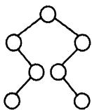

原文页码：1；bbox：`[806, 708, 897, 783]`

## 图 2

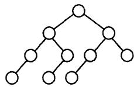

原文页码：2；bbox：`[168, 91, 327, 162]`

## 图 3

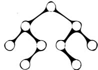

原文页码：2；bbox：`[168, 165, 304, 232]`

## 图 4

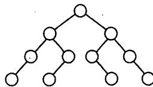

原文页码：2；bbox：`[554, 90, 732, 160]`

## 图 5

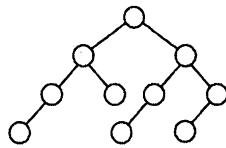

原文页码：2；bbox：`[556, 161, 713, 232]`

## 图 6

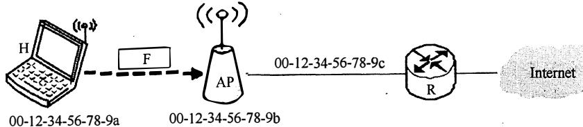

原文页码：5；bbox：`[211, 159, 792, 247]`

## 图 7

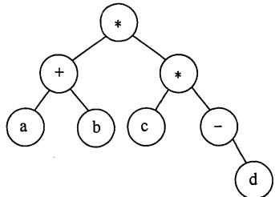

原文页码：5；bbox：`[246, 743, 482, 861]`

## 图 8

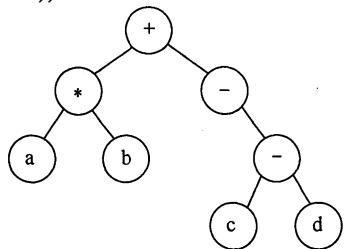

原文页码：5；bbox：`[544, 742, 782, 861]`

## 图 9

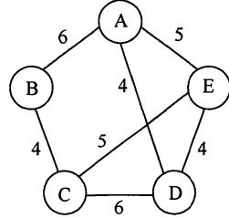

原文页码：6；bbox：`[400, 234, 574, 349]`

## 图 10

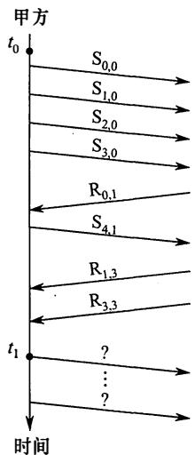

原文页码：8；bbox：`[318, 268, 471, 516]`

**图注：** (a)

## 图 11

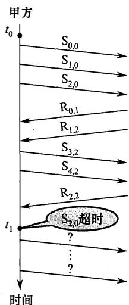

原文页码：8；bbox：`[511, 267, 662, 514]`

**图注：** (b)
