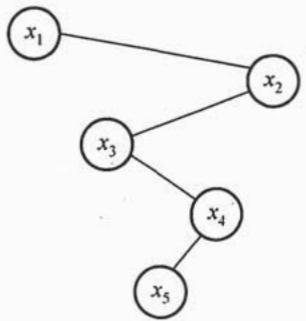
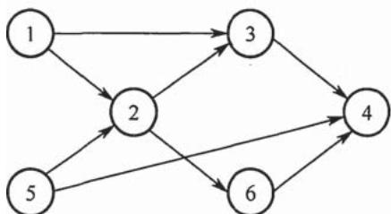
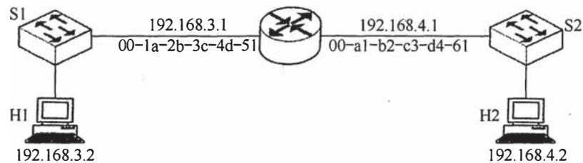
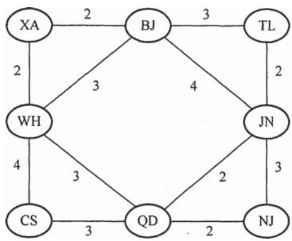
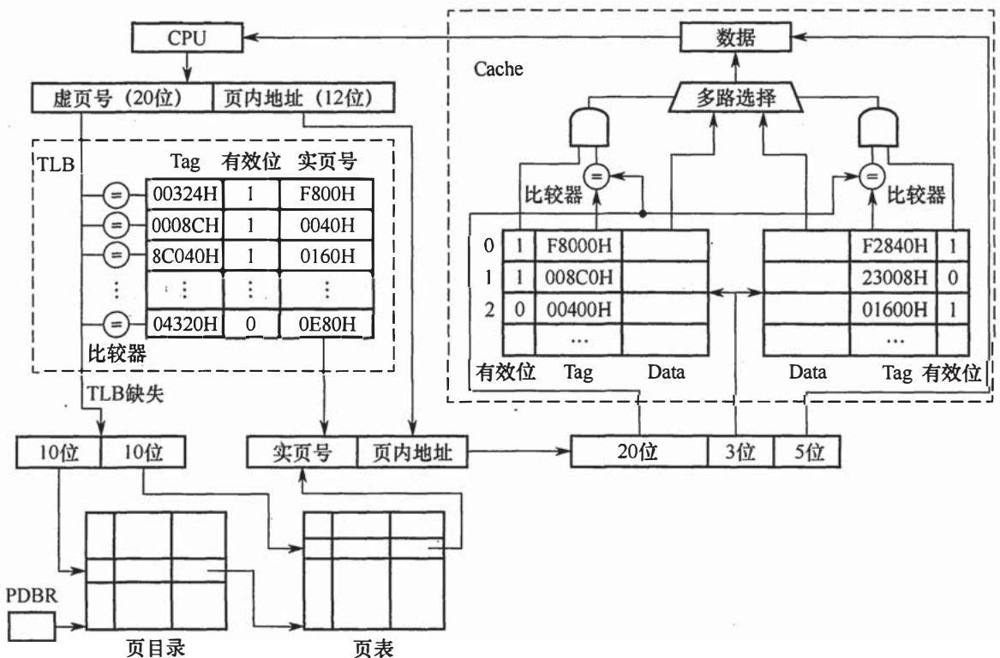
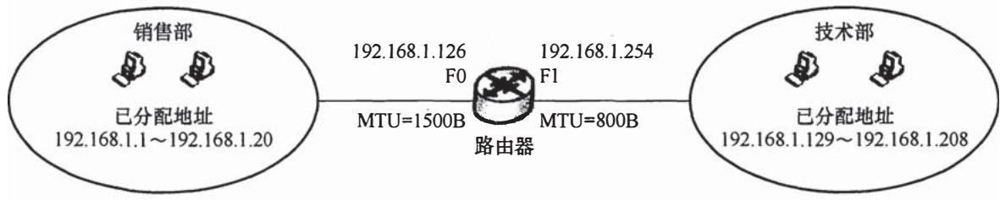

# 2018年计算机408统考真题.pdf — 图像索引

> 由 MinerU 结构化结果生成。题目若依赖树形、拓扑、流程、曲线、区域、时序或其他空间关系，应核对这里的原图，不要只依据 OCR 文本推断。

## 图 1

原文页码：1；bbox：`[400, 796, 584, 933]`

## 图 2

原文页码：2；bbox：`[376, 138, 640, 241]`

## 图 3

原文页码：5；bbox：`[240, 347, 734, 445]`

**图注：** 00-1a-2b-3c-4d-52 00-a1-b2-c3-d4-62

## 图 4

原文页码：6；bbox：`[364, 91, 658, 262]`

**图注：** 题42图

## 图 5

原文页码：7；bbox：`[136, 91, 842, 419]`

**图注：** 题44图

## 图 6

原文页码：8；bbox：`[151, 90, 865, 191]`

**图注：** 题47图
