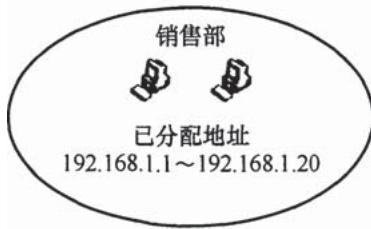
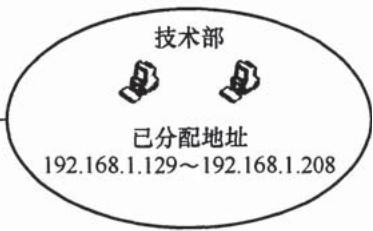

# 2018年计算机408统考真题.pdf

# 2018年全国硕士研究生入学统一考试

# 计算机科学与技术学科联考计算机学科专业基础综合试题

## 一、单项选择题（第 1～40 小题，每小题 2 分，共 80 分。下列每题给出的四个选项中，只有一个选项最符合试题要求）

1. 若栈 $S_{1}$ 中保存整数，栈 $S_{2}$ 中保存运算符，函数 $F()$ 依次执行下述各步操作：

(1) 从 $S_{1}$ 中依次弹出两个操作数 a 和 b;

(2) 从 $S_{2}$ 中弹出一个运算符 op;

(3) 执行相应的运算 b op a;

(4) 将运算结果压入 $S_{1}$ 中。

假定 $S_{1}$ 中的操作数依次是 5, 8, 3, 2（2 在栈顶）， $S_{2}$ 中的运算符依次是 $*, -, + (+$ 在栈顶）。调用 3 次 $F()$ 后， $S_{1}$ 栈顶保存的值是 \_\_\_\_。
A. -15
B. 15
C. -20
D. 20

2. 现有队列 Q 与栈 S，初始时 Q 中的元素依次是 1, 2, 3, 4, 5, 6（1 在队头），S 为空。若仅允许下列 3 种操作：① 出队并输出出队元素；② 出队并将出队元素入栈；③ 出栈并输出出栈元素，则不能得到的输出序列是\_\_\_\_。
A. 1, 2, 5, 6, 4, 3
B. 2, 3, 4, 5, 6, 1
C. 3, 4, 5, 6, 1, 2
D. 6, 5, 4, 3, 2, 1

3. 设有一个 $12 \times 12$ 的对称矩阵 $M$ ，将其上三角部分的元素 $m_{i,j}$ （ $1 \leqslant i \leqslant j \leqslant 12$ ）按行优先存入 C 语言的一维数组 N 中，元素 $m_{6,6}$ 在 N 中的下标是 \_\_\_\_。
A. 50    B. 51    C. 55    D. 66

4. 设一棵非空完全二叉树 T 的所有叶结点均位于同一层，且每个非叶结点都有 2 个子结点。若 T 有 k 个叶结点，则 T 的结点总数是 \_\_\_\_。
A. 2k - 1
B. 2k
C. $k^{2}$ D. $2^{k} - 1$

5. 已知字符集 $\{a, b, c, d, e, f\}$ ，若各字符出现的次数分别为 6, 3, 8, 2, 10, 4，则对应字符集中各字符的哈夫曼编码可能是 \_\_\_\_。
A. 00, 1011, 01, 1010, 11, 100
B. 00, 100, 110, 000, 0010, 01
C. 10, 1011, 11, 0011, 00, 010
D. 0011, 10, 11, 0010, 01, 000

6. 已知二叉排序树如下图所示，元素之间应满足的大小关系是\_\_\_\_。

A. $x_{1} <   x_{2} <   x_{5}$ B. $x_{1} <   x_{4} <   x_{5}$ C. $x_{3} <   x_{5} <   x_{4}$ D. $x_{4} <   x_{3} <   x_{5}$

7. 下列选项中，不是如下有向图的拓扑序列的是\_\_\_\_。

A. 1, 5, 2, 3, 6, 4 B. 5, 1, 2, 6, 3, 4 C. 5, 1, 2, 3, 6, 4 D. 5, 2, 1, 6, 3, 4

8. 高度为 5 的 3 阶 B 树含有的关键字个数至少是\_\_\_\_。
A. 15    B. 31    C. 62    ,    D. 242

9. 现有长度为 7、初始为空的散列表 HT，散列函数 $H(k) = k\% 7$ ，用线性探测再散列法解决冲突。将关键字 22, 43, 15 依次插入到 HT 后，查找成功的平均查找长度是 \_\_\_\_。
A. 1.5    B. 1.6    C. 2    D. 3

10. 对初始数据序列(8,3,9,11,2,1,4,7,5,10,6)进行希尔排序。若第一趟排序结果为(1,3,7,5,2,6,4,9,11,10,8)，第二趟排序结果为(1,2,6,4,3,7,5,8,11,10,9)，则两趟排序采用的增量（间隔）依次是\_\_\_\_。
A. 3, 1    B. 3, 2    C. 5, 2    D. 5, 3

11. 在将数据序列(6,1,5,9,8,4,7)建成大根堆时，正确的序列变化过程是\_\_\_\_。
A. 6, 1, 7, 9, 8, 4, 5 → 6, 9, 7, 1, 8, 4, 5 → 9, 6, 7, 1, 8, 4, 5 → 9, 8, 7, 1, 6, 4, 5
B. 6, 9, 5, 1, 8, 4, 7 → 6, 9, 7, 1, 8, 4, 5 → 9, 6, 7, 1, 8, 4, 5 → 9, 8, 7, 1, 6, 4, 5
C. 6, 9, 5, 1, 8, 4, 7 → 9, 6, 5, 1, 8, 4, 7 → 9, 6, 7, 1, 8, 4, 5 → 9, 8, 7, 1, 6, 4, 5
D. 6, 1, 7, 9, 8, 4, 5 → 7, 1, 6, 9, 8, 4, 5 → 7, 9, 6, 1, 8, 4, 5 → 9, 7, 6, 1, 8, 4, 5 → 9, 8, 6, 1, 7, 4, 5

I. 二进制的运算规则简单
II. 制造两个稳态的物理器件较容易
III. 便于用逻辑门电路实现算术运算
A. 仅 I、II    B. 仅 I、III    C. 仅 II、III    D.I、II 和 III

13. 假定带符号整数采用补码表示，若 int 型变量 x 和 y 的机器数分别是 FFFF FFDFH 和 0000 0041H，则 x、y 的值以及 x-y 的机器数分别是 \_\_\_\_。
A. x = -65, y = 41, x - y 的机器数溢出
B. x = -33, y = 65, x - y 的机器数为 FFFF FF9DH
C. x = -33, y = 65, x - y 的机器数为 FFFF FF9EH
D. x = -65, y = 41, x - y 的机器数为 FFFF FF96H

14. IEEE 754 单精度浮点格式表示的数中，最小的规格化正数是\_\_\_\_。
A. $1.0 \times 2^{-126}$ B. $1.0 \times 2^{-127}$ C. $1.0 \times 2^{-128}$ D. $1.0 \times 2^{-149}$

15. 某 32 位计算机按字节编址，采用小端（Little Endian）方式。若语句 “int i = 0;” 对应指令的机器代码为 “C7 45 FC 00 00 00 00”，则语句 “int i = -64;” 对应指令的机器代码是 \_\_\_\_。
A. C7 45 FC C0 FF FF FF
B. C7 45 FC 0C FF FF FF
C. C7 45 FC FF FF FF C0
D. C7 45 FC FF FF FF 0C

16. 整数 x 的机器数为 11011000，分别对 x 进行逻辑右移 1 位和算术右移 1 位操作，得到的机器数分别是 \_\_\_\_。

A. 1110 1100, 1110 1100 B. 0110 1100, 1110 1100 C. 1110 1100, 0110 1100 D. 0110 1100, 0110 1100

17. 假定 DRAM 芯片中存储阵列的行数为 r、列数为 c，对于一个 $2K \times 1$ 位的 DRAM 芯片，为保证其地址引脚数最少，并尽量减少刷新开销，则 r、c 的取值分别是 \_\_\_\_。
A. 2048、1 B. 64、32 C. 32、64 D. 1、2048

18. 按字节编址的计算机中, 某 double 型数组 A 的首地址为 $2000 \mathrm{~H}$ , 使用变址寻址和循环结构访问数组 A, 保存数组下标的变址寄存器初值为 0, 每次循环取一个数组元素, 其偏移地址为变址值乘以 sizeof(double), 取完后变址寄存器内容自动加 1。若某次循环所取元素的地址为 $2100 \mathrm{~H}$ , 则进入该次循环时变址寄存器的内容是 \_\_\_\_。
A. 25 B. 32 C. 64 D. 100

19. 减法指令 “sub R1, R2, R3” 的功能为 “(R1) - (R2) → R3”，该指令执行后将生成进位/借位标志 CF 和溢出标志 OF。若(R1) = FFFF FFFFH，(R2) = FFFF FFF0H，则该减法指令执行后，CF 与 OF 分别为 \_\_\_\_。
A. CF = 0, OF = 0    B. CF = 1, OF = 0    C. CF = 0, OF = 1    D. CF = 1, OF = 1

20. 若某计算机最复杂指令的执行需要完成 5 个子功能, 分别由功能部件 A\~E 实现, 各功能部件所需时间分别为 $80 \mathrm{ps}$ 、 $50 \mathrm{ps}$ 、 $50 \mathrm{ps}$ 、 $70 \mathrm{ps}$ 和 $50 \mathrm{ps}$ , 采用流水线方式执行指令, 流水段寄存器延时为 $20 \mathrm{ps}$ , 则 CPU 时钟周期至少为 \_\_\_\_。  
A. 60ps B. 70ps C. 80ps D. 100ps

21. 下列选项中，可提高同步总线数据传输率的是\_\_\_\_。
Ⅰ. 增加总线宽度    Ⅱ. 提高总线工作频率
Ⅲ. 支持突发传输    Ⅳ. 采用地址/数据线复用
A. 仅 I、II    B. 仅 I、II、III    C. 仅 III、IV    D.I、II、III 和 IV

22. 下列关于外部 I/O 中断的叙述中, 正确的是\_\_\_\_。
A. 中断控制器按所接收中断请求的先后次序进行中断优先级排队
B. CPU 响应中断时, 通过执行中断隐指令完成通用寄存器的保护
C. CPU 只有在处于中断允许状态时, 才能响应外部设备的中断请求
D. 有中断请求时, CPU 立即暂停当前指令执行, 转去执行中断服务程序

23. 下列关于多任务操作系统的叙述，正确的是\_\_\_\_。
Ⅰ. 具有并发和并行的特点
· Ⅱ. 需要实现对共享资源的保护
Ⅲ. 需要运行在多 CPU 的硬件平台上
A. 仅 I    B. 仅 II    C. 仅 I、II    D.I、II、III

24. 某系统采用基于优先权的非抢占式进程调度策略，完成一次进程调度和进程切换的系统时间开销为 $1 \mu s$ 。在 T 时刻就绪队列中有 3 个进程 $P_{1}$ 、 $P_{2}$ 和 $P_{3}$ ，其在就绪队列中的等待时间、需要的 CPU 时间和优先权如下表所示。

<table><tr><td>进程</td><td>等待时间</td><td>需要的 CPU 时间</td><td>优先权</td></tr><tr><td> $P_{1}$ </td><td>30μs</td><td>12μs</td><td>10</td></tr><tr><td> $P_{2}$ </td><td>15μs</td><td>24μs</td><td>30</td></tr><tr><td> $P_{3}$ </td><td>18μs</td><td>36μs</td><td>20</td></tr></table>

若优先权值大的进程优先获得 CPU，从 T 时刻起系统开始进程调度，系统的平均周转时间为 \_\_\_\_。

A. $54\mu \mathrm{s}$ B. $73\mu \mathrm{s}$ C. $74\mu \mathrm{s}$ D. $75\mu \mathrm{s}$

25. 属于同一进程的两个线程 thread1 和 thread2 并发执行，共享初值为 0 的全局变量 x。thread1 和 thread2 实现对全局变量 x 加 1 的机器级代码描述如下。

<table><tr><td colspan="2">thread1</td><td colspan="2">thread2</td></tr><tr><td>mov R1, x</td><td> $//(x) \rightarrow R1$ </td><td>mov R2, x</td><td> $//(x) \rightarrow R2$ </td></tr><tr><td>inc R1</td><td> $//(R1) + 1 \rightarrow R1$ </td><td>inc R2</td><td> $//(R2) + 1 \rightarrow R2$ </td></tr><tr><td>mov x, R1</td><td> $//(R1) \rightarrow x$ </td><td>mov x, R2</td><td> $//(R2) \rightarrow x$ </td></tr></table>

在所有可能的指令执行序列中，使 x 的值为 2 的序列个数是\_\_\_\_。
A. 1 B. 2 C. 3 D. 4

26. 假设系统中有 4 个同类资源, 进程 $\mathrm{P}_{1}, \mathrm{P}_{2}$ 和 $\mathrm{P}_{3}$ 需要的资源数分别为 4, 3 和 1, $\mathrm{P}_{1}, \mathrm{P}_{2}$ 和 $\mathrm{P}_{3}$ 已申请到的资源数分别为 2, 1 和 0, 则执行安全性检测算法的结果是 \_\_\_\_。

A. 不存在安全序列, 系统处于不安全状态

B. 存在多个安全序列, 系统处于安全状态

C. 存在唯一安全序列 $\mathrm{P}_{3}, \mathrm{P}_{1}, \mathrm{P}_{2}$ , 系统处于安全状态

D. 存在唯一安全序列 $\mathrm{P}_{3}, \mathrm{P}_{2}, \mathrm{P}_{1}$ , 系统处于安全状态

27. 下列选项中，可能导致当前进程 P 阻塞的事件是 \_\_\_\_。
I. 进程 P 申请临界资源
II. 进程 P 从磁盘读数据

III. 系统将 CPU 分配给高优先权的进程
A. 仅 I    B. 仅 II    C. 仅 I、II    D. I、II、III

28. 若 x 是管程内的条件变量，则当进程执行 x.wait() 时所做的工作是 \_\_\_\_。
A. 实现对变量 x 的互斥访问
B. 唤醒一个在 x 上阻塞的进程
C. 根据 x 的值判断该进程是否进入阻塞状态
D. 阻塞该进程，并将之插入 x 的阻塞队列中

29. 当定时器产生时钟中断后，由时钟中断服务程序更新的部分内容是\_\_\_\_。

III. 当前进程在时间片内的剩余执行时间
A. 仅 I、II    B. 仅 II、III    C. 仅 I、III    D. I、II、III

30. 系统总是访问磁盘的某个磁道而不响应对其他磁道的访问请求，这种现象称为磁臂黏着。下列磁盘调度算法中，不会导致磁臂黏着的是\_\_\_\_。
A. 先来先服务（FCFS）
B. 最短寻道时间优先（SSTF）
C. 扫描算法（SCAN）
D. 循环扫描算法（CSCAN）

31. 下列优化方法中，可以提高文件访问速度的是\_\_\_\_。
Ⅰ. 提前读    Ⅱ. 为文件分配连续的簇
Ⅲ. 延迟写    Ⅳ. 采用磁盘高速缓存
A. 仅 I、II    B. 仅 II、III    C. 仅 I、III、IV    D. I、II、III、IV

32. 下列同步机制中，可以实现让权等待的是\_\_\_\_。
A. Peterson 方法    B. swap 指令    C. 信号量方法    D. TestAndSet 指令

33. 下列 TCP/P 应用层协议中，可以使用传输层无连接服务的是 \_\_\_\_。

A. FTP    B. DNS    C. SMTP    D. HTTP

34. 下列选项中, 不属于物理层接口规范定义范畴的是\_\_\_\_。
A. 接口形状    B. 引脚功能    C. 物理地址    D. 信号电平

35. IEEE 802.11 无线局域网的 MAC 协议 CSMA/CA 进行信道预约的方法是\_\_\_\_。
A. 发送确认帧    B. 采用二进制指数退避
C. 使用多个 MAC 地址    D. 交换 RTS 与 CTS 帧

36. 主机甲采用停-等协议向主机乙发送数据, 数据传输速率是 $3 \mathrm{kbps}$ , 单向传播延时是 $200 \mathrm{~ms}$ , 忽略确认帧的传输延时。当信道利用率等于 $40 \%$ 时, 数据帧的长度为 \_\_\_\_ 。A. 240 比特 B. 400 比特 C. 480 比特 D. 800 比特

37. 路由器 R 通过以太网交换机 S1 和 S2 连接两个网络，R 的接口、主机 H1 和 H2 的 IP 地址与 MAC 地址如下图所示。若 H1 向 H2 发送 1 个 IP 分组 P，则 H1 发出的封装 P 的以太网帧的目的 MAC 地址、H2 收到的封装 P 的以太网帧的源 MAC 地址分别是 \_\_\_\_。

  
00-1a-2b-3c-4d-52  
00-a1-b2-c3-d4-62

A. 00-a1-b2-c3-d4-62, 00-1a-2b-3c-4d-52  
B. 00-a1-b2-c3-d4-62, 00-a1-b2-c3-d4-61  
C. 00-1a-2b-3c-4d-51, 00-1a-2b-3c-4d-52  
D. 00-1a-2b-3c-4d-51, 00-a1-b2-c3-d4-61

38. 某路由表中有转发接口相同的 4 条路由表项，其目的网络地址分别为 35.230.32.0/21, 35.230.40.0/21, 35.230.48.0/21 和 35.230.56.0/21，将该 4 条路由聚合后的目的网络地址为 \_\_\_\_。
A. 35.230.0.0/19
B. 35.230.0.0/20
C. 35.230.32.0/19
D. 35.230.32.0/20

39. UDP 协议实现分用（demultiplexing）时所依据的头部字段是\_\_\_\_。
A. 源端口号    B. 目的端口号    C. 长度    D. 校验和

40. 无须转换即可由 SMTP 协议直接传输的内容是\_\_\_\_。
A. JPEG 图像    B. MPEG 视频    C. EXE 文件    D. ASCII 文本

## 二、综合应用题（第 41～47 小题，共 70 分）

41. （13 分）给定一个含 $n$ ( $n \geqslant 1$ ) 个整数的数组，请设计一个在时间上尽可能高效的算法，找出数组中未出现的最小正整数。例如，数组 $\{-5, 3, 2, 3\}$ 中未出现的最小正整数是 1；数组 $\{1, 2, 3\}$ 中未出现的最小正整数是 4。要求：

（1）给出算法的基本设计思想。

（2）根据设计思想，采用 C 或 C++ 语言描述算法，关键之处给出注释。

（3）说明你所设计算法的时间复杂度和空间复杂度。

42. （12 分）拟建设一个光通信骨干网络连通 BJ、CS、XA、QD、JN、NJ、TL 和 WH 等 8 个城市，题 42 图中无向边上的权值表示两个城市间备选光纤的铺设费用。

  
题42图

请回答下列问题。

（1）仅从铺设费用角度出发，给出所有可能的最经济的光纤铺设方案（用带权图表示），并计算相应方案的总费用。

（2）题42图可采用图的哪种存储结构？给出求解问题（1）所使用的算法名称。

（3）假设每个城市采用一个路由器按（1）中得到的最经济方案组网，主机 H1 直接连接在 TL 的路由器上，主机 H2 直接连接在 BJ 的路由器上。若 H1 向 H2 发送一个 TTL = 5 的 IP 分组，则 H2 是否可以收到该 IP 分组？

43. （8 分）假定计算机的主频为 500MHz，CPI 为 4。现有设备 A 和 B，其数据传输率分别为 2MB/s 和 40MB/s，对应 I/O 接口中各有一个 32 位数据缓冲寄存器。请回答下列问题，要求给出计算过程。

（1）若设备 A 采用定时查询 I/O 方式，每次输入/输出都至少执行 10 条指令。设备 A 最多间隔多长时间查询一次才能不丢失数据？CPU 用于设备 A 输入/输出的时间占 CPU 总时间的百分比至少是多少？

(2) 在中断 I/O 方式下, 若每次中断响应和中断处理的总时钟周期数至少为 400 , 则设备 B 能否采用中断 I/O 方式? 为什么?

（3）若设备 B 采用 DMA 方式，每次 DMA 传送的数据块大小为 1000B，CPU 用于 DMA 预处理和后处理的总时钟周期数为 500，则 CPU 用于设备 B 输入/输出的时间占 CPU 总时间的百分比最多是多少？

44. （15 分）某计算机采用页式虚拟存储管理方式，按字节编址。CPU 进行存储访问的过程如题 44 图所示。

根据题 44 图回答下列问题。

（1）主存物理地址占多少位？

(2) TLB 采用什么映射方式? TLB 是用 SRAM 还是用 DRAM 实现?

（3）Cache 采用什么映射方式？若 Cache 采用 LRU 替换算法和回写（Write Back）策略，则 Cache 每行中除数据（Data）、Tag 和有效位外，还应有哪些附加位？Cache 的总容量是多少？Cache 中有效位的作用是什么？

（4）若 CPU 给出的虚拟地址为 0008 C040H，则对应的物理地址是多少？是否在 Cache 中命中？说明理由。若 CPU 给出的虚拟地址为 0007 C260H，则该地址所在主存块映射到的 Cache 组号是多少？

  
题44图  
45. （8 分）请根据题 44 图给出的虚拟存储管理方式，回答下列问题。

（1）某虚拟地址对应的页目录号为6，在相应的页表中对应的页号为6，页内偏移量为8，该虚拟地址的十六进制表示是什么？

（2）寄存器 PDBR 用于保存当前进程的页目录起始地址，该地址是物理地址还是虚拟地址？进程切换时，PDBR 的内容是否会变化？说明理由。同一进程的线程切换时，PDBR 的内容是否会变化？说明理由。

（3）为了支持改进型 CLOCK 置换算法，需要在页表项中设置哪些字段？

46. （7 分）某文件系统采用索引节点存放文件的属性和地址信息，簇大小为 4KB。每个文件索引节点占 64B，有 11 个地址项，其中直接地址项 8 个，一级、二级和三级间接地址项各 1 个，每个地址项长度为 4B。请回答下列问题。

（1）该文件系统能支持的最大文件长度是多少？（给出计算表达式即可。）

（2）文件系统用 1M（ $1\mathrm{M} = 2^{20}$ ）个簇存放文件索引节点，用 512M 个簇存放文件数据。若一个图像文件的大小为 5600B，则该文件系统最多能存放多少个图像文件？

（3）若文件 F1 的大小为 6KB，文件 F2 的大小为 40KB，则该文系统获取 F1 和 F2 最后一个簇的簇号需要的时间是否相同？为什么？

47. （7 分）某公司的网络如题 47 图所示。IP 地址空间 192.168.1.0/24 被均分给销售部和技术部两个子网，并已分别为部分主机和路由器接口分配了 IP 地址，销售部子网的 MTU = 1500B，技术部子网的 MTU = 800B。

请回答下列问题。

（1）销售部子网的广播地址是什么？技术部子网的子网地址是什么？若每个主机仅分配一个IP地址，则技术部子网还可以连接多少台主机？

  
题47图

（2）假设主机 192.168.1.1 向主机 192.168.1.208 发送一个总长度为 1500B 的 IP 分组，IP 分组的头部长度为 20B，路由器在通过接口 F1 转发该 IP 分组时进行了分片。若分片时尽可能分为最大片，则一个最大 IP 分片封装数据的字节数是多少？至少需要分为几个分片？每个分片的片偏移量是多少？
