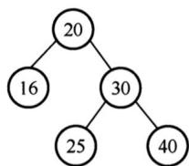
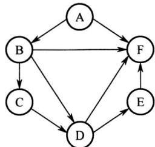
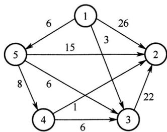
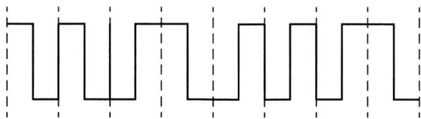
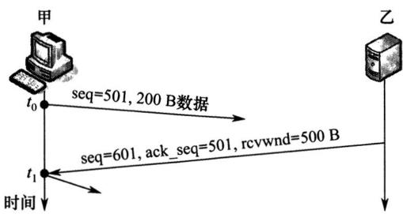
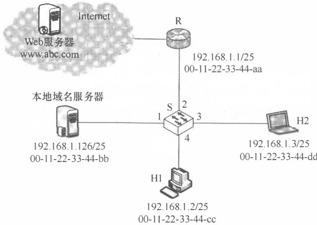

# 2021年计算机408统考真题.pdf — 图像索引

> 由 MinerU 结构化结果生成。题目若依赖树形、拓扑、流程、曲线、区域、时序或其他空间关系，应核对这里的原图，不要只依据 OCR 文本推断。

## 图 1

原文页码：1；bbox：`[403, 846, 550, 934]`

## 图 2

原文页码：2；bbox：`[429, 157, 612, 276]`

## 图 3

原文页码：2；bbox：`[403, 390, 640, 518]`

## 图 4

原文页码：5；bbox：`[266, 512, 693, 595]`

## 图 5

原文页码：6；bbox：`[337, 497, 700, 629]`

## 图 6

原文页码：9；bbox：`[281, 418, 740, 641]`

**图注：** 题 47 图
