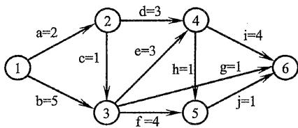
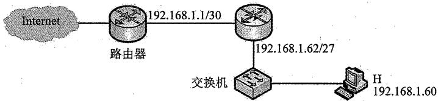
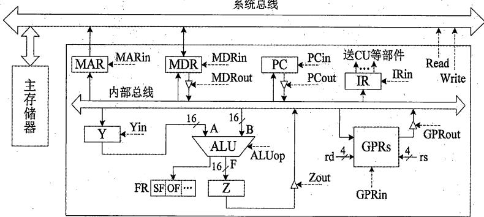
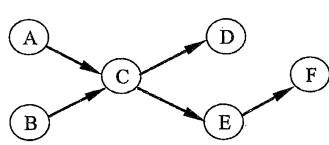

# 2022年计算机408统考真题.pdf — 图像索引

> 由 MinerU 结构化结果生成。题目若依赖树形、拓扑、流程、曲线、区域、时序或其他空间关系，应核对这里的原图，不要只依据 OCR 文本推断。

## 图 1

原文页码：2；bbox：`[174, 122, 508, 172]`

## 图 2

原文页码：2；bbox：`[627, 586, 924, 675]`

## 图 3

原文页码：2；bbox：`[293, 749, 780, 804]`

## 图 4

原文页码：5；bbox：`[239, 534, 742, 615]`

## 图 5

原文页码：6；bbox：`[340, 305, 517, 418]`

**图注：** 二叉树T1

## 图 6

原文页码：6；bbox：`[589, 302, 727, 417]`

**图注：** 二叉树T2

## 图 7

原文页码：7；bbox：`[238, 64, 792, 234]`

**图注：** 题43图

## 图 8

原文页码：7；bbox：`[675, 736, 886, 857]`

**图注：** 题45(a)图

## 图 9

原文页码：8；bbox：`[685, 254, 914, 323]`

**图注：** 题46图

## 图 10

原文页码：8；bbox：`[236, 505, 780, 682]`

**图注：** 题47图
