# 2023年计算机408统考真题.pdf — 图像索引

> 由 MinerU 结构化结果生成。题目若依赖树形、拓扑、流程、曲线、区域、时序或其他空间关系，应核对这里的原图，不要只依据 OCR 文本推断。

## 图 1

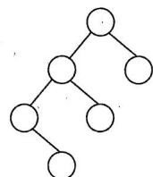

原文页码：2；bbox：`[796, 458, 914, 554]`

## 图 2

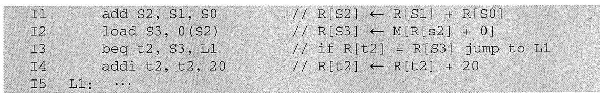

原文页码：3；bbox：`[120, 766, 920, 852]`

## 图 3

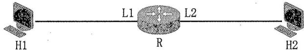

原文页码：5；bbox：`[281, 430, 714, 480]`

## 图 4

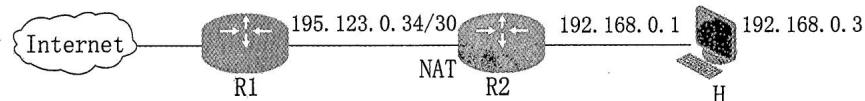

原文页码：5；bbox：`[196, 847, 800, 896]`

## 图 5

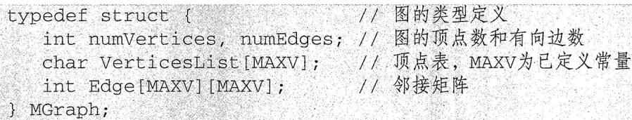

原文页码：6；bbox：`[153, 330, 779, 412]`

## 图 6

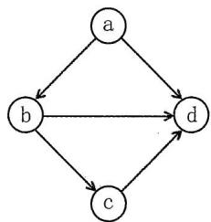

原文页码：6；bbox：`[750, 423, 910, 541]`

## 图 7

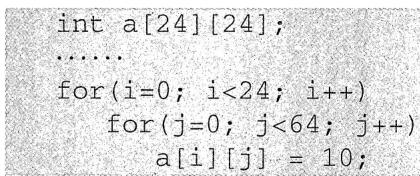

原文页码：6；bbox：`[120, 723, 412, 809]`

## 图 8

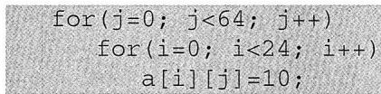

原文页码：7；bbox：`[151, 186, 443, 236]`

## 图 9

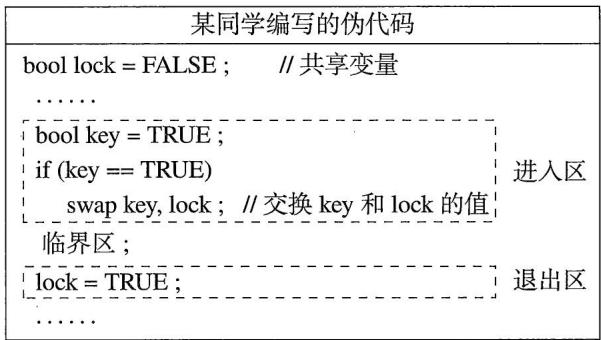

原文页码：8；bbox：`[164, 58, 582, 223]`

**图注：** (a)

## 图 10

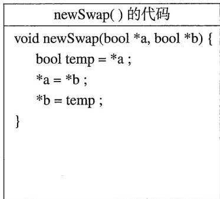

原文页码：8；bbox：`[613, 58, 872, 221]`

**图注：** (b)

## 图 11

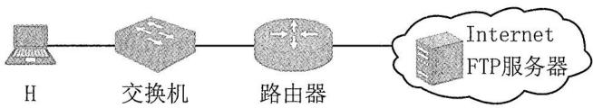

原文页码：8；bbox：`[274, 546, 729, 604]`
