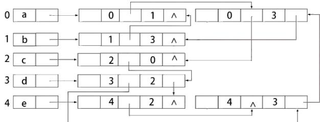
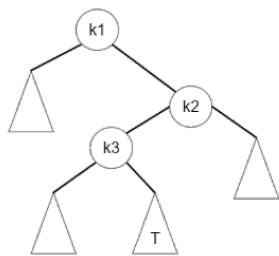
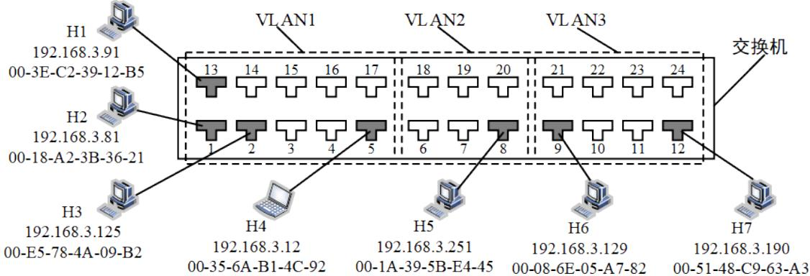
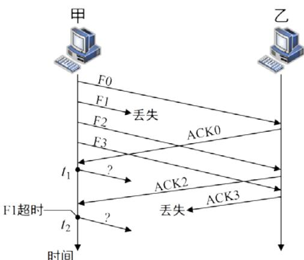
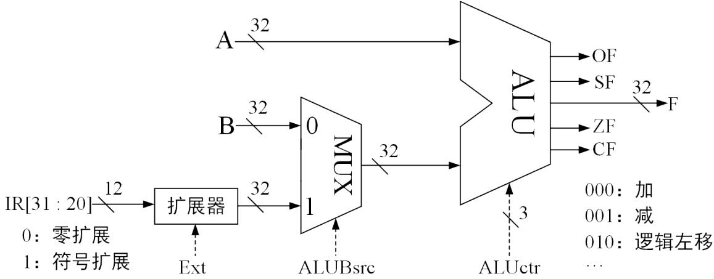
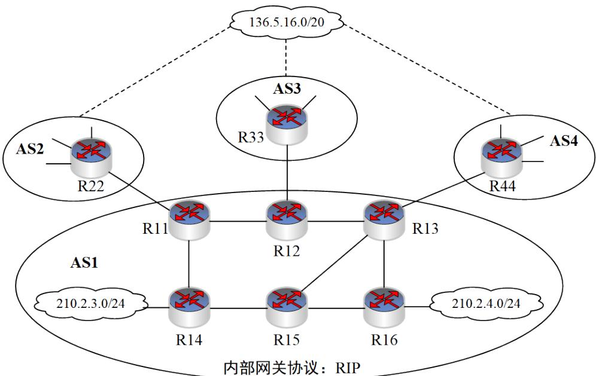

# 24考研408真题【题】_.pdf — 图像索引

> 由 MinerU 结构化结果生成。题目若依赖树形、拓扑、流程、曲线、区域、时序或其他空间关系，应核对这里的原图，不要只依据 OCR 文本推断。

## 图 1

原文页码：1；bbox：`[324, 720, 702, 822]`

**图注：** 题4图

## 图 2

原文页码：2；bbox：`[470, 313, 638, 423]`

## 图 3

原文页码：6；bbox：`[287, 472, 709, 595]`

## 图 4

原文页码：7；bbox：`[157, 68, 838, 233]`

**图注：** 题35图

## 图 5

原文页码：7；bbox：`[347, 508, 653, 693]`

**图注：** 题37图

## 图 6

原文页码：10；bbox：`[168, 502, 867, 696]`

**图注：** 题 43 图 (b)

## 图 7

原文页码：15；bbox：`[198, 209, 800, 478]`

**图注：** 题47图
