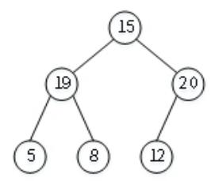
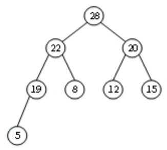
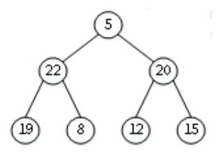
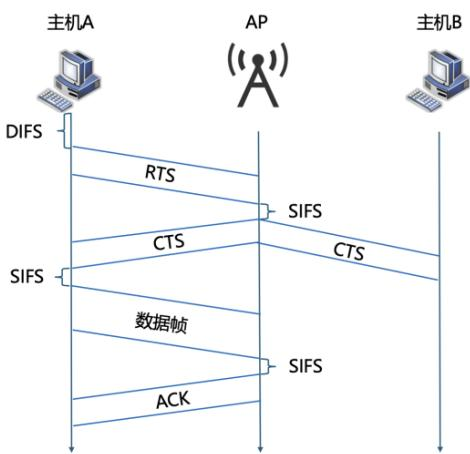

# 24考研408答案【答案和解析】_.pdf — 图像索引

> 由 MinerU 结构化结果生成。题目若依赖树形、拓扑、流程、曲线、区域、时序或其他空间关系，应核对这里的原图，不要只依据 OCR 文本推断。

## 图 1

原文页码：3；bbox：`[250, 766, 413, 864]`

## 图 2

原文页码：3；bbox：`[398, 501, 594, 626]`

## 图 3

原文页码：3；bbox：`[240, 661, 426, 755]`

## 图 4

原文页码：10；bbox：`[352, 70, 636, 263]`
