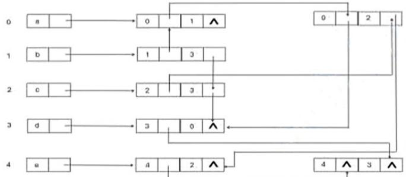
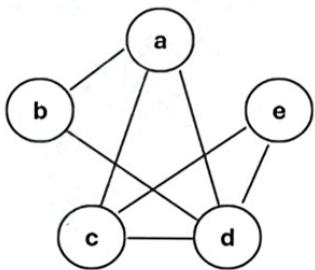
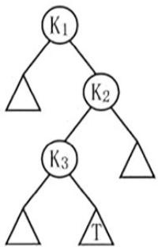
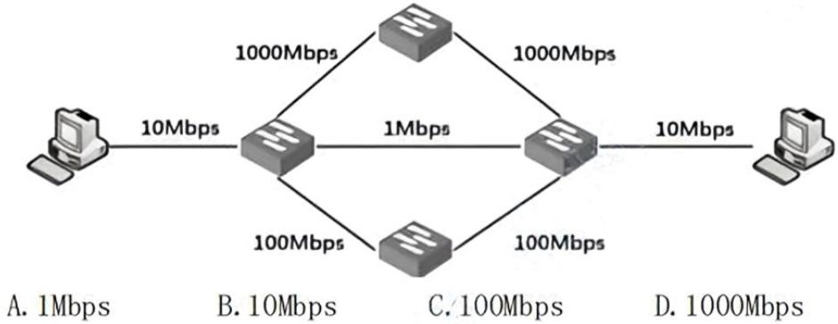
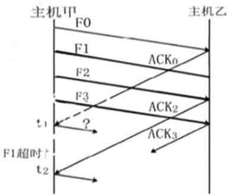
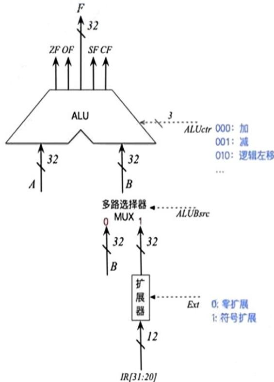

# 2024年408计算机专业基础综合真题【解析】.pdf — 图像索引

> 由 MinerU 结构化结果生成。题目若依赖树形、拓扑、流程、曲线、区域、时序或其他空间关系，应核对这里的原图，不要只依据 OCR 文本推断。

## 图 1

原文页码：2；bbox：`[117, 677, 531, 804]`

## 图 2

原文页码：2；bbox：`[122, 874, 312, 989]`

## 图 3

原文页码：3；bbox：`[438, 505, 559, 638]`

## 图 4

原文页码：11；bbox：`[124, 132, 692, 287]`

## 图 5

原文页码：12；bbox：`[115, 473, 347, 613]`

## 图 6

原文页码：17；bbox：`[102, 447, 443, 784]`
