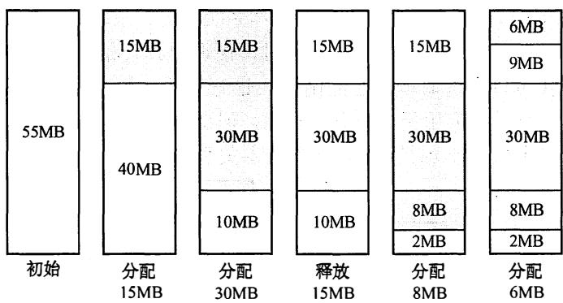
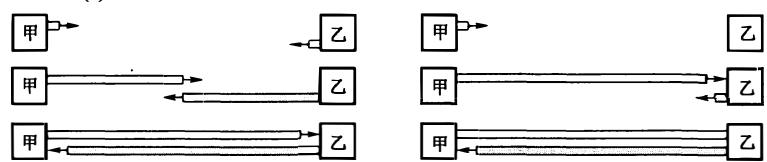
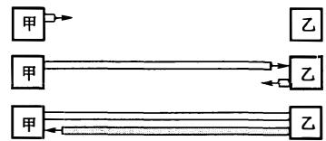

# 2010年计算机408统考真题解析.pdf

# 2010 年计算机学科专业基础综合试题参考答案

## 一、单项选择题

<table><tr><td>1.</td><td>D</td><td>2.</td><td>C</td><td>3.</td><td>D</td><td>4.</td><td>C</td><td>5.</td><td>B</td><td>6.</td><td>A</td><td>7.</td><td>C</td><td>8.</td><td>B</td></tr><tr><td>9.</td><td>B</td><td>10.</td><td>D</td><td>11.</td><td>A</td><td>12.</td><td>D</td><td>13.</td><td>B</td><td>14.</td><td>B</td><td>15.</td><td>D</td><td>16.</td><td>A</td></tr><tr><td>17.</td><td>D</td><td>18.</td><td>B</td><td>19.</td><td>A</td><td>20.</td><td>D</td><td>21.</td><td>A</td><td>22.</td><td>D</td><td>23.</td><td>A</td><td>24.</td><td>C</td></tr><tr><td>25.</td><td>B</td><td>26.</td><td>A</td><td>27.</td><td>D</td><td>28.</td><td>B</td><td>29.</td><td>B</td><td>30.</td><td>C</td><td>31.</td><td>C</td><td>32.</td><td>B</td></tr><tr><td>33.</td><td>C</td><td>34.</td><td>C</td><td>35.</td><td>D</td><td>36.</td><td>C</td><td>37.</td><td>B</td><td>38.</td><td>D</td><td>39.</td><td>A</td><td>40.</td><td>A</td></tr></table>

## 1. 解析：

选项 A 可由 in, in, in, in, out, out, in, out, out, in, out, out 得到；选项 B 可由 in, in, in, out, out, in, out, out, in, out, in, out, in, out, in, out 得到；选项 C 可由 in, in, out, in, out, out, in, in, out, in, out, out 得到；选项 D 可由 in, out, in, in, in, in, in, out, out, out, out 得到，但题意要求不允许连续三次退栈操作，故 D 不可能得到。

【另解】先进栈的元素后出栈，进栈顺序为 a, b, c, d, e, f，故连续出栈时的序列必然是按字母表逆序的，若出栈序列中出现了长度大于等于 3 的连续逆序子序列，则为不符合要求的出栈序列。

## 2. 解析:

本题的队列实际上是一个输出受限的双端队列。A 操作：a 左入（或右入）、b 左入、c 右入、d 右入、e 右入。B 操作：a 左入（或右入）、b 左入、c 右入、d 左入、e 右入。D 操作：a 左入（或右入）、b 左入、c 左入、d 右入、e 左入。C 操作：a 左入（或右入）、b 右入、因 d 未出，此时只能进队，c 怎么进都不可能在 b 和 a 之间。

【另解】初始时队列为空，第1个元素a左入（或右入），而第2个元素b无论是左入还是右入都必与a相邻，而选项D中a与b不相邻，不合题意。

## 3. 解析:

题中所给二叉树的后序序列为 d, b, c, a。结点 d 无前驱和左子树，左链域空，无右子树，右链域指向其后继结点 b；结点 b 无左子树，左链域指向其前驱结点 d；结点 c 无左子树，左链域指向其前驱结点 b，无右子树，右链域指向其后继结点 a。故选 D。

## 4. 解析:

插入 48 以后，该二叉树根结点的平衡因子由-1 变为-2，在最小不平衡子树根结点的右子树（R）的左子树（L）中插入新结点引起的不平衡属于 RL 型平衡旋转，需要做两次旋转操作（先右旋后左旋）。

  
调整后，关键字37所在结点的左、右子结点中保存的关键字分别是24、53。

## 5. 解析:

设树中度为 $i$ ( $i=0,1,2,3,4$ ) 的结点数分别为 $N_i$ ，树中结点总数为 $N$ ，则树中各结点的度之和等于 $N-1$ ，即 $N=1+N_1+2N_2+3N_3+4N_4=N_0+N_1+N_2+N_3+N_4$ ，根据题设中的数据，即可得到 $N_0=82$ ，即树 $\dot{T}$ 的叶结点的个数是 82。

## 6. 解析:

哈夫曼树为带权路径长度最小的二叉树，不一定是完全二叉树。哈夫曼树中没有度为1的结点，B正确；构造哈夫曼树时，最先选取两个权值最小的结点作为左、右子树构造一棵新的二叉树，C正确；哈夫曼树中任一非叶结点P的权值为其左、右子树根结点权值之和，其权值不小于其左、右子树根结点的权值，在与结点P的左、右子树根结点处于同一层的结点中，若存在权值大于结点P权值的结点Q，则结点Q的兄弟结点中权值较小的一个应该与结点P作为左、右子树构造新的二叉树。综上可知，哈夫曼树中任一非叶结点的权值一定不小于下一层任一结点的权值。

## 7. 解析:

要保证无向图 G 在任何情况下都是连通的，即任意变动图 G 中的边，G 始终保持连通，首先需要 G 的任意 6 个结点构成完全连通子图 G1，需 $n(n-1)/2 = 6 \times (6-1)/2 = 15$ 条边，然后再添一条边将第 7 个结点与 G1 连接起来，共需 16 条边。

## 8. 解析:

拓扑排序的过程如下图所示。

  
可以得到 3 个不同的拓扑序列，分别为 abced、abecd、aebcd。

## 9. 解析:

折半查找法在查找成功时进行的关键字比较次数最多为 $\left\lfloor\log_{2}n\right\rfloor+1$ ，即判定树的高度；折半查找法在查找不成功时进行的关键字比较次数最多为 $\left\lfloor\log_{2}n\right\rfloor+1$ 。题中n=16，因此最多比较 $\left\lfloor\log_{2}16\right\rfloor+1=5$ 次。也可以画出草图求解。

思考：若本题题干改为求最少的比较次数呢？

## 10. 解析:

快递排序的递归次数与元素的初始排列有关。若每次划分后分区比较平衡，则递归次数少；若划分后分区不平衡，则递归次数多。但快速排序的递归次数与分区处理顺序无关，即先处理较长的分区或先处理较短的分区都不影响递归次数。

此外，可以形象地把快速排序的递归调用过程用一个二叉树描述，先处理较长或较短分区，

可以想象为交换某一递归结点处的左右子树，这并不会影响树中的分支数。

## 11. 解析:

题中所给的三趟排序过程中，每一趟排序是从前往后依次比较，使最大值 “沉底”，符合冒泡排序的特点。

看第一趟可知仅有 88 被移到最后。

\- 如果是希尔排序，则 12,88,10 应变为 10,12,88。因此排除希尔排序。

\- 如果是归并排序，则长度为2的子序列是有序的。因此可排除归并排序。

\- 如果是基数排序，则 16,5,10 应变为 10,5,16。因此排除基数排序。

提示：对于此类题，先看备选项的排序算法有什么特征，再看题目中的排序过程是否符合这一特征，从而得出答案。一般先从选项中的简单排序方法（插入排序、起泡排序、选择排序）开始判断，若简单排序方法不符合，再判断排序方法（希尔排序、快速排序、堆排序、归并排序）。

## 12. 解析:

CPU 时钟频率（主频）越高，完成指令的一个执行步骤所用的时间就越短，执行指令的速度越快，I 正确。数据通路的功能是实现 CPU 内部的运算器和寄存器以及寄存器之间的数据交换，优化数据通路结构，可以有效提高计算机系统的吞吐量，从而加快程序的执行，II 正确。计算机程序需要先转化成机器指令序列才能最终得到执行，通过对程序进行编译优化可以得到更优的指令序列，从而使得程序的执行时间也越短，III 正确。

【另解】定量分析：CPU 执行时间 = (程序指令条数×每条指令时钟周期数)/时钟频率。提高时钟频率显然可以缩短 CPU 执行时间；编译优化可能减少程序的指令数或优化指令结构；优化数据通路结构可能减少时钟周期，即提高时钟频率，故选 D。

## 13. 解析:

本题的真正意图是考查补码的表示范围，而不是补码的乘法运算。若采用补码乘法规则计算出4个选项，是费力不讨好的做法，而且极容易出错。

8 位补码所能表示的整数范围为 $-128 \sim +127$ 。将 4 个数全部转换为十进制： $r1 = -2, r2 = -14, r3 = -112, r4 = -8$ ，得 $r2 \times r3 = 1568$ ，远超出了表示范围，发生溢出。

【提示】解题时，尤其是对于这种看似很复杂的题，不要轻易动笔，要弄清题目考查的真正意图，而尽可能地“走捷径”，以免绕进命题者设计的“死胡同”。

## 14. 解析:

题中三种数据类型的精度从低到高为 $int \rightarrow float \rightarrow double$ ，从低到高的转换通常可以保持其值不变，I 和 III 正确，而从高到低的转换可能会有数据的舍入，从而损失精度。对于 II，先将 float 型的 f 转换为 int 型，小数点后的数位丢失，故其结果不为真。对于 IV，初看似乎没有问题，但浮点运算 d+f 时需要对阶，对阶后 f 的尾数有效位被舍去而变为 0，故 d+f 仍然为 d，再减去 d 后结果为 0，故 IV 结果不为真。

此外，根据不同类型数据混合运算的“类型提升”原则，在 IV 中，等号左端的类型为 double 型，结果不为真。

## 15. 解析:

用 $2K \times 4$ 位的芯片组成一个 $8K \times 8$ 位存储器，共需 8 片 $2K \times 4$ 位的芯片，分为 4 组，每组由 2 片 $2K \times 4$ 位的芯片并联组成 $2K \times 8$ 位的芯片，各组芯片的地址分配如下：

第一组（2个芯片并联）：0000H～07FFH。

第二组（2个芯片并联）：0800H～0FFFH。

第三组（2个芯片并联）：1000H～17FFH。

第四组（2个芯片并联）：1800H～1FFFH。

地址 0B1FH 所在的芯片属于第二组，故其所在芯片的最小地址为 0800H。

## 16. 解析:

RAM（分为 DRAM 和 SRAM）断电后会失去信息，而 ROM 断电后不会丢失信息，它们都采用随机存取方式（注意，采用随机存取方式的存储器并不一定就是随机存储器）。Cache 一般采用高速的 SRAM 制成，而 ROM 只可读，不能用作 Cache，III 错误。DRAM 需要定期刷新，而 ROM 不需要刷新，故 IV 错误。

## 17. 解析:

Cache 中存放的是主存的一部分副本，TLB（快表）中存放的是 Page（页表）的一部分副本。在同时具有虚拟页式存储器（有 TLB）和 Cache 的系统中，CPU 发出访存命令，先查找对应的 Cache 块。

1）若 Cache 命中，则说明所需内容在 Cache 内，其所在页面必然已调入主存，因此 Page 必然命中，但 TLB 不一定命中。

2）若 Cache 不命中，并不能说明所需内容未调入主存，和 TLB、Page 命中与否没有联系。但若 TLB 命中，Page 也必然命中；而当 Page 命中，TLB 则未必命中，故 D 不可能发生。

主存、Cache、TLB 和 Page 的关系如下图所示。


【提示】本题看似既涉及虚拟存储器又涉及 Cache，实际上这里并不需要考虑 Cache 命中与否。因为一旦缺页，说明信息不在主存，那么 TLB 中就一定没有该页表项，所以不存在 TLB 命中、Page 缺失的情况，也根本谈不上访问 Cache 是否命中。

## 18. 解析:

读者首先必须明白 “汇编语言程序员可见” 的含义，即汇编语言程序员通过汇编程序可以对某个寄存器进行访问。汇编程序员可以通过指定待执行指令的地址来设置 PC 的值，如转移指令、子程序调用指令等。而 IR、MAR、MDR 是 CPU 的内部工作寄存器，程序员无法直接获取和设置它们的值，也无法直接对它们进行其他操作，所以对程序员不可见。

【提示】①指令寄存器 IR 中的内容总是根据 PC 所取出的指令代码。②在 CPU 的专用寄存器中，只有 PC 和 PSWR 是汇编程序员可见的。

## 19. 解析:

采用流水线方式，相邻或相近的两条指令可能会因为存在某种关联，后一条指令不能按照原指定的时钟周期运行，从而使流水线断流。有三种相关可能引起指令流水线阻塞：①结构相关，又称资源相关；②数据相关；③控制相关，主要由转移指令引起。

数据旁路技术，其主要思想是不必待某条指令的执行结果送回到寄存器，再从寄存器中取出该结果，作为下一条指令的源操作数，而是直接将执行结果送到其他指令所需要的地方，这样可以使流水线不发生停顿。

## 20. 解析:

典型的总线标准有：ISA、EISA、VESA、PCI、PCI-Express、AGP、USB、RS-232C 等。A 中的 CRT 是纯平显示器；B 中的 CPI 是每条指令的时钟周期数；C 中的 RAM 是半导体随机存储器、MIPS 是每秒执行多少百万条指令数。

## 21. 解析:

在单级（或单重）中断系统中，不允许中断嵌套。中断处理过程为：①关中断；②保存断点；③识别中断源；④保存现场；⑤中断事件处理；⑥恢复现场；⑦开中断；⑧中断返回。其中，①～③由硬件完成，④～⑧由中断服务程序完成，故选A。

【排除法】选项 B、C、D 的第一个任务（保存断点或关中断）都是由中断隐指令完成的，即由硬件直接执行，与中断服务程序无关。

## 22. 解析:

刷新所需带宽 = 分辨率×色深×帧频 = 1600×1200×24bit×85Hz = 3916.8Mbps，显存总带宽的 50%用来刷屏，于是需要的显存总带宽为 3916.8Mbps/0.5 = 7833.6Mbps≈7834Mbps。

## 23. 解析:

操作系统提供的接口主要有两类：命令接口和系统调用。系统调用是能完成特定功能的子程序，当应用程序请求操作系统提供某种服务时，便调用具有相应功能的系统调用。库函数则是高级语言中提供的与系统调用对应的函数（也有些库函数与系统调用无关），目的是隐藏访管指令的细节，使系统调用更为方便、抽象。但要注意，库函数属于用户程序而非系统调用，是系统调用的上层。下图是Linux中的分层关系。


## 24. 解析:

引起进程创建的事件有：用户登录、作业调度、提供服务、应用请求等。I. 用户登录成功后，系统要为此创建一个用户管理的进程，包括用户桌面、环境等。所有的用户进程会在该进程下创建和管理。II. 设备分配是通过在系统中设置相应的数据结构实现的，不需要创建进程。III. 启动程序执行是典型的引起创建进程的事件。

## 25. 解析:

信号量表示相关资源的当前可用数量。当信号量 K > 0 时，表示还有 K 个相关资源可用，所以该资源的可用个数是 1。而当信号量 K < 0 时，表示有 |K| 个进程在等待该资源。由于资源有剩余，可见没有其他进程等待使用该资源，故进程数为 0。

## 26. 解析:

进程时间片用完，可降低其优先级以让别的进程被调度进入执行状态。B 选项中进程刚完成 I/O，进入就绪队列等待被处理机调度，为了让其尽快处理 I/O 结果，故应提高优先权。C 选项中进程长期处于就绪队列，为不至于产生饥饿现象，也应适当提高优先级。D 选项中进程的优先级不应该在此时降低，而应在时间片用完后再降低。

## 27. 解析:

这是皮特森算法的实际实现，保证进入临界区的进程合理安全。该算法为了防止两个进程为进入临界区而无限期等待，设置变量 turn，表示不允许进入临界区的编号，每个进程在先设置自己标志后再设置 turn 标志，不允许另一个进程进入，这时，再同时检测另一个进程状态标志和不允许进入表示，这样可以保证当两个进程同时要求进入临界区时只允许一个进程进入临界区。保存的是较晚的一次赋值，因此较晚的进程等待，较早的进程进入。先到先入，后到等待，从而完成临界区访问的要求。

其实这里可以想象为两个人进门，每个人进门前都会和对方客套一句“你先走”。如果进门时没别人，就当和空气说句废话，然后大步登门入室；如果两人同时进门，就互相请先，但各自只客套一次，所以先客套的人请完对方，就等着对方请自己，然后光明正大地进门。

## 28. 解析:

最佳适配算法是指每次为作业分配内存空间时，总是找到能满足空间大小需要的最小的空闲分区给作业，可以产生最小的内存空闲分区，如下图所示。



## 29. 解析:

页大小为 $2^{10}B$ ，页表项大小为 2B，故一页可以存放 $2^{9}$ 个页表项，逻辑地址空间大小为 $2^{16}$ 页，即共需 $2^{16}$ 个页表项，则需要 $2^{16}/2^{9}=2^{7}=128$ 个页面保存页表项，即页目录表中包含表项的个数至少是 128。

## 30. 解析:

每个磁盘索引块和磁盘数据块大小均为 256B，每个磁盘索引块有 256/4=64 个地址项。因此，4 个直接地址索引指向的数据块大小为 $4 \times 256B$ ；2 个一级间接索引包含的直接地址索引数为 $2 \times (256/4)$ ，即其指向的数据块大小为 $2 \times (256/4) \times 256B$ 。1 个二级间接索引所包含的直接地址索引数为 $(256/4) \times (256/4)$ ，即其所指向的数据块大小为 $(256/4) \times (256/4) \times 256B$ 。即 7 个地址项所指向的数据块总大小为 $4 \times 256 + 2 \times (256/4) \times 256 + (256/4) \times (256/4) \times 256 = 1082368B = 1057KB$ 。

## 31. 解析:

当一个文件系统含有多级目录时，每访问一个文件，都要使用从树根开始到树叶为止、包括各中间结点名的全路径名。当前目录又称工作目录，进程对各个文件的访问都相对于当前目录进行，而不需要从根目录一层一层的检索，加快了文件的检索速度。选项 A 和 B 都与相对目录无关；选项 D，文件的读/写速度取决于磁盘的性能。

## 32. 解析:

键盘是典型的通过中断 I/O 方式工作的外设，当用户输入信息时，计算机响应中断并通过中断处理程序获得输入信息。

## 33. 解析:

计算机网络的各层及其协议的集合称为体系结构，分层就涉及对各层功能的划分，因此 A、B、D 正确。体系结构是抽象的，它不包括各层协议的具体实现细节。《计算机网络》中在讲解网络层次时，仅有讲各层的协议和功能，而内部实现细节没有提及。内部实现细节是由具体设备厂

家来确定的。

## 34. 解析:

分组大小为 1000B，其中分组头大小为 20B，则分组携带的数据大小为 980B，文件长度为 980000B，需拆分为 1000 个分组，加上头部后，每个分组大小为 1000B，总共需要传送的数据量大小为 1MB。由于所有链路的数据传输速度相同，因此文件传输经过最短路径时所需时间最少，最短路径经过 2 个分组交换机。

当 $t = 1 \text{M} \times 8 / (100 \text{Mbps}) = 80 \text{ms}$ 时，H1 发送完最后一个比特。

当 H1 发送完最后一个分组时，该分组需要经过 2 个分组交换机的转发，在 2 次转发完成后，所有分组均到达 H2。每次转发的时间为 $t_{0}=1\mathrm{K}\times8/(100\mathrm{Mbps})=0.08\mathrm{ms}$ 。

所以，在不考虑分组拆装时间和传播延迟的情况下，当 $t = 80 \, ms + 2t_{0} = 80.16 \, ms$ 时，H2 接收完文件，即所需的时间至少为 80.16ms。

## 35. 解析:

R1 在收到信息并更新路由表后，若需要经过 R2 到达 net1，则其跳数为 17，由于距离为 16 表示不可达，因此 R1 不能经过 R2 到达 net1，R2 也不可能到达 net1。B、C 错误，D 正确。而题目中并未给出 R1 向 R2 发送的信息，因此 A 也不正确。

## 36. 解析:

ICMP 差错报告报文有 5 种：终点不可达、源点抑制、时间超过、参数问题、改变路由（重定向），其中源点抑制是当路由器或主机由于拥塞而丢弃数据报时，就向源点发送源点抑制报文，使源点知道应当把数据报的发送速率放慢。

## 37. 解析:

由于该网络的 IP 地址为 192.168.5.0/24，网络号为前 24 位，后 8 位为子网号+主机号。子网掩码为 255.255.255.248，第 4 个字节 248 转换成二进制为 11111000，因此后 8 位中，前 5 位用于子网号，在 CIDR 中可以表示 $2^{5} = 32$ 个子网；后 3 位用于主机号，除去全 0 和全 1 的情况，可以表示 $2^{3} - 2 = 6$ 个主机地址。

## 38. 解析:

中继器和集线器工作在物理层，既不隔离冲突域也不隔离广播域。为了解决冲突域的问题，人们利用网桥和交换机来分隔互联网的各个网段中的通信量，建立多个分离的冲突域，但当网桥和交换机接收到一个未知转发信息的数据帧时，为了保证该帧能被目的结点正确接收，将该帧从所有的端口广播出去，可以看出网桥和交换机的冲突域等于端口个数，广播域为1。路由器工作在网络层，既隔离冲突域，也隔离广播域。

【提示】广播风暴产生于网络层，因此只有网络层设备才能抑制。链路层设备和物理层设备对网络层的数据包是透明传输，对是否为广播报文是不可知的。

## 39. 解析:

发送方的发送窗口的上限值取接收方窗口和拥塞窗口这两个值中较小的一个，于是此时发送方的发送窗口为 $\min\{4000, 2000\} = 2000B$ 。由于发送方还没有收到第二个最大段的确认，所以此时甲还可以向乙发送的最大字节数为 2000-1000 = 1000B。

## 40. 解析:

当采用递归查询时，如果主机所询问的本地域名服务器不知道被查询域名的 IP 地址，那么本地域名服务器就以 DNS 客户的身份，向其他根域名服务器继续发出查询请求报文，而不是让该主机自己进行下一步的查询。因此，这种方法用户主机和本地域名服务器发送的域名请求条数均为 1 条。因此选 A。

## 二、综合应用题

## 41. 解答:

1）由装载因子为 0.7，数据总数为 7，得一维数组大小为 $7/0.7 = 10$ ，数组下标为 $0 \sim 9$ 。所构造的散列函数值见下表。

<table><tr><td>key</td><td>7</td><td>8</td><td>30</td><td>11</td><td>18</td><td>9</td><td>14</td></tr><tr><td>H(key)</td><td>0</td><td>3</td><td>6</td><td>5</td><td>5</td><td>6</td><td>0</td></tr></table>

采用线性探测再散列法处理冲突，所构造的散列表见下表。

<table><tr><td>地址</td><td>0</td><td>1</td><td>2</td><td>3</td><td>4</td><td>5</td><td>6</td><td>7</td><td>8</td><td>9</td></tr><tr><td>关键字</td><td>7</td><td>14</td><td></td><td>8</td><td></td><td>11</td><td>30</td><td>18</td><td>9</td><td></td></tr></table>

2）查找成功时，是根据每个元素查找次数来计算平均长度的，在等概率的情况下，各关键字的查找次数见下表。

<table><tr><td>key</td><td>7</td><td>8</td><td>30</td><td>11</td><td>18</td><td>9</td><td>14</td></tr><tr><td>次数</td><td>1</td><td>1</td><td>1</td><td>1</td><td>3</td><td>3</td><td>2</td></tr></table>

ASL 成功 = 查找次数/元素个数 = $(1 + 2 + 1 + 1 + 1 + 3 + 3)/7 = 12/7$ 。

这里要特别防止惯性思维。查找失败时，是根据查找失败位置计算平均次数，根据散列函数 mod 7，初始只可能在 0～6 的位置。等概率情况下，查找 0～6 位置查找失败的查找次数见下表。

<table><tr><td>H(key)</td><td>0</td><td>1</td><td>2</td><td>3</td><td>4</td><td>5</td><td>6</td></tr><tr><td>次数</td><td>3</td><td>2</td><td>1</td><td>2</td><td>1</td><td>5</td><td>4</td></tr></table>

ASL 不成功 = 查找次数/散列后的地址个数 = $(3 + 2 + 1 + 2 + 1 + 5 + 4)/7 = 18/7$ 。

42. 解答:

1）算法的基本设计思想：

可以将这个问题视为把数组 ab 转换成数组 ba（a 代表数组的前 p 个元素，b 代表数组中余下的 n-p 个元素），先将 a 逆置得到 $a^{-1}b$ ，再将 b 逆置得到 $a^{-1}b^{-1}$ ，最后将整个 $a^{-1}b^{-1}$ 逆置得到 $(a^{-1}b^{-1})^{-1}=ba$ 。设 Reverse 函数执行将数组元素逆置的操作，对 abcdefgh 向左循环移动 3 (p=3) 个位置的过程如下：

```txt
Reverse(0,p-1)得到cbadefgh;  
Reverse(p,n-1)得到cbahgfed;  
Reverse(0,n-1)得到defghabc。
```

注：Reverse 中，两个参数分别表示数组中待转换元素的始末位置。

2）使用 C 语言描述算法如下：

```c
void Reverse(int R[], int from, int to) {
    int i, temp;
    for (i = 0; i < (to - from + 1) / 2; i++)
    { temp = R[from + i]; R[from + i] = R[to - i]; R[to - i] = temp;}
} // Reverse
void Converse(int R[], int n, int p) {
    Reverse(R, 0, p - 1);
    Reverse(R, p, n - 1);
    Reverse(R, 0, n - 1);
}
```

3）上述算法中 3 个 Reverse 函数的时间复杂度分别为 O(p/2)、O((n-p)/2) 和 O(n/2)，故所设计的算法的时间复杂度为 O(n)，空间复杂度为 O(1)。

## 【另解】借助辅助数组来实现。

算法思想：创建大小为 p 的辅助数组 S，将 R 中前 p 个整数依次暂存在 S 中，同时将 R 中后 n-p 个整数左移，然后将 S 中暂存的 p 个数依次放回到 R 中的后续单元。

时间复杂度为 $O(n)$ ，空间复杂度为 $O(p)$ 。

## 43. 解答:

1）操作码占4位，则该指令系统最多可有 $2^{4} = 16$ 条指令。操作数占6位，其中寻址方式占3位、寄存器编号占3位，因此该机最多有 $2^{3} = 8$ 个通用寄存器。主存地址空间大小为128KB，按字编址，字长为16位，共有 $128\mathrm{KB} / 2\mathrm{B} = 2^{16}$ 个存储单元，因此MAR至少为16位；因为字长为16位，故MDR至少为16位。

2) 寄存器字长为 16 位, PC 和 Rn 可表示的地址范围均为 $0 \sim 2^{16} - 1$ , 而主存地址空间为 $2^{16}$ , 故转移指令的目标地址范围为 $0000 \mathrm{H} \sim \mathrm{FFFFH}(0 \sim 2^{16} - 1)$ 。

3）汇编语句 “add (R4), (R5)+”，对应的机器码为

<table><tr><td>字段</td><td>OP</td><td>Ms</td><td>Rs</td><td>Md</td><td>Rd</td></tr><tr><td>内容</td><td>0010</td><td>001</td><td>100</td><td>010</td><td>101</td></tr><tr><td>说明</td><td>add</td><td>寄存器间接</td><td>R4</td><td>寄存器间接、自增</td><td>R5</td></tr></table>

将对应的机器码写成十六进制形式为 0010 0011 0001 0101B = 2315H。

该指令的功能是将 R4 的内容所指存储单元的数据与 R5 的内容所指存储单元的数据相加，并将结果送入 R5 的内容所指存储单元中。 $(R4)=1234H,(1234H)=5678H;\quad(R5)=5678H,(5678H)=1234H$ ；执行加法操作 $5678H+1234H=68ACH$ ，之后 R5 自增。

该指令执行后，R5 和存储单元 5678H 的内容会改变，R5 的内容从 5678H 变为 5679H，存储单元 5678H 中的内容变为该指令的计算结果 68ACH。

【注意】第 3 问中两个操作数的存储地址和数值有点令人晕头，请读者务必保持清醒。

## 44. 解答:

1）每个 Cache 行对应一个标记项，如下图所示。

<table><tr><td>有效位</td><td>脏位</td><td>替换控制位</td><td>标记位</td></tr></table>

不考虑用于 Cache 一致性维护和替换算法的控制位。地址总长度为 28 位（ $2^{28} = 256\mathrm{M}$ ），块内地址 6 位（ $2^6 = 64$ ），Cache 块号 3 位（ $2^3 = 8$ ），故 Tag 的位数为 $28 - 6 - 3 = 19$ 位，还需使用一个有效位，故题中数据 Cache 行的结构如下图所示。


数据 Cache 共有 8 行，因此数据 Cache 的总容量为 $8 \times (64 + 20/8)B = 532B$ 。

2）数组 a 在主存的存放位置及其与 Cache 之间的映射关系如下图所示。


数组按行优先方式存放，首地址为 320，数组元素占 4 字节。a[0][31]所在的主存块对应的 Cache 行号为 $(320 + 31 \times 4)/64 = 6$ ；a[1][1]所在的主存块对应的 Cache 行号为 $(320 + 256 \times 4 + 1 \times 4)/64 \% 8 = 5$ 。

【另解】由1）可知主存和Cache的地址格式如下图所示。


数组按行优先方式存放，首地址320，数组元素占4字节。a[0][31]的地址为 $320+31\times4=1$ 1011 1100B，故其对应的Cache行号为110B=6；a[1][1]的地址为 $320+256\times4+1\times4=1348=101$ 0100 0100B，故其对应的Cache行号为101B=5。

3）数组 a 的大小为 $256 \times 256 \times 4B = 2^{18}B$ ，占用 $2^{18}/64 = 2^{12}$ 个主存块，按行优先存放，程序 A 逐行访问数组 a，共需访问的次数为 $2^{16}$ 次，未命中次数为 $2^{12}$ 次（即每个字块的第一个数未命中），因此程序 A 的命中率为 $(2^{16} - 2^{12})/2^{16} \times 100\% = 93.75\%$ .

【另解】数组 a 按行存放，程序 A 按行存取。每个字块中存放 16 个 int 型数据，除访问的第一个不命中，随后的 15 个全都命中，访问全部字块都符合这一规律，且数组大小为字块大小的整数倍，故程序 A 的命中率为 $15/16 = 93.75\%$ .

程序 B 逐列访问数组 a，Cache 总容量为 $64B \times 8 = 512B$ ，数组 a 一行的大小为 1KB，正好是 Cache 容量的 2 倍，可知不同行的同一列数组元素使用的是同一个 Cache 单元，故逐列访问每个数据时，都会将之前的字块置换出，也即每次访问都不会命中，命中率为 0。

由于从 Cache 读数据比从主存读数据快很多，所以程序 A 的执行比程序 B 快得多。

注意：本题考查 Cache 容量计算，直接映射方式的地址计算，以及命中率计算（注意：行优先遍历与列优先遍历命中率差别很大）。

45. 解答:

1）用位图表示磁盘的空闲状态。每位表示一个磁盘块的空闲状态，共需要 16384/32 = 512 字 = 512×4 字节 = 2KB，正好可放在系统提供的内存中。

2）采用 CSCAN 调度算法，访问磁道的顺序和移动的磁道数见下表。



<table><tr><td>被访问的下一个磁道号</td><td>移动距离(磁道数)</td></tr><tr><td>120</td><td>20</td></tr><tr><td>30</td><td>90</td></tr><tr><td>50</td><td>20</td></tr><tr><td>90</td><td>40</td></tr></table>

移动的磁道数为 $20 + 90 + 20 + 40 = 170$ ，故总的移动磁道时间为 170ms。

由于转速为 6000rpm，则平均旋转延迟为 5ms，总的旋转延迟时间 = 20ms。

由于转速为 6000rpm，则读取一个磁道上一个扇区的平均读取时间为 0.1ms，总的读取扇区的时间为 0.4ms。

综上，读取上述磁道上所有扇区所花的总时间为 190.4ms。

3）采用 FCFS（先来先服务）调度策略更高效。因为 Flash 半导体存储器的物理结构不需要考虑寻道时间和旋转延迟，可直接按 I/O 请求的先后顺序服务。

## 46. 解答:

1）由于该计算机的逻辑地址空间和物理地址空间均为 $64KB = 2^{16}B$ ，按字节编址，且页的大小为 $1KB = 2^{10}B$ ，故逻辑地址和物理地址的地址格式均为

<table><tr><td>页号/页框号(6位)</td><td>页内偏移量(10位)</td></tr></table>

17CAH = 0001 0111 1100 1010B，可知该逻辑地址的页号为 000101B = 5。

2）根据FIFO算法，需要替换装入时间最早的页，故需要置换装入时间最早的0号页，即将5号页装入7号页框中，所以物理地址为0001 1111 1100 1010B = 1FCAH。

3）根据 CLOCK 算法，如果当前指针所指页框的使用位为 0，则替换该页；否则将使用位清零，并将指针指向下一个页框，继续查找。根据题设和示意图，将从 2 号页框开始，前 4 次查找页框号的顺序为 $2 \rightarrow 4 \rightarrow 7 \rightarrow 9$ ，并将对应页框的使用位清零。在第 5 次查找中，指针指向 2 号页框，因 2 号页框的使用位为 0，故淘汰 2 号页框对应的 2 号页，把 5 号页装入 2 号页框中，并将对应使用位设置为 1，所以对应的物理地址为 0000 1011 1100 1010B = 0BCAH。

## 47. 解答:

1）显然当甲和乙同时向对方发送数据时，信号在信道中发生冲突后，冲突信号继续向两个方向传播。这种情况下两台主机均检测到冲突需要经过的时间最短：

$$
T _ {(a)} = 1 \mathrm{km} / 2 0 0 0 0 0 \mathrm{km} / \mathrm{s} \times 2 = 0. 0 1 \mathrm{ms} = \text { 单   程   传   播   时   延 } t _ {0}
$$

设甲先发送数据，当数据即将到达乙时，乙也开始发送数据，此时乙将立刻检测到冲突，而甲要检测到冲突还需等待冲突信号从乙传播到甲。两台主机均检测到冲突的时间最长：

$$
T _ {(b)} = 2 \mathrm{km} / 2 0 0 0 0 0 \mathrm{km} / \mathrm{s} \times 2 = 0. 0 2 \mathrm{ms} = \text { 双程传播时延 } 2 t _ {0}
$$

(a) 时间最短的情况  
  
(b) 时间最长的情况

2）甲发送一个数据帧的时间，即发送时延 $t_1 = 1518 \times 8 \text{bit/(10Mbps)} = 1.2144 \text{ms}$ ；乙每成功收到一个数据帧后，向甲发送一个确认帧，确认帧的发送时延 $t_2 = 64 \times 8 \text{bit/10Mbps} = 0.0512 \text{ms}$ ；主机甲收到确认帧后，即发送下一数据帧，故主机甲的发送周期 $T =$ 数据帧发送时延 $t_1 +$ 确认帧发送时延 $t_2 +$ 双程传播时延 $= t_1 + t_2 + 2t_0 = 1.2856 \text{ms}$ 。于是主机甲的有效数据传输率为 $1500 \times 8 / T = 12000 \text{bit/1.2856ms} \approx 9.33 \text{Mbps}$ （以太网帧的数据部分为 1500B）。
