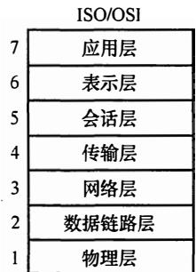

# 2016年计算机408统考真题解析.pdf

# 2016年计算机学科专业基础综合试题参考答案

## 一、单项选择题

<table><tr><td>1.</td><td>D</td><td>2.</td><td>D</td><td>3.</td><td>C</td><td>4.</td><td>B</td><td>5.</td><td>C</td><td>6.</td><td>D</td><td>7.</td><td>B</td><td>8.</td><td>B</td></tr><tr><td>9.</td><td>B</td><td>10.</td><td>A</td><td>11.</td><td>D</td><td>12.</td><td>C</td><td>13.</td><td>D</td><td>14.</td><td>A</td><td>15.</td><td>C</td><td>16.</td><td>C</td></tr><tr><td>17.</td><td>C</td><td>18.</td><td>B</td><td>19.</td><td>B</td><td>20.</td><td>A</td><td>21.</td><td>A</td><td>22.</td><td>A</td><td>23.</td><td>A</td><td>24.</td><td>B</td></tr><tr><td>25.</td><td>C</td><td>26.</td><td>A</td><td>27.</td><td>B</td><td>28.</td><td>D</td><td>29.</td><td>A</td><td>30.</td><td>C</td><td>31.</td><td>D</td><td>32.</td><td>A</td></tr><tr><td>33.</td><td>C</td><td>34.</td><td>C</td><td>35.</td><td>D</td><td>36.</td><td>B</td><td>37.</td><td>B</td><td>38.</td><td>D</td><td>39.</td><td>C</td><td>40.</td><td>C</td></tr></table>

1. 解析:

根据存储状态，单链表的结构如下图所示。


其中“链接地址”是指结点 next 所指的内存地址。当结点 f 插入后，a 指向 f，f 指向 e，e 指向 b。显然 a、e 和 f 的“链接地址”分别是 f、b 和 e 的内存地址，即 1014H、1004H 和 1010H。

2. 解析:

此类题的解题思路万变不离其宗，无论是链表的插入还是删除都必须保证不断链。

3. 解析:

在确保队列先进先出原则的前提下。根据题意具体分析：入队顺序为8,4,2,5,3,9,1,6,7，出队顺序为1\~9。入口和出口之间有多个队列（n条轨道），且每个队列（轨道）可容纳多个元素（多列列车）。如此分析：显然先入队的元素必须小于后入队的元素（如果8和4入同一队列，8在前4在后，那么出队时只能是8在前4在后），这样8入队列1，4入队列2，2入队列3，5入队列2（按照前面的原则“大的元素在小的元素后面”也可以将5入队列3，但这时剩下的元素3就必须放到一个新的队列里面，无法确保“至少”，本应该是将5入队列2，再将3入队列3，不增加新队列的情况下，可以满足题意“至少”的要求），3入队列3，9入队列1，这时共占了3个队列，后面还有元素1，直接再占用一个新的队列4，1从队列4出队后，剩下的元素6和7或者入队到队列2或者入队到队列3（为简单起见我们不妨设n个队列的序号分别为1,2,…,n），这样就可以满足题目的要求。综上，共占用了4个队列。当然还有其他的入队出队的情况，请考生们自己推演。但要确保满足：①队列中后面的元素大于前面的元素；②确保占用最少（即满足题目中的“至少”）的队列。

4. 解析：

三对角矩阵如下图所示。

$$
\left[ \begin{array}{c c c c c c} a _ {1, 1} & a _ {1, 2} & & & & \\ a _ {2, 1} & a _ {2, 2} & a _ {2, 3} & & 0 & \\ & a _ {3, 2} & a _ {3, 3} & a _ {3, 4} & & \\ & & \ddots & \ddots & \ddots & \\ & 0 & & a _ {n - 1, n - 2} & a _ {n - 1, n - 1} & a _ {n - 1, n} \\ & & & & a _ {n, n - 1} & a _ {n, n} \end{array} \right]
$$

采用压缩存储，将3条对角线上的元素按行优先方式存放在一维数组B中，且 $a_{1,1}$ 存放于B[0]中，其存储形式如下所示：

<table><tr><td> $a_{1,1}$ </td><td> $a_{1,2}$ </td><td> $a_{2,1}$ </td><td> $a_{2,2}$ </td><td> $a_{2,3}$ </td><td>...</td><td> $a_{n-1,n}$ </td><td> $a_{n,n-1}$ </td><td> $a_{n,n}$ </td></tr></table>

可以计算矩阵 A 中 3 条对角线上的元素 $a_{i,j}$ （ $1 \leqslant i, j \leqslant n, |i-j| \leqslant 1$ ）在一维数组 B 中存放的下标为 $k = 2i + j - 3$ 。

解法一：针对该题，仅需将数字逐一代入公式里面即可： $k=2\times30+30-3=87$ ，结果为87。

解法二：观察上图的三对角矩阵不难发现，第一行有两个元素，剩下的在元素 $m_{30,30}$ 所在行之前的 28 行（注意下标 $1 \leqslant i \leqslant 100$ 、 $1 \leqslant j \leqslant 100$ ）中每行都有 3 个元素，而 $m_{30,30}$ 之前仅有一个元素 $m_{30,29}$ ，那么不难发现元素 $m_{30,30}$ 在数组 N 中的下标是： $2 + 28 \times 3 + 2 - 1 = 87$ 。

【注意】矩阵和数组的下标是从0或1开始的（如矩阵可能从 $a_{0,0}$ 或 $a_{1,1}$ 开始，数组可能从B[0]或B[1]开始），这时就需要适时调整计算方法（这个方法无非是针对上面提到的公式 $k=2\times i+j-3$ 多计算1或少计算1的问题）。

## 5. 解析:

解法一：树有一个很重要的性质：在 n 个结点的树中有 n-1 条边，“那么对于每棵树，其结点数比边数多 1”。题中的森林中的结点数比边数多 10（即 25-15=10），显然共有 10 棵树。

解法二：若考生再仔细分析可发现，此题也是考察图的某些方面的性质：生成树和生成森林。此时对于图的生成树有一个重要的性质：若图中顶点数为 n，则它的生成树含有 n-1 条边。对比解法一中树的性质，不难发现两种解法都利用到了“树中结点数比边数多 1”的性质，接下来的分析如解法一。

## 6. 解析:

对于本题，只需按深度优先遍历的策略进行遍历即可。对于选项 A：先访问 $V_{1}$ ，然后访问与 $V_{1}$ 邻接且未被访问的任一顶点（满足的有 $V_{2}$ 、 $V_{3}$ 和 $V_{5}$ ），此时访问 $V_{5}$ ，然后从 $V_{5}$ 出发，访问与 $V_{5}$ 邻接且未被访问的任一顶点（满足的只有 $V_{4}$ ），然后从 $V_{4}$ 出发，访问与 $V_{4}$ 邻接且未被访问的任一顶点（满足的只有 $V_{3}$ ），然后从 $V_{3}$ 出发，访问与 $V_{3}$ 邻接且未被访问的任一顶点（满足的只有 $V_{2}$ ），结束遍历。选项 B 和 C 的分析方法与选项 A 相同，不再赘述。对于选项 D，首先访问 $V_{1}$ ，然后从 $V_{1}$ 出发，访问与 $V_{1}$ 邻接且未被访问的任一顶点（满足的有 $V_{2}$ 、 $V_{3}$ 和 $V_{5}$ ），然后从 $V_{2}$ 出发，访问与 $V_{2}$ 邻接且未被访问的任一顶点（满足的只有 $V_{5}$ ），按规则本应该访问 $V_{5}$ ，但选项 D 却访问 $V_{3}$ ，因此 D 错误。

## 7. 解析:

根据拓扑排序的规则，输出每个顶点的同时还要删除以它为起点的边，这样对各顶点和边都要进行遍历，故拓扑排序的时间复杂度为 $O(n+e)$ 。

## 8. 解析:

根据 Dijkstra 算法，从顶点 1 到其余各顶点的最短路径如下表所示。

<table><tr><td>顶点</td><td>第1趟</td><td>第2趟</td><td>第3趟</td><td>第4趟</td><td>第5趟</td></tr><tr><td>2</td><td> $5$  $v_1 \rightarrow v_2$ </td><td> $5$  $v_1 \rightarrow v_2$ </td><td></td><td></td><td></td></tr><tr><td>3</td><td> $\infty$ </td><td> $\infty$ </td><td> $7$  $v_1 \rightarrow v_2 \rightarrow v_3$ </td><td></td><td></td></tr><tr><td>4</td><td> $\infty$ </td><td> $11$  $v_1 \rightarrow v_5 \rightarrow v_4$ </td><td> $11$  $v_1 \rightarrow v_5 \rightarrow v_4$ </td><td> $11$  $v_1 \rightarrow v_5 \rightarrow v_4$ </td><td> $11$  $v_1 \rightarrow v_5 \rightarrow v_4$ </td></tr><tr><td>5</td><td> $4$  $v_1 \rightarrow v_5$ </td><td></td><td></td><td></td><td></td></tr><tr><td>6</td><td> $\infty$ </td><td> $9$  $v_1 \rightarrow v_5 \rightarrow v_6$ </td><td> $9$  $v_1 \rightarrow v_5 \rightarrow v_6$ </td><td> $9$  $v_1 \rightarrow v_5 \rightarrow v_6$ </td><td></td></tr><tr><td>集合S</td><td> $\{1,5\}$ </td><td> $\{1,5,2\}$ </td><td> $\{1,5,2,3\}$ </td><td> $\{1,5,2,3,6\}$ </td><td> $\{1,5,2,3,6,4\}$ </td></tr></table>

## 9. 解析:

此题为送分题。该程序采用跳跃式的顺利查找法查找升序数组中的 x，显然是 x 越靠前，比较次数才会越少。

## 10. 解析:

由于 B+树的所有叶结点中包含了全部的关键字信息, 且叶结点本身依关键字从小到大顺序链接, 可以进行顺序查找, 而 B 树不支持顺序查找 (只支持多路查找)。

## 11. 解析:

外部排序指待排序文件较大，内存一次性放不下，需存放在外部介质中。外部排序通常采用归并排序法。选项 A、B、C 都是内部排序的方法。

## 12. 解析:

翻译程序是指把高级语言源程序转换成机器语言程序（目标代码）的软件。翻译程序有两种：一种是编译程序，它将高级语言源程序一次全部翻译成目标程序，每次执行程序时，只要执行目标程序，因此，只要源程序不变，就无须重新编译。另一种是解释程序，它将源程序的一条语句翻译成对应的机器目标代码，并立即执行，然后翻译下一条源程序语句并执行，直至所有源程序语句全部被翻译并执行完。所以解释程序的执行过程是翻译一句执行一句，并且不会生成目标程序。汇编程序也是一种语言翻译程序，它把汇编语言源程序翻译为机器语言程序。汇编语言是一种面向机器的低级语言，是机器语言的符号表示，与机器语言一一对应。

## 13. 解析:

结合题干及选项可知，short 为 16 位。因 C 语言中的数据在内存中为补码表示形式，si 对应的补码二进制表示为：1000 0000 0000 0001B，最前面的一位“1”为符号位，表示负数，即 -32767。由 signed 型转化为等长 unsigned 型数据时，符号位成为数据的一部分，也就是说，负数转化为无符号数（即正数），其数值将发生变化。Usi 对应的补码二进制表示与 si 的表示相同，但表示正数，为 32769。

## 14. 解析:

大端方式：一个字中的高位字节（Byte）存放在内存中这个字区域的低地址处。小端方式：一个字中的低位字节（Byte）存放在内存中这个字区域的低地址处。依此分析，各字节的存储分配如下表所示。

<table><tr><td>地址</td><td>0000 8040H</td><td>0000 8041H</td><td>0000 8042H</td><td>0000 8043H</td></tr><tr><td>内容</td><td>88H</td><td>77H</td><td>66H</td><td>55H</td></tr><tr><td>地址</td><td>0000 8044H</td><td>0000 8045H</td><td>0000 8046H</td><td>0000 8047H</td></tr><tr><td>内容</td><td>44H</td><td>33H</td><td>22H</td><td>11H</td></tr></table>

从而存储单元 0000846H 中存放的是 22H。

## 15. 解析:

分析语句 “a[k] = a[k] + 32”：首先读取 a[k] 需要访问一次 a[k]，之后将结果赋值给 a[k] 需要访问一次，共访问两次。第一次访问 a[k] 未命中，并将该字所在的主存块调入 Cache 对应的块中，对于该主存块中的 4 个整数的两次访问中只在访问第一次的第一个元素时发生缺失，其他的 7 次访问中全部命中，故该程序段执行过程中访问数组 a 的 Cache 缺失率约为 1/8（即 12.5%）。

## 16. 解析:

5FFF-4000 + 1 = 2000H，即 ROM 区容量为 $2^{13}B = 8 \, KB (2000H = 2 \times 16^{3} = 2^{13})$ ，RAM 区容量为 56KB (64 KB - 8 KB 56KB)，则需要 8 K × 4位的 SRAM 芯片的数量为 14 (56KB / 8 K × 4位 = 14)。

## 17. 解析:

变址寻址中，有效地址 EA 等于指令字中的形式地址 D 与变址寄存器 I 的内容相加之和，即 $\mathrm{EA} = (\mathrm{I}) + \mathrm{D}$ 。间接寻址是相对于直接寻址而言的，指令的地址字段给出的形式地址不是操作数的真正地址，而是操作数地址的地址，即 $\mathrm{EA} = (\mathrm{D})$ 。从而该操作数的有效地址是 $((\mathrm{I}) + \mathrm{D})$ 。

## 18. 解析:

程序计数器（PC）给出下一条指令字的访存地址（指令在内存中的地址），取决于存储器的字数（4 GB/32bit= $2^{30}$ ），故程序计数器（PC）的位数至少是30位；指令寄存器（IR）用于接收取得的指令，取决于指令字长（32位），故指令寄存器（IR）的位数至少为32位。

## 19. 解析:

数据冒险，即数据相关，指在一个程序中存在必须等前一条指令执行完才能执行后一条指令的情况，则这两条指令即为数据相关。当多条指令重叠处理时就会发生冲突。首先这两条指令发生写后读相关，并且两条指令在流水线中执行情况（发生数据冒险）如下表所示。

<table><tr><td>指令\时钟</td><td>1</td><td>2</td><td>3</td><td>4</td><td>5</td><td>6</td><td>7</td></tr><tr><td>I2</td><td>取指</td><td>译码/读寄存器</td><td>运算</td><td>访存</td><td>写回</td><td></td><td></td></tr><tr><td>I3</td><td></td><td>取指</td><td>译码/读寄存器</td><td>运算</td><td>访存</td><td>写回</td><td></td></tr></table>

指令 I2 在时钟 5 时将结果写入寄存器（R5），但指令 I3 在时钟 3 时读寄存器（R5）。本来指令 I2 应先写入 R5，指令 I3 后读 R5，结果变成指令 I3 先读 R5，指令 I2 后写入 R5，因而发生数据冲突。

## 20. 解析:

单周期处理器即指所有指令的指令周期为一个时钟周期，D 正确。因为每条指令的 CPI 为 1，要考虑比较慢的指令，所以处理器的时钟频率较低，B 正确。单总线结构将 CPU、主存、I/O 设备都挂在一组总线上，允许 I/O 设备之间、I/O 设备与主存之间直接交换信息，但多个部件只能争用唯一的总线，且不支持并发传送操作。单周期处理器并不是可以采用单总线结构数据通路，故 A 错误。控制信号即指 PC 中的内容，PC 用来存放当前欲执行指令的地址，可以自动+1 以形成下一条指令的地址。在指令执行过程中控制信号不变化。

## 21. 解析:

初看可能会觉得 A 正确，并行总线传输通常比串行总线传输速度快，但这不是绝对的。在实际时钟频率比较低的情况下，并行总线因为可以同时传输若干比特，速率确实比串行总线快。但是，随着技术的发展，时钟频率越来越高，并行导线之间的相互干扰越来越严重，当时钟频率提高到一定程度时，传输的数据已经无法恢复。而串行总线因为导线少，线间干扰容易控制，反而可以通过不断提高时钟频率来提高传输速率，A 错误。总线复用是指一种信号线在不同的时间传输不同的信息。可以使用较少的线路传输更多的信息，从而节省了空间和成本。故 B 正确。突发（猝发）传输是在一个总线周期中，可以传输多个存储地址连续的数据，即一次传输一个地址和一批地址连续的数据，C 正确。分离事务通信即总线复用的一种，相比单一的传输线路可以提高总线的利用率，D 正确。

## 22. 解析:

中断是指来自 CPU 执行指令以外事件的发生，如设备发出的 I/O 结束中断，表示设备输入/输出处理已经完成，希望处理机能够向设备发出下一个输入/输出请求，同时让完成输入/输出后的程序继续运行。时钟中断，表示一个固定的时间片已到，让处理机处理计时、启动定时运行的任务等。这一类中断通常是与当前程序运行无关的事件，即它们与当前处理机运行的程序无关。异常也称内中断、例外或陷入（Trap），指源自 CPU 执行指令内部的事件，如程序的非法操作码、地址越界、算术溢出、虚存系统的缺页以及专门的陷入指令等引起的事件。A 错误。

## 23. 解析:

批处理系统中，作业执行时用户无法干预其运行，只能通过事先编制作业控制说明书来间接干预，缺少交互能力，也因此才发展出分时系统，I错误。批处理系统按发展历程又分为单道批处理系统、多道批处理系统，II正确。多道程序设计技术允许同时把多个程序放入内存，并允许它们交替在CPU中运行，它们共享系统中的各种硬、软件资源，当一道程序因I/O请求而暂停运行时，CPU便立即转去运行另一道程序，即多道批处理系统的I/O设备可与CPU并行工作，这都是借助于中断技术实现的，III正确。

## 24. 解析:

这类调度题目最好画图。因 CPU、输入设备、输出设备都只有一个，因此各操作步骤不能重叠，画出运行时的甘特图后就能清楚地看到不同作业间的时序关系，如下表所示。

<table><tr><td>作业\时间</td><td>1</td><td>2</td><td>3</td><td>4</td><td>5</td><td>6</td><td>7</td><td>8</td><td>9</td><td>10</td><td>11</td><td>12</td><td>13</td><td>14</td><td>15</td><td>16</td><td>17</td></tr><tr><td>1</td><td colspan="2">输入</td><td colspan="3">计算</td><td colspan="4">输出</td><td></td><td></td><td></td><td></td><td></td><td></td><td></td><td></td></tr><tr><td>2</td><td></td><td></td><td colspan="2">输入</td><td></td><td colspan="3">计算</td><td></td><td colspan="4">输出</td><td></td><td></td><td></td><td></td></tr><tr><td>3</td><td></td><td></td><td></td><td></td><td colspan="2">输入</td><td></td><td></td><td colspan="3">计算</td><td></td><td></td><td colspan="4">输出</td></tr></table>

## 25. 解析:

对于本题，先满足一个进程的资源需求，再看其他进程是否能出现死锁状态。因为 $p_{4}$ 只申请一个资源，当将 $R_{2}$ 分配给 $p_{4}$ 后， $p_{4}$ 执行完后将 $R_{2}$ 释放，这时使得系统满足死锁的条件是 $R_{1}$ 分配给 $p_{1}$ ， $R_{2}$ 分配给 $p_{2}$ ， $R_{3}$ 分配给 $p_{3}$ （或者 $R_{2}$ 分配给 $p_{1}$ ， $R_{3}$ 分配给 $p_{2}$ ， $R_{1}$ 分配给 $p_{3}$ ）。穷举其他情况如 $p_{1}$ 申请的资源 $R_{1}$ 和 $R_{2}$ ，先都分配给 p1，运行完并释放占有的资源后，可以分别将 $R_{1}$ 、 $R_{2}$ 和 $R_{3}$ 分配给 $p_{3}$ 、 $p_{4}$ 和 $p_{2}$ ，也满足系统死锁的条件。各种情况需要使得处于死锁状态的进程数至少为 3。

## 26.. 解析:

改进型的 CLOCK 置换算法执行的步骤如下:

1）从指针的当前位置开始，扫描帧缓冲区。在这次扫描过程中，对使用位不做任何修改。选择遇到的第一个帧（A=0，M=0）用于替换。

2）如果第1）步失败，则重新扫描，查找（A=0，M=1）的帧。选择遇到的第一个这样的帧用于替换。在这个扫描过程中，对每个跳过的帧，把它的使用位设置成0。

3）如果第2）步失败，指针将回到它的最初位置，并且集合中所有帧的使用位均为0。重复第1步，并且如果有必要，重复第2）步。这样将可以找到供替换的帧。

从而，该算法淘汰页的次序为(0,0),(0,1),(1,0),(1,1)，即A正确。

## 27. 解析：

当进程退出临界区时置 lock 为 FALSE，会负责唤醒处于就绪状态的进程，A 错误。若等待进入临界区的进程会一直停留在执行 while(TSL(&lock)) 的循环中，不会主动放弃 CPU，B 正确。让权等待，即当进程不能进入临界区时，应立即释放处理器，防止进程忙等待。通过 B 选项的分析中发现上述伪代码并不满足“让权等待”的同步准则，C 错误。若 while(TSL(&lock)) 在关中断状态下执行，当 TSL(&lock) 一直为 true 时，不再开中断，则系统可能会因此终止，D 错误。

## 28. 解析:

分段系统的逻辑地址 A 到物理地址 E 之间的地址变换过程如下。


① 从逻辑地址 A 中取出前几位为段号 S，后几位为段内偏移量 W，注意段式存储管理的题目中，逻辑地址一般以二进制给出，而在页式存储管理中，逻辑地址一般以十进制给出，各位读者要具体问题具体分析。

② 比较段号 S 和段表长度 M，若 $S \geqslant M$ ，则产生越界异常，否则继续执行。

③ 段表中段号 S 对应的段表项地址 = 段表起始地址 $F +$ 段号 $S \times$ 段表项长度，取出该段表项的前几位得到段长 C。若段内偏移量 $\geqslant C$ ，则产生越界异常，否则继续执行。从这句话我们可以看出，段表项实际上只有两部分，前几位是段长，后几位是起始地址。

④ 取出段表项中该段的起始地址 b，计算 $E = b + W$ ，用得到的物理地址 E 去访问内存。

题目中段号为 2 的段长为 300，小于段内地址为 400，故发生越界异常，D 正确。

## 29. 解析:

在任一时刻 $t$ ，都存在一个集合，它包含所有最近 $k$ 次（该题窗口大小为 6）内存访问所访问过的页面。这个集合 $w(k, t)$ 就是工作集。该题中最近 6 次访问的页面分别为 6, 0, 3, 2, 3, 2，再去除重复的页面，形成的工作集为 $\{6, 0, 3, 2\}$ 。

30. 解析:

$\mathrm{P}_{1}$ 中对 $a$ 进行赋值，并不影响最终的结果，故 $a = 1$ 与 $a = 2$ 不需要互斥执行； $a = x$ 与 $b = x$ 执行先后不影响 a 与 b 的结果，无须互斥执行； $x += 1$ 与 $x += 2$ 执行先后会影响 x 的结果，需要互斥执行； $P_{1}$ 中的 x 和 $P_{2}$ 中的 x 是不同范围中的 x，互不影响，不需要互斥执行。

## 31. 解析:

SPOOLing 是利用专门的外围控制机，将低速 I/O 设备上的数据传送到高速磁盘上，或者相反。SPOOLing 的意思是外部设备同时联机操作，又称为假脱机输入/输出操作，是操作系统中采用的一项将独占设备改造成共享设备的技术。高速磁盘即外存，A 正确。SPOOLing 技术需要进行输入/输出操作，单道批处理系统无法满足，B 正确。SPOOLing 技术实现了将独占设备改造成共享设备的技术，C 正确。设备与输入/输出井之间数据的传送是由系统实现的，D 错误。

## 32. 解析:

管程是由一组数据以及定义在这组数据之上的对这组数据的操作组成的软件模块，这组操作能初始化并改变管程中的数据和同步进程。管程不仅能实现进程间的互斥，而且能实现进程间的同步，故 A 错误、B 正确。管程具有特性：①局部于管程的数据只能被局部于管程内的过程所访问；②一个进程只有通过调用管程内的过程才能进入管程访问共享数据；③每次仅允许一个进程在管程内执行某个内部过程，故 C 和 D 正确。

## 33. 解析:

OSI 参考模型中各层如下图所示。



集线器是一个多端口的中继器，工作在物理层。以太网交换机是一个多端口的网桥，工作在数据链路层。路由器是网络层设备，它实现了网络模型的下三层，即物理层、数据链路层和网络层。题中 R1、Switch 和 Hub 分别是路由器、交换机和集线器，实现的最高层功能分别是网络层（即 3）、数据链路层（即 2）和物理层（即 1）。

## 34. 解析:

香农定理给出了带宽受限且有高斯白噪声干扰的信道的极限数据传输速率，香农定理定义为：信道的极限数据传输速率 $= W \log_{2}(1 + S/N)$ ，单位 bps。其中，S/N 为信噪比，即信号的平均功率和噪声的平均功率之比，信噪比 $= 10 \log_{10}(S/N)$ ，单位 dB，当 S/N = 1000 时，信噪比为 30dB，则该链路的实际数据传输速率约为 $50\% \times W \log_{2}(1 + S/N) = 50\% \times 8k \times \log_{2}(1 + 1000) = 40kbps$ 。

## 35. 解析:

关于物理层、数据链路层、网络层设备对于隔离冲突域的总结如下表所示。

<table><tr><td>设别名称</td><td>能否隔离冲突域</td></tr><tr><td>集线器</td><td>不能</td></tr><tr><td>中继器</td><td>不能</td></tr><tr><td>交换机</td><td>能</td></tr><tr><td>网桥</td><td>能</td></tr><tr><td>路由器</td><td>能</td></tr></table>

交换机（Switch）可以隔离冲突域，但集线器（Hub）无法隔离冲突域，因此从物理层上能够收到该确认帧的主机仅 H2、H3，选项 D 正确。

## 36. 解析:

因为要解决 “理论上可以相距的最远距离”，所以最远肯定要保证能检测到碰撞，而以太网规定最短帧长为 64B，其中 Hub 为 100Base-T 集线器，可知线路的传输速率为 100Mbps，则单程传输时延为 64B/100Mbps/2 = 2.56μs，又 Hub 再产生比特流的过程中会导致延时 1.535μs，则单程的传播时延为 2.56μs - 1.535μs = 1.025μs，从而 H3 与 H4 之间理论上可以相距的最远距离为 200m/μs × 1.025μs = 205m。

## 37. 解析:

因为 R3 检测到网络 201.1.2.0/25 不可达，故将到该网络的距离设置为 16（距离为 16 表示不可达）。当 R2 从 R3 收到路由信息时，因为 R3 到该网络的距离为 16，则 R2 到该网络也不可达，但此时记录 R1 可达（由于 RIP 的特点“坏消息传得慢”，R1 并没有收到 R3 发来的路由信息），R1 到该网络的距离为 2，再加上从 R2 到 R1 的 1 就是 R2 到该网络的距离 3。

## 38. 解析:

由题意知连接 R1、R2 和 R3 之间的点对点链路使用 201.1.3.x/30 地址，其子网掩码为 255.255.255.252，R1 的一个接口的 IP 地址为 201.1.3.9，转换为对应的二进制的后 8 位为 0000 1001（由 201.1.3.x/30 知，IP 地址对应的二进制的后两位为主机号，而主机号全为 0 表示本网络本身，主机号全为 1 表示本网络的广播地址，不用于源 IP 地址或者目的 IP 地址），那么除 201.1.3.9 外，只有 IP 地址为 201.1.3.10 才可以作为源 IP 地址使用（本题为 201.1.3.10）。Web 服务器的 IP 地址为 130.18.10.1，作为 IP 分组的目的 IP 地址。综上可知，选项 D 正确。

## 39. 解析:

从子网掩码可知 H1 和 H2 处于同一网段，H3 和 H4 处于同一网段，分别可以进行正常的 IP 通信，A 和 D 错误。因为 R2 的 E1 接口的 IP 地址为 192.168.3.254，而 H2 的默认网关为 192.168.3.1，所以 H2 不能访问 Internet，而 H4 的默认网关为 192.168.3.254，所以 H4 可以正常访问 Internet，B 错误。由 H1、H2、H3 和 H4 的子网掩码可知 H1、H2 和 H3、H4 处于不同的网段，需通过路由器才能进行正常的 IP 通信，而这时 H1 和 H2 的默认网关为 192.168.3.1，但 R2 的 E1 接口的 IP 地址为 192.168.3.254，无法进行通信，从而 H1 不能与 H3 进行正常的 IP 通信。C 正确。

## 40. 解析:

最少情况下：当本机 DNS 高速缓存中存有该域名的 DNS 信息时，则不需要查询任何域名服务器，这样最少发出 0 次 DNS 查询。最多情况下：因为均采用迭代查询的方式，在最坏的情况下，需要依次迭代地向本地域名服务器、根域名服务器（.com）、顶级域名服务器（xyz.com）、权限域名服务器（abc.xyz.com）发出 DNS 查询请求，因此最多发出 4 次 DNS 查询。

## 二、综合应用题

## 41. 解答:

（1）TCP 连接的建立分以下三个阶段。首先，H3 向 Web 服务器 S 发出连接请求报文段，这时首部中的同步位 SYN = 1，ACK = 0，同时选择一个初始序号 seq = 100。TCP 规定，SYN 报文段（即 SYN = 1 的报文段）不能携带数据，但是要消耗一个序号。接着，S 收到连接请求报文段，为自己选择一个初始序号 seq = y，向 A 发送确认。这个报文段 SYN = 1，ACK = 1，seq = y，确认号 ack 是 $100 + 1 = 101$ 。它不能携带数据，但是也要消耗一个序号。最后，H3收到 S 的确认报文段后，还要向 S 给出确认。这份确认报文段 SYN=0，ACK=1，确认号 ack=y+1，自己的序号 seq=101。因此，第二次握手 TCP 段的 SYN=1，（1 分）ACK=1；（1 分）确认序号是 101。（1 分）

（2）题目规定 S 对收到的每个段（MSS 大小的段）进行确认，并通告新的接收窗口，而且 TCP 接收缓存仅有数据存入而无数据取出。H3 收到的第 8 个确认段所通告的接收窗口是 20-8 = 12KB；（1 分）在慢开始算法里，发送方 H3 先设置拥塞窗口 cwnd = 1KB，接下来每收到一个对新报文段的确认就使发送方的拥塞窗口加 1KB。H3 共收到 8 个确认段，所以此时 H3 的拥塞窗口变为 $1 + 8 = 9KB$ ；（1 分）发送窗口 = min{拥塞窗口，接收窗口}，所以 H3 的发送窗口变为 min{9, 12} = 9KB。（1 分）

（3）TCP 是用字节作为窗口和序号的单位。当 H3 的发送窗口等于 0KB 时，也就是接收窗口等于 0KB 时，下一个待发送段的序号是 $20K + 101 = 20 \times 1024 + 101 = 20581$ ; （1 分）H3 从发送第 1 个段到发送窗口等于 0KB 时刻为止，经过五个传输轮次，每个传输轮次的时间就是往返 RTT，因此平均数据传输速率是 $20KB / (5 \times 200ms) = 20KB / s = 20.48kbps$ 。（1 分）

（4）通信结束后，H3 向 S 发送连接释放报文段。S 收到 H3 的连接释放报文段后，马上发出确认报文段。此时 S 已经没有数据需要传输，于是它也马上发出连接释放报文段。H3 在收到 S 的连接释放报文段后，发出确认报文段。S 在收到这份确认后就释放 TCP 连接。因此从 t 时刻起，S 释放该连接的最短时间是：H3 的连接释放报文段传送到 S 的时间 + S 的连接释放报文段传送到 H3 的时间 + H3 的确认报文段传送到 S 的时间 = $1.5 \times 200 \, ms = 300 \, ms$ 。（1 分）

## 42. 解答：

（1）根据定义，正则 k 叉树中仅含有两类结点；叶结点（个数记为 $n_{0}$ ）和度为 k 的分支结点（个数记为 $n_{1}$ ）。树 T 中的结点总数 $n = n_{0} + n_{k} = n_{0} + m$ 。树中所含的边数 e = n - 1，这些边均为 m 个度为 k 的结点发出的，即 e = mk。整理得 $n_{0} + m = mk + 1$ ，故 $n_{0} = (k - 1)m + 1$ 。(3 分)

（2）高度为 h 的正则 k 叉树 T 中，含最多结点的树形为：除第 h 层外，第 1 层到第 h-1 层的结点都是度为 k 的分支结点；而第 h 层均为叶结点，即树是“满”树。此时第 j ( $1 \leqslant j \leqslant h$ ) 层结点数为 $k^{j-1}$ ，结点总数 $M_{1}$ 为

$$
M _ {1} = \sum_ {j = 1} ^ {h} k ^ {j - 1} = \frac {k ^ {h} - 1}{k - 1}\tag{3 分}
$$

含最少结点的正则 k 叉树的树形为：第 1 层只有根结点，第 2 层到第 h-1 层仅含 1 个分支结点和 k-1 个叶结点，第 h 层有 k 个叶结点。即除根外第 2 层到第 h 层中每层的结点数均为 k，故 T 中所含结点总数 $M_{2}$ 为

$$
M _ {2} = 1 + (h - 1) k\tag{2 分}
$$

## 【评分说明】

①参考答案仅给出一种推导过程，若考生采用其他推导方法且正确，同样给分。②若考生仅给出结果，但没有推导过程，则（1）、（2）的最高得分分别是2分和3分。若推导过程或答案不完全正确，酌情给分。

## 43. 解答:

## （1）算法的基本设计思想

由题意知，将最小的 $\lfloor n/2 \rfloor$ 个元素放在 $A_{1}$ 中，其余的元素放在 $A_{2}$ 中，分组结果即可满足题目要求。仿照快速排序的思想，基于枢轴将n个整数划分为两个子集。根据划分后枢轴所处的位置i分别处理：

① 若 $i=\lfloor n/2 \rfloor$ 则分组完成，算法结束；

② 若 $i < \lfloor n/2 \rfloor$ ，则枢轴及之前的所有元素均属于 $A_{1}$ ，继续对 i 之后的元素进行划分；

③ 若 $i > \lfloor n/2 \rfloor$ ，则枢轴及之后的所有元素均属于 $A_{2}$ ，继续对 i 之前的元素进行划分；

基于该设计思想实现的算法，无须对全部元素进行全排序，其平均时间复杂度是 $O(n)$ ，空间复杂度是 $O(1)$ 。

## (2) 算法实现 (9 分)

```txt
int setPartition(int a[], int n){
    int pivotkey, low=0, low0=0, high=n-1, high0=n-1, flag=1, k=n/2, i;
    int s1=0, s2=0;
    while(flag) {
    piovtkey=a[low]; //选择枢轴
    while(low<high) { //基于枢轴对数据进行划分
    while(low<high && a[high]>=pivotkey) -high;
    if(low!=high) a[low]=a[high];
    while(low<high && a[low]<=pivotkey) ++low;
    if(low!=high) a[high]=a[low];
    } //end of while(low<high)
    a[low]=pivotkey;
    if(low==k-1) //如果枢轴是第n/2小元素，划分成功
    flag=0;
    else{ //是否继续划分
    if(low<k-1){
    low0=++low;
    high=high0;
    }
    else{
    high0=-high;
    low=low0;
    }
    }
    }
    for(i=0;i<k;i++) s1+=a[i];
    for(i=k;i<n;i++) s2+=a[i];
    return s2-s1;
}
```

## 【(1) (2) 的评分说明】

① 本题目只需将最大的一半元素与最小的一半元素分组，不需要对所有元素进行全部排序。参考答案基于快速排序思想，采用非递归的方式实现。若考生设计的算法满足题目的功能要求且正确，则（1）、（2）根据所实现算法的平均时间复杂度给分，细则见下表。

<table><tr><td>时间复杂度</td><td>分数</td><td>说明</td></tr><tr><td> $O(n)$ </td><td>13</td><td>采用类似快速排序思想,没有对元素进行全排序</td></tr><tr><td> $O(n\log_{2}n)$ </td><td>11</td><td></td></tr><tr><td> $O(n^{2})$ </td><td>9</td><td></td></tr><tr><td>其他</td><td>7</td><td>时间复杂度高于  $O(n^{2})$  的算法</td></tr></table>

② 若在算法的基本设计思想描述中因文字表达没有清晰反映出算法思路，但在算法实现中能够表达出算法思想且正确的，可参照①的标准给分。

③ 若算法的基本设计思想描述或算法实现中部分正确，可参照①中各种情况的相应给分

标准酌情给分。

④ 参考答案中只给出了使用 C 语言的版本，使用 C++ 语言的答案视同使用 C 语言。

## （3）算法的平均时间复杂度和空间复杂度

本参考答案给出的算法平均时间复杂度是 $O(n)$ ，空间复杂度是 $O(1)$ 。

## 【评分说明】

## 44. 解答:

（1）每传送一个 ASCII 字符，需要传输的位数有 1 位起始位、7 位数据位（ASCII 字符占 7 位）、1 位奇校验位和 1 位停止位，故总位数为 $1 + 7 + 1 + 1 = 10$ 。（2 分）

I/O 端口每秒钟最多可接收 1000/0.5 = 2000 个字符。（1 分）

【评分说明】对于第一问，若考生回答总位数为9，则给1分。

（2）一个字符传送时间包括：设备 D 将字符送 I/O 端口的时间、中断响应时间和中断服务程序前 15 条指令的执行时间。时钟周期为 $1/(50\text{MHz}) = 20\text{ns}$ ，设备 D 将字符送 I/O 端口的时间为 $0.5\text{ms}/20\text{ns} = 2.5 \times 10^{4}$ 个时钟周期。一个字符的传送时间大约为 $2.5 \times 10^{4} + 10 + 15 \times 4 = 25070$ 个时钟周期。完成 1000 个字符传送所需时间大约为 $1000 \times 25070 = 25070000$ 个时钟周期。（3 分）

CPU 用于该任务的时间大约为 $1000 \times (10 + 20 \times 4) = 9 \times 10^{4}$ 个时钟周期。(1 分)

在中断响应阶段，CPU 主要进行以下操作：关中断、保护断点和程序状态、识别中断源。（2 分）

## 【评分说明】

① 位于第一问，若答案是 25070020，则同样给分；若答案是 25000000 或 25000020，则给 2 分。如果没有给出分布计算步骤，但算式和结果正确，同样给分。

② 对于第三问，只要回答关中断和保护断点，就给 2 分，其他答案酌情给分。

## 45. 解答:

（1）页大小为 8KB，页内偏移地址为 13 位，故 A = B = 32 - 13 = 19；D = 13；C = 24 - 13 = 11；主存块大小为 64B，故 G = 6。2 路组相联，每组数据区容量有 $64B \times 2 = 128B$ ，共有 $64KB / 128B = 512$ 组，故 F = 9；E = 24 - G - F = 24 - 6 - 9 = 9。

因而 A=19, B=19, C=11, D=13, E=9, F=9, G=6。（各 1 分，共 7 分）

TLB 中标记字段 B 的内容是虚页号，表示该 TLB 项对应哪个虚页的页表项。（1 分）

(2) 块号 4099 = 00 0001 0000 0000 0011B，因此，所映射的 Cache 组号为 0 0000 0011B = 3，（1 分）对应的 H 字段内容为 0 0000 1000B。（1 分）

（3）Cache缺失带来的开销小，而处理缺页的开销大。（1分）因为缺页处理需要访问磁盘，而Cache缺失只要访问主存。（1分）

【评分说明】对于（3）中第2问，若考生回答因为缺页需要软件实现而 Cache 缺失用硬件实现，则同样给分。

（4）因为采用直写策略时需要同时写快速存储器和慢速存储器，而写磁盘比写主存慢很多，所以，在 Cache-主存层次，Cache 可以采用直写策略，而在主存-外存（磁盘）层次，修改页面内容时总是采用回写策略。（2 分）

## 46. 解答:

（1）由于采用了静态优先数，当就绪队列中总有优先数较小的进程时，优先数较大的进程一直没有机会运行，因而会出现饥饿现象。（2分）

## (2) 优先数 priority 的计算公式为

priority = nice + k1 × cpuTime - k2 × waitTime，其中 k1 > 0，k2 > 0，用来分别调整 cpuTime和 waitTime 在 priority 中所占的比例。(3 分) waitTime 可使长时间等待的进程优先数减少，从而避免出现饥饿现象。(1 分)

## 【评分说明】

① 公式中包含 nice 给 1 分，利用 cpuTime 增大优先数给 1 分，利用 waitTime 减少优先数给 1 分；部分正确，酌情给分。

② 若考生给出包含 nice、cpuTime 和 waitTime 的其他合理的优先数计算方法，同样给分。
47. 解答：

（1）两个目录文件 dir 和 dir1 的内容如下表所示。（3 分）


【评分说明】每个目录项的内容正确给 1 分，共 3 分。

（2）由于 FAT 的簇号为 2 个字节，即 16 比特，因此在 FAT 表中最多允许 $2^{16}$ （65536）个表项，一个 FAT 文件最多包含 $2^{16}$ （65536）个簇。FAT 的最大长度为 $2^{16} \times 2B = 128KB$ 。（1 分）文件的最大长度是 $2^{16} \times 4B = 256MB$ 。（1 分）

【评分说明】若考生考虑到文件结束标志、坏块标志等，且答案正确，同样给分。

（3）在 FAT 的每个表项中存放下一个簇号。file1 的簇号 106 存放在 FAT 的 100 号表项中，（1 分）簇号 108 存放在 FAT 的 106 号表项中。（1 分）

（4）先在 dir 目录文件里找到 dir1 的簇号，然后读取 48 号簇，得到 dir1 目录文件，接着找到 file1 的第一个簇号，据此在 FAT 里查找 file1 的第 5000 个字节所在的簇号，最后访问磁盘中的该簇。因此，需要访问目录文件 dir1 所在的 48 号簇，（1 分）及文件 file1 的 106 号簇。（1 分）
