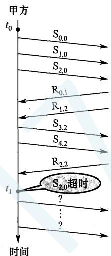

# 2017年计算机408统考真题.pdf

33. 假设 OSI 参考模型的应用层欲发送 400B 的数据（无拆分），除物理层和应用层之外，其他各层在封装 PDU 时均引入 20B 的额外开销，则应用层数据传输效率约为 \_\_\_\_。
A. 80%
B. 83%
C. 87%
D. 91%

34. 若信道在无噪声情况下的极限数据传输速率不小于信噪比为 30dB 条件下的极限数据传输速率，则信号状态数至少是\_\_\_\_。
A. 4 B. 8 C. 16 D. 32

35. 在下图所示的网络中，若主机 H 发送一个封装访问 Internet 的 IP 分组的 IEEE 802.11 数据帧 F，则帧 F 的地址 1、地址 2 和地址 3 分别是 \_\_\_\_。

A. 00-12-34-56-78-9a, 00-12-34-56-78-9b, 00-12-34-56-78-9c  
B. 00-12-34-56-78-9b, 00-12-34-56-78-9a, 00-12-34-56-78-9c  
C. 00-12-34-56-78-9b, 00-12-34-56-78-9c, 00-12-34-56-78-9a  
D. 00-12-34-56-78-9a, 00-12-34-56-78-9c, 00-12-34-56-78-9b

36. 下列 IP 地址中，只能作为 IP 分组的源 IP 地址但不能作为目的 IP 地址的是 \_\_\_\_。
A. 0.0.0.0
B. 127.0.0.1
C. 200.10.10.3
D. 255.255.255.255

37. 直接封装 RIP、OSPF、BGP 报文的协议分别是\_\_\_\_。
A. TCP、UDP、IP B. TCP、IP、UDP C. UDP、TCP、IP D. UDP、IP、TCP

38. 若将网络 21.3.0.0/16 划分为 128 个规模相同的子网，则每个子网可分配的最大 IP 地址个数是 \_\_\_\_。
A. 254 B. 256 C. 510 D. 512

39. 若甲向乙发起一个 TCP 连接，最大段长 MSS = 1KB，RTT = 5ms，乙开辟的接收缓存为 64KB，则甲从连接建立成功至发送窗口达到 32KB，需经过的时间至少是 \_\_\_\_。
A. 25ms    B. 30ms    C. 160ms    D. 165ms

40. 下列关于 FTP 协议的叙述中，错误的是\_\_\_\_。
A. 数据连接在每次数据传输完毕后就关闭
B. 控制连接在整个会话期间保持打开状态
C. 服务器与客户端的 TCP 20 端口建立数据连接
D. 客户端与服务器的 TCP 21 端口建立控制连接

## 二、综合应用题（第41～47小题，共70分）

47.（9分）甲乙双方均采用后退 $N$ 帧协议（GBN）进行持续的双向数据传输，且双方始终采用捎带确认，帧长均为 $1000\mathrm{B}$ 。 $\mathbf{S}_{x,y}$ 和 $\mathbb{R}_{x,y}$ 分别表示甲方和乙方发送的数据帧，其中 $x$ 是发送序号， $y$ 是确认序号（表示希望接收对方的下一帧序号）；数据帧的发送序号和确认序号字段均为3比特。信道传输速率为 $100\mathrm{Mbps}$ ， $\mathrm{RTT} = 0.96\mathrm{ms}$ 。下图给出了甲方发送数据帧和接收数据帧的两种场景，其中 $t_0$ 为初始时刻，此时甲方的发送和确认序号均为0， $t_1$ 时刻甲方有足够多的数据待发送。

  
(a)

  
(b)

请回答下列问题。

(1) 对于图 (a), $t_0$ 时刻到 $t_1$ 时刻期间, 甲方可以断定乙方已正确接收的数据帧数是多少? 正确接收的是哪几个帧? (请用 $\mathbf{S}_{x,y}$ 形式给出。)

（2）对于图（a），从 $t_{1}$ 时刻起，甲方在不出现超时且未收到乙方新的数据帧之前，最多还可以发送多少个数据帧？其中第一个帧和最后一个帧分别是哪个？（请用 $S_{x,y}$ 形式给出。）

（3）对于图（b），从 $t_1$ 时刻起，甲方在不出现新的超时且未收到乙方新的数据帧之前，需要重发多少个数据帧？重发的第一个帧是哪个？（请用 $\mathbf{S}_{xy}$ 形式给出。）

（4）甲方可以达到的最大信道利用率是多少？
