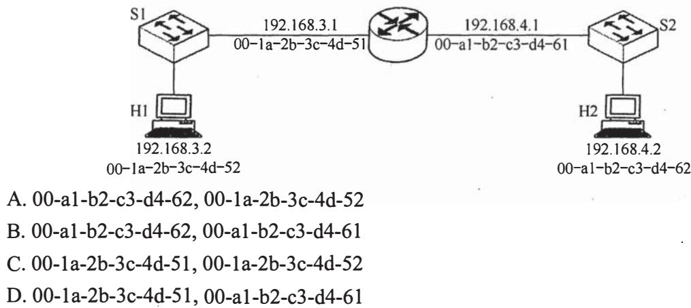

# 2018年计算机408统考真题.pdf — 图像索引

> 由 MinerU 结构化结果生成。题目若依赖树形、拓扑、流程、曲线、区域、时序或其他空间关系，应核对这里的原图，不要只依据 OCR 文本推断。

## 图 1

原文页码：1；bbox：`[107, 359, 721, 553]`

## 图 2

原文页码：1；bbox：`[685, 619, 751, 640]`

## 图 3

原文页码：2；bbox：`[137, 138, 850, 239]`

**图注：** 题47图
