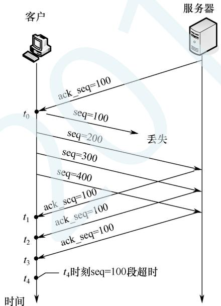

# 2019年计算机408统考真题.pdf

33. OSI 参考模型的第 5 层（自下而上）完成的主要功能是\_\_\_\_。
A. 差错控制    B. 路由选择    C. 会话管理    D. 数据表示转换

34. 100BaseT 快速以太网使用的导向传输介质是\_\_\_\_。
A. 双绞线    B. 单模光纤    C. 多模光纤    D. 同轴电缆

35. 对于滑动窗口协议，若分组序号采用 3 比特编号，发送窗口大小为 5，则接收窗口最大是\_\_\_\_。
A. 2 B. 3 C. 4 D. 5

36. 假设一个采用 CSMA/CD 协议的 10Mb/s 局域网，最小帧长是 128B，则在一个冲突域内两个站点之间的单向传播延时最多是 \_\_\_\_。
A. 2.56μs    B. 5.12μs    C. 10.24μs    D. 20.48μs

37. 若将 101.200.16.0/20 划分为 5 个子网, 则可能的最小子网的可分配 IP 地址数是 \_\_\_\_。
A. 126    B. 254    C. 510    D. 1022

38. 某客户通过一个 TCP 连接向服务器发送数据的部分过程如题 38 图所示。客户在 $t_0$ 时刻第一次收到确认序列号 ack\_seq = 100 的段，并发送序列号 seq = 100 的段，但发生丢失。若 TCP 支持快速重传，则客户重新发送 seq = 100 段的时刻是 \_\_\_\_。
A. $t_1$ B. $t_2$ C. $t_3$ D. $t_4$

  
题38图

39. 若主机甲主动发起一个与主机乙的 TCP 连接，甲、乙选择的初始序列号分别为 2018 和 2046，则第三次握手 TCP 段的确认序列号是 \_\_\_\_。
A. 2018    B. 2019    C. 2046    D. 2047

40. 下列关于网络应用模型的叙述中，错误的是\_\_\_\_。
A. 在 P2P 模型中，结点之间具有对等关系
B. 在客户/服务器（C/S）模型中，客户与客户之间可以直接通信
C. 在 C/S 模型中，主动发起通信的是客户，被动通信的是服务器
D. 在向多用户分发一个文件时，P2P 模型通常比 C/S 模型所需的时间短

## 二、综合应用题（第 41～47 小题，共 70 分）

47.（9 分）某网络拓扑如题 47 图所示，其中 R 为路由器，主机 H1～H4 的 IP 地址配置以及 R 的各接口 IP 地址配置如图中所示。现有若干以太网交换机（无 VLAN 功能）和路由器两类网络互连设备可供选择。

  
题 47 图

请回答下列问题:

（1）设备 1、设备 2 和设备 3 分别应选择什么类型的网络设备？

（2）设备 1、设备 2 和设备 3 中，哪几个设备的接口需要配置 IP 地址？为对应的接口配置正确的 IP 地址。

（3）为确保主机 H1～H4 能够访问 Internet，R 需要提供什么服务？

（4）若主机 H3 发送一个目的地址为 192.168.1.127 的 IP 数据报，网络中哪几个主机会接收该数据报？
