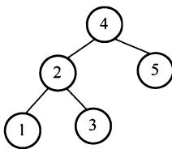
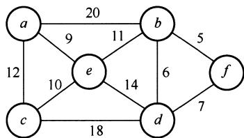
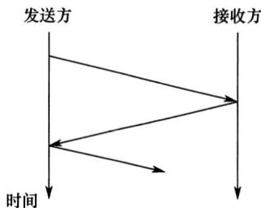
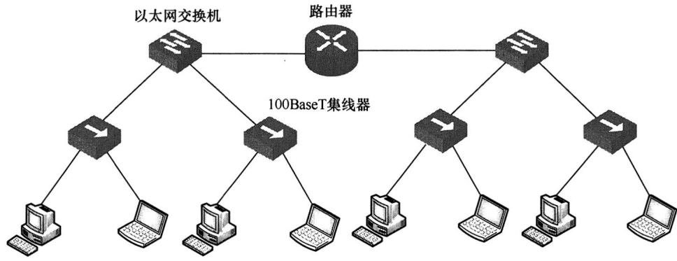
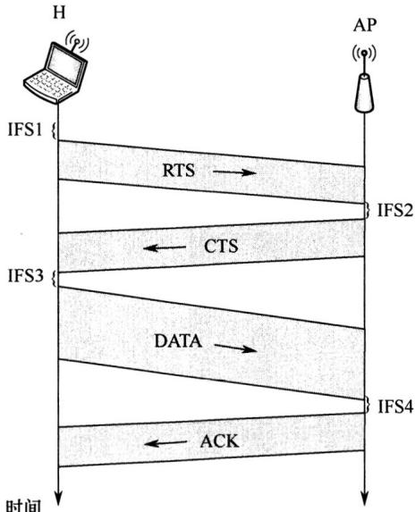
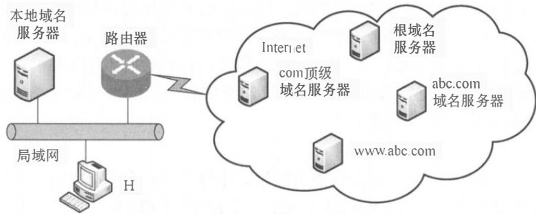
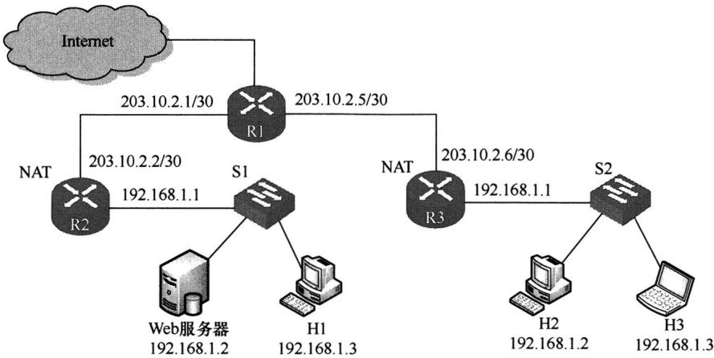

# 2020年计算机408统考真题.pdf — 图像索引

> 由 MinerU 结构化结果生成。题目若依赖树形、拓扑、流程、曲线、区域、时序或其他空间关系，应核对这里的原图，不要只依据 OCR 文本推断。

## 图 1

原文页码：1；bbox：`[738, 613, 890, 702]`

## 图 2

原文页码：1；bbox：`[640, 841, 892, 938]`

## 图 3

原文页码：5；bbox：`[359, 578, 588, 703]`

## 图 4

原文页码：6；bbox：`[181, 90, 867, 271]`

## 图 5

原文页码：6；bbox：`[362, 447, 692, 726]`

## 图 6

原文页码：7；bbox：`[202, 237, 761, 389]`

## 图 7

原文页码：9；bbox：`[161, 214, 798, 432]`
