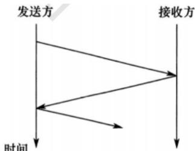
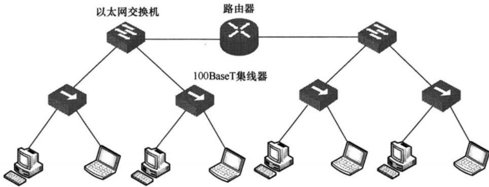
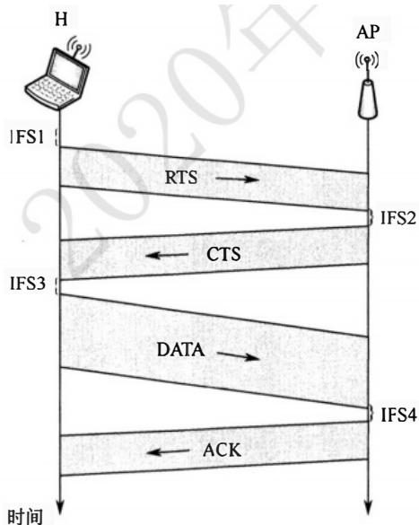
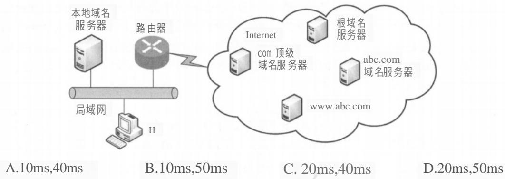

# 合并PDF.pdf — 图像索引

> 由 MinerU 结构化结果生成。题目若依赖树形、拓扑、流程、曲线、区域、时序或其他空间关系，应核对这里的原图，不要只依据 OCR 文本推断。

## 图 1

原文页码：1；bbox：`[212, 86, 443, 209]`

## 图 2

原文页码：1；bbox：`[79, 456, 769, 637]`

## 图 3

原文页码：2；bbox：`[343, 110, 674, 395]`

## 图 4

原文页码：3；bbox：`[105, 240, 864, 423]`
